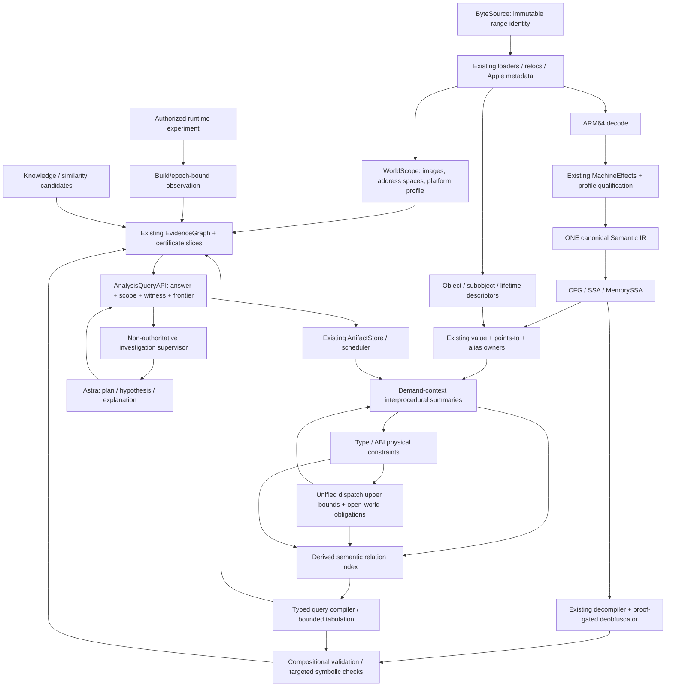
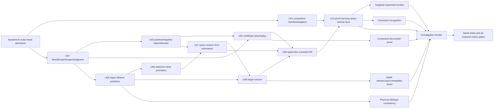

# HEX ARM64 POST-ROADMAP COMPETITIVE SUPREMACY ARCHITECTURE

> **2026-09-12 implementation update / session14:** 既存PRの実装を再利用し、ARM64のnative解析・証明・Apple metadata・保持traceの不足部分を追加した。main `d7da0f5777ca38ca6b40d9fb16c132d7e1e56ff5` まで整合。**目標100%の受入は未認定。** 現在の実装・検証・残条件は第44章と `docs/SCPA_FUNCTIONAL_ACCEPTANCE.md`。第1–42章は設計時の記録、第43章はsession13の履歴として保持する。

**Research + Architecture Design only · 2026-09-10 JST · v1.0**\
Repository: `rhgrive3/hex-ida`\
Source baseline: `eae8d8ff9a60bf149ee855baf2d09bd5b52cbe65`\
対象: ARM64/AArch64 native、Apple ARM64/arm64e、Linux/Android ARM64、関連する ARM64 PE。\
状態: **設計提案。競合勝利未実証。製品実装・外部 write なし。**

本文の MUST は新設計の受入条件であり、現行実装済みという意味ではない。コードブロックは仕様用 pseudocode。既存ファイル名は固定 snapshot で確認したもの、新しいパスには **NEW** を付す。外部事実は章41の source ID、現行 source は `[H: path:line]` または同章の source ledger に結び付ける。測定未実施の数値は **proposed gate** と明記する。

## 1. Executive verdict

**勝ち筋はある。ただし現時点で「Hex が勝っている」と結論する証拠はない。** 最も強い仮説は、既存 roadmap が作る正確な局所解析を、**成立条件付き・再検証可能・不完全性を明示する関数間 query** に合成することにある。Astra の能力差、UI、機能数、単に pseudocode が短いことは根拠にしない。

今回の中心提案は **Scope-Closed, Proof-Carrying Analysis（SCPA）campaign** である。「新しい semantic IR」ではなく、既存 canonical Semantic IR / SSA / MemorySSA / summaries / type graph / EvidenceGraph の上に、次の契約を追加する。

1. fact は命題だけでなく、binary/world、実行 profile、仮定、根拠、未解決 obligation を持つ。
2. query は結果に加え、bytes → IR → MemorySSA → summary → result の検証可能な依存 slice と、答えを変え得る未読領域を返す。
3. 新しい module、dispatch target、runtime generation、ABI 解釈が加わったとき、**正の依存だけでなく「存在しない」という判定の依存**も失効させる。
4. 高価な精度向上は query の frontier だけに限定し、予算を使い切っても TOP/unknown と再開位置を残す。
5. Astra は hypothesis と action selection を所有するが、fact/proof/closed-world の発行権限は持たない。

この設計が狙う最初の優位は、**Apple を含む関数間調査の evidence correctness、focused-query latency、再解析コスト、同じ Astra の task completion**。命令 semantics、全体 readability、最新 vector ISA の全面優位は独立した長期 gate とする。

特に既存 `C4-04` の pass-local translation validation、`C4-05` の equality saturation、`FR-ME-01A/B` の独立 ISA/relaxed-memory oracle、C1 の object roots/context、C-SYM の memory/solver/taint は **既に Baseline B**。それらを新発見として再提出しない。

## 2. Research freeze point

### 2.1 固定入力

|項目|固定値|
|---|---|
|Drive path|`hex-ida-mirror/hex-ida-main.zip`|
|Drive file ID|`1uuqW3mx_KGYF7Jptm8_zqKkrWkuXgWab`|
|modified UTC|`2026-09-09T15:41:40.929000Z`|
|modified JST|`2026-09-10T00:41:40.929000+09:00`|
|size|23,142,168 bytes|
|SHA-256|`a4bb3d0131b589032ff3a51a0f405a6967e6bb711e5c2fc6ac2a07cc5c351203`|
|ZIP embedded identity/comment|`eae8d8ff9a60bf149ee855baf2d09bd5b52cbe65`|
|取得時 GitHub main|同上|
|main commit timestamp|`2026-09-09T15:40:29Z`|
|main tree|`b8170d4a7ccd7e26e4be5247b45aaa5f696b5b00`|
|ZIP inventory|4,088 members、展開サイズ 45,183,648 bytes|

Drive metadata と ZIP hash は別の証拠である。ZIP comment は embedded identity であり、単独で Git object 全体の真正性を証明しない。取得時 GitHub main と一致したことを別途確認した。後続 GitHub issue/PR は更新されるため、**source snapshot と workflow observation は原子的な同一時刻 snapshot ではない**。[G01–G04]

Git clone は行っていない。外部 write、CI log download、製品コード変更は行っていない。Connector の schema に timeout 引数がない read は提供側の呼出上限に依存し、架空の timeout parameter は渡していない。ローカル実行には有限 timeout を設定した。

### 2.2 読んだ既存設計の identity

|実際のファイル|役割|
|---|---|
|`docs/解析ツール改善.md.txt`|先頭 title が `HEX_REVERSE_ENGINEERING_DEEP_RESEARCH_MASTER.md`。ユーザー指定の二つの名前に対応する同一文書として扱う|
|`docs/HEX_MASTER_ARCHITECTURE.md`|現行 amendment。単独で全 architecture を置換する文書ではない|
|`docs/archive/architecture/HEX_MASTER_ARCHITECTURE-v1.0-574429289786c9d3d8998c8240b67d56c8029b1b.md`|amendment が参照する詳細 architecture|
|`docs/flash.md`|C0–C4/C-ME/C-SYM 等の実施順、ownership、denominator、exit gate|
|`docs/ENGINEERING_PROCESS_GUARDRAILS.md`, `AGENTS.md`|境界・検証・owner lane・baseline-red・統合制約|

文書中の過去の SHA、当時の「current」、過去の test pass は今回の main の測定結果に読み替えていない。

### 2.3 検証実績と限界

固定 source 上で Node `v22.16.0`、各 `node --max-old-space-size=512 --test <file>`、各 process timeout 7 秒で focused test 10 ファイルを実行した。**10/10 ファイル PASS、node:test 上の 78 test cases PASS**。詳細とファイル hash は添付 evidence bundle。実行後、ZIP内の非directory 3,679ファイルを展開先とSHA-256比較し、内容不一致0を確認した。これは契約と配線の選択的な確認であり、全 test suite、physical iPad、Safari、hardware oracle、IDA/Ghidra の比較は実行していない。

|focused file|node:test cases|
|---|---:|
|`tests/phase7/pointsto/loaded-pointer-recovery.test.mjs`|11|
|`tests/phase7/pointsto/lattice-laws.test.mjs`|18|
|`tests/phase7/summary/interprocedural.test.mjs`|24|
|`tests/phase7/types/constraint-graph.test.mjs`|19|
|`tests/phase7/integration/analysis-query-app-wiring.test.mjs`|1|
|`tests/phase7/integration/analysis-query-artifact-versions-stale.test.mjs`|1|
|`tests/runtime-module-binding-contract.mjs`|1|
|`tests/runtime-evidence-fusion.mjs`|1|
|`tests/arm64-adr-adrp-encoding-domain.test.mjs`|1|
|`tests/metadata-downstream-integration.test.mjs`|1|

## 3. Evidence methodology

### 3.1 二種類の evidence axis

外部 research の信頼度は E1 official source/docs/SDK/release、E2 public source/paper、E3 official issue/conference/community technical evidence、E4 opinion とする。一方、解析 fact の authority は第14章の **機械 semantics、証明、metadata、観測、ユーザー宣言、heuristic** の直積で管理する。E1 marketing は「公式がそう述べた」という証拠であり、実行性能や soundness の証明ではない。

実装状態は `SOURCE-TRACED`, `FOCUSED-TESTED`, `DECLARED-ONLY`, `IN-FLIGHT`, `NOT-VERIFIED` を使う。SOURCE-TRACED は producer → artifact → consumer/query の経路を読んだという意味で、全入力に正しいという意味ではない。存在しないことの証明は scoped search の範囲に限定する。

### 3.2 Ground truth の順序

`source/spec → pinned compiler/linker/options → one exact binary → debug/oracle twin → hardware/reference execution → independent parser/oracle → Hex/competitor`。

debug info はコンパイラが生成した mapping の証拠であって完全な machine CFG oracle ではない。trace は観測済み behavior の下界であって、未観測 behavior の不可能性を証明しない。SMT UNSAT は適切な式変換・仮定・observables・solver trust が成立する範囲の結果である。

**wrong exact facts = 0** は frozen finite corpus の release veto。有限 test から世界中の binary に誤りがないとは言わない。Exact recall と unknown honesty を同時に測り、何も exact と言わない製品が勝つ採点にはしない。

### 3.3 調査の exclusion

proprietary internals、leaked SDK、pirated IDBs、他人の非公開 binary、LLM leaderboard は根拠にしない。競合の非公開性能は `UNMEASURED`。各 public beta は GA と分ける。未取得 API の存在・不在を推測で断定しない。

## 4. Current Hex ARM64 truth map

### 4.1 Production wiring ledger

以下は固定 snapshot の実在するパス。複数 file の全文監査ではなく、記載経路と境界の source trace である。各 gate の完全性は個別に扱う。

|対象|producer → canonical artifact → production consumer/query|test / 状態 / ceiling|
|---|---|---|
|ARM64 decode/lift|`js/targets/architecture/index.js` → `arm64/effects/*`, `arm64e/effects.js` → MachineEffects|integer/flags/memory/atomic/FP/SIMD/system owner 存在。全 encoding oracle coverage 未測定|
|Semantic IR|`js/ir-core.js:53,616` default V2 compatibility → `js/semantics/compat/index.js:293–605` liftExact/lower/SSA/alias/MSSA|SOURCE-TRACED。registry の legacy 表記だけで旧 IR と判断しない|
|CFG / SSA|compat pipeline → canonical CFG / `buildSemanticSsa` / validation → decompiler/query|explicit legacy route は別。silent failure fallback を完成機能扱いしない|
|MemorySSA|canonical IR/alias → initial/refined MSSA → `js/analysis/index.js`, `alias/solver.js`|loaded-pointer test PASS。arbitrary load forwarding が全て正確という意味ではない|
|points-to / alias|`analysis/pointsto/local.js`, `analysis/alias/solver.js` → root/offset/escape proof → pointsTo/queryAlias|lattice/loaded-pointer PASS。scope、root cardinality、complete memory witness が精度の境界|
|summaries|`analysis/summary/interprocedural.js` bounded SCC → summaries → `analysis/index.js` exported wrapper|24 tests PASS。全 binary の scheduler が常時この engine を走らせる配線までは確認していない|
|value/range|`decompiler/phase8/range.js` → range facts → phase8 consumers|existing owner。別 value authority を作らない。whole-program selective refinement は未検証|
|type graph|`analysis/types/graph.js`, constraints/SCC → types()/explainType|19 tests PASS。recursive ambiguity/budget guards。metadata 型名を machine exact と等置しない|
|ABI|`targets/abi/aapcs64.js`, `aapcs64-core.js`, Darwin variant → ABIPlugin → IR call/return/prototype consumers|SOURCE-TRACED。HFA/int128 等の open PR 状態と全 ABI correctness は別|
|decompiler|`decompiler/pipeline-core.js:668–693` → phase8 registry/stage runner → projection|default interactive は canonical-facts subset、`phase8Optimize===true` は別 tier。全 pass 常時稼働ではない|
|symbolic|`symbolic/verify/equivalence.js` → translator/backend result/model validation → proof gate|`solver/registry.js` の backend 登録だけで realistic 64-bit SMT 能力を認定しない。PR7036 は未マージ|
|runtime|`runtime/app-runtime.js` → RuntimeAnalysisPlatform → `runtime/evidence-bridge.js` → EvidenceGraph/query|module binding/evidence tests PASS。external debugger/hardware の実行試験なし|
|ELF/Mach-O/PE|`binary/source-loaders.js:40–87` → bounded ByteSource parse → canonical BinaryImage → backend|source-backed route 実在。個別 malformed metadata、relocation/fault の完全性は未認定|
|Apple metadata|`chained.js`, `apple/objc-*`, `swift.js`, `metadata/swift.js` → metadata/runtime index → downstream|metadata integration test PASS。Swift async/全 resilient layout を閉じる能力は未確認|
|recognition/diff|`fingerprint/index.js`, `signature/index.js`, `recognition/matcher.js` → FunctionMatchIndex → app recognition|`app.js:89,156–192,1367` demand-driven wiring。whole-binary matcher/postprocessing budget は open 修正対象もある|
|binary diff|`js/diff/index.js:29` → matcher + semantic-change projection → `js/diff/worker.js` / runtime|SOURCE-TRACED。matching incomplete時はunmatchedをnew/deletedと断定せずunresolved。semantic-equivalentというmatcherlabel自体をSMTproofとは扱わない。relateddiff tests存在、今回未実行|
|knowledge|`knowledge/index.js`, phase12 recognition → KnowledgeDB revision → `app.js` recognition cache|schema v3、search cap、negative records、evidence fields が存在。新しい知識の追加は recognition invalidation に影響|
|artifacts/scheduler|`core/artifacts/store.js`, `core/scheduler/*`, `cache/artifact-orchestration.js` → versioned artifacts → query adapter|publish/upstream validation、single-flight/queue の owner。将来もここを拡張|
|AnalysisQueryAPI|`app.js:331` → app adapter → `query/api.js:264–393` snapshot 前後検証 → UI/AI|app wiring/stale tests PASS。search/causalPath のメソッド存在だけで sound interprocedural query と呼ばない|
|demand-driven|`js/ux.js:69`, `analysis/demand-driven-runtime.js:563–566` → bounded per-function work|source-backed/snapshot route。全 world の negative-answer closure は未確認|
|AI|`ai/runtime.js` → session-bound EvidenceStore/HypothesisStore/ProposalStore、ContextBroker、job slices → tool loop|既に persistent session/job はある。新 supervisor は単なる会話保存の再実装ではない|

Query adapter の `causalPath` は `app.queryCausalPath` があれば委譲し、それ以外は unsupported を返す経路がある。scoped source search で閉じた関数間 dataflow producer は確認できなかった。**「存在する query method」と「sound query engine」は区別する。** `[H: js/analysis/query/app-adapter.js:797–827]`

### 4.2 Current workflow inventory

取得時の open issue title `ARM64` 検索は 52 件。これは ARM64 関連全 issue の総数ではない。`#5490` invalid FP condition、`#4201` FP/AdvSIMD access trap が返ったが、古い issue 本文を今回の未修正バグと断定していない。[G05]

主要 in-flight は `#7036`。read 時点で open/draft、head `a51ce44222a086dab2363291829ab057382cbf9a`、branch `feat/analysis-roadmap-v8-current-main-20260907`、45 commits/278 files。本文の「one commit / 140 files」は過去の publication description で、最新 metadata と一致しない。symbolic byte memory、tiered solver、taint、egraph、proof-gated phase8 等を含むが、**Baseline A の能力に加算しない**。[G03]

関連 open PR の観測例: `#7757` PAC aliases、`#7768` AAPCS64 HFA stack、`#7684` int128 call/return、`#7776` Swift enum、`#7792` ObjC IMP、`#7793` loop recurrence、`#7795/#7778/#7767` MSSA/SSA binding、`#7741` pointer wrap、`#7548` alias identity/escape cache、`#7675` runtime snapshot、`#7774` event epoch、`#7520` recognition approval。**inventory は修正妥当性の認定ではない**。

closed/merged `#7317` は PAC aliases/ADR/MOV の integration、`#7770` は proven 32→64 address extension。merge 履歴は capability が後続 commit で維持されている証拠ではなく、source/test が必要。[G06,G07]

存在を確認した roadmap branch: `feat/analysis-roadmap-v8-20260907`, `...-clean`, `...-current-main-20260907`, `...-pr`。全 branch の網羅調査とはしない。

### 4.3 ARM64 semantic completeness matrix

maturity は単一順位にしない。`D` decode、`C` control、`E` scalar/effect、`M` memory、`F` flags、`P` FP、`V` vector、`X` exception、`S` system、`A` auth/tag、`H` high-level/decompiler、`Y` symbolic、`O` independent oracle の **vector** とする。各 cell は `0=not supported in audited owner`, `1=source path present`, `2=selected tests`, `3=independently verified for declared profile`, `?=not established`, `—=not applicable`。1 は exact を意味しない。

|family|D|C|E|M|F|P|V|X|S|A|H|Y|O|
|---|---:|---:|---:|---:|---:|---:|---:|---:|---:|---:|---:|---:|---:|
|base integer / address|1|1|2|1|1|—|—|1|—|—|1|1|?|
|branch / tail / indirect|1|1|1|—|1|—|—|1|1|1|1|1|?|
|load/store / pair|1|—|1|2|—|—|1|1|—|1|1|1|?|
|scalar FP|1|1|1|1|1|1|—|1|1|—|1|?|?|
|Advanced SIMD/NEON|1|—|1|1|1|1|1|1|1|—|1|?|?|
|LL/SC / LSE atomics|1|1|1|1|1|—|—|1|1|—|1|?|?|
|barriers / relevant sysreg|1|1|1|1|—|1|—|1|1|—|1|?|?|
|PAC / authenticated branch/load|1|1|1|1|—|—|—|1|1|1|1|?|?|
|BTI / BTYPE|1|1|1|—|—|—|—|1|1|1|1|?|?|
|TBI / tagged pointer universe|?|?|?|1|—|—|—|?|?|?|?|?|?|
|MTE|?|?|0|0|—|—|—|0|0|0|?|?|?|
|SVE|?|?|0|0|?|?|0|?|?|—|?|?|?|
|SVE2|?|?|0|0|?|?|0|?|?|—|?|?|?|
|SME / SME2|?|?|0|0|?|?|0|?|0|—|?|?|?|

SVE は `arm64/effects/fp-core.js` に明示的 rejection がある。SVE/SVE2/SME/MTE の dedicated exact effect owner は今回の scoped audit では見つからなかった。decoder 全体が認識できないとまで断言していない。独立 oracle を実行していないので O 列を source/test 件数で埋めない。legacy A0–A7 表示が必要ならこの vector と profile を添え、A7 は当該 cell の declared semantics だけに付ける。

## 5. Post-roadmap assumed baseline

Baseline B は「issue が closed」「PR が merged」ではなく、既存 exit gates を満たす source/toolchain/device identity の組である。未来の commit SHA は存在しないためここでは固定できない。着手時に `BaselineBManifest` を作り、A と混同しない。

|既存 item|B に含める能力|それだけでは競合を超えない理由|今回の追加差分|
|---|---|---|---|
|C0|independent same-binary ground truth、frozen growth-only denominator|競合の最適 API と same-Astra 比較の実施結果が別途必要|counterbalanced native-best track、availability gap、joint correctness/latency victory contract|
|C1|MSSA exact loaded pointers、summary return roots、cardinality/context、bounded feedback|関数ごとの precision は query world の閉鎖を保証しない|query-selected context partitions、negative-dependency cut、resumable frontier|
|C2|既存 range owner、wrapped interval/known bits/congruence、edge facts|全関数を高価な product domain で解くと browser budget を失う|costed promotion request と certificate-aware reduced product。owner は不変|
|C3|recursive type ambiguity、ABI/prototype/metadata separation|joint dispatch/type/lifetime constraints の循環で過剰確定し得る|physical-layout obligation と nominal evidence の相互整合性 checker|
|C4, HEX-C4-04|pass ordering/invalidation、pass-local refinement validation、memory/exception observables|個別 pass の proof は query answer と最終 projection の全依存を閉じない|compositional proof DAG と statement/query certificate、observable footprint binding|
|HEX-C4-05 / §53|typed bounded egraph candidates、taint、proof-gated deobfuscation|candidate/proof の存在だけで program-level path closure にならない|closed cut に対する rewrite bundle と cross-pass revalidation|
|C-ME / FR-ME-01A/B|ARM64 independent semantics/defined bits/Sail/Isla/litmus/hardware triangulation|特定 instruction の検証結果は ambient machine state 全体の truth ではない|profile-indexed semantic qualification と reusable effect-contract composition|
|C-SYM|realistic 32/64-bit tiered solver、symbolic byte memory、underconstrained slices|全 query を solver に送るのは不適切|obligation selector、counterexample replay、query/value/solver cooperative refinement|
|C-X / HEX-X-03|Apple metadata/loaders/discovery/reassemblable evidence|metadata-aware discovery と async/dispatch/object lifetime の閉じた意味は違う|multi-image scoped dispatch と continuation/capture joint queries|
|Stage2 ARM64/Apple|runtime generation binding、knowledge collisions、typed tools、browser/device proof|既存 session/tool-loop は goal の evidence coverage を解決しない|non-authoritative investigation frontier と reproducible substrate-only experiments|

既存 R0/R1/R2 refinement cap は勝手に撤廃しない。新 query が別 context で bounded refinement を依頼する **外側の scheduler** を設ける。全体 budget と重複検出を親に集約し、内側の安全 gate を再利用する。

## 6. Ghidra current capability map

公開 release で確認した基準は **Ghidra 12.1.3**、tag `Ghidra_12.1.3_build`。実行バイナリはこの環境で導入していない。比較時には distribution SHA、JDK、processor specification、script/plugin set を pin する。[R01]

SLEIGH は命令記述から P-code を生成し、high P-code は SSA/dataflow 上の演算や型・pointer 表現を持つ。HighFunction / varnode / high variable は命令・storage・型・use-def の対応を API に出す。[R02–R04]

**精度を作る機構**は pass の列挙以上に ordering と再反復である。固定 tag の `coreaction.cc` では heritage 後に parameter/local recovery、RestrictLocal は DeadCode より前、DynamicMapping は restructure/infer types より前、Spacebase は nonzero-mask/type inference より前に置かれる。mainloop/fullloop と bounded restart が異なる責務を持ち、type propagation には非収束時の上限と warning がある。これを Hex の pass precondition/invalidation oracle の参照にする。[R05]

|領域|公開能力 / 強い invariant|比較上の注意|
|---|---|---|
|CFG/switch/indirect|P-code dataflow と jumptable 用 action group、構造化 pass|未知 target、irreducible CFG、compiler/language idiom の一般解ではない|
|types/high variables|storage/def-use/merge/type propagation の統合|型 lock/ユーザー情報と推論を区別。nominal type 復元が一意とは限らない|
|headless/scripts/API|非対話解析、Java/Python系 integration、decompiler APIs|competitor adapter に使わせる。GUI だけに制限しない|
|FID/version tracking|function recognition、program 間対応と transfer の framework|match が独立 truth になるわけではない|
|debugger/project|runtime/static mapping、trace、共有 project/repository の workflow|provider ごとの platform 能力を fixture で確認|
|ARM64 processor|SLEIGH processor model + compiler specifications|processor file の存在 ≠ 全 FP/SVE/PAC semantics が oracle-verified|

上の platform capability は official project/docs の機能区分であり、今回 headless/FID/debugger の全 pipeline を実行したわけではない。[R06]

**失敗から学ぶ invariant:** malformed container counts、non-cancellable analysis、stale decompiler references は解析製品にも防御境界が必要なことを示す。旧版の修正済み事例を 12.1.3 の未修正 vulnerability と表現しない。Hex は bounded enumeration、cancellation、epoch/versioned handles を必須にする。競合が必ず遅い、常に whole-file materialization する、といった未測定の比較はしない。

## 7. IDA/Hex-Rays current capability map

基準は **IDA 9.4 AVAILABLE**。9.3 や 9.4 beta を現行 production の代用にしない。9.4 公開 release は Swift calling-convention recovery と Apple/dyld workflow を更新し、on-demand shared-cache image loading が公開されている。従って「Hex は demand-driven、IDA は全読込」という差別化は成立しない。[R07,R08]

|機能|分類|公開根拠 / 正しく限定した比較|
|---|---|---|
|ARM64 disassembler/decompiler|AVAILABLE|Hex-Rays ARM64 product + 9.4 release。全 instruction equivalence proof を意味しない|
|SVE/SVE2/SME/SME2 decode|AVAILABLE（decode）|9.4 processor support。scalable semantics/decompiler exactness の全面保証へ拡大しない [R09]|
|MTE/PAC/BTI|instruction/platform support は family ごとに評価|本調査では全 effect/profile maturity を認定しない。UNKNOWN は未調査であって absent ではない|
|microcode API / use-def|AVAILABLE|mblock_t の must/may use/def、value range、dirty/rebuild 等の公開 interface [R10]|
|regtracker / regfinder|AVAILABLE|bounded register-value tracing、cache invalidation、origin surfaces [R11]|
|types / local-global propagation / interactivity|AVAILABLE|API、type/prototype modification と decompiler interaction。private algorithm は断定しない|
|gooMBA / SMT-assisted simplification|AVAILABLE publicly documented plugin|heuristic/synthesis candidate と SMT checking を組み合わせる。proof-gated MBA 自体は Hex 固有ではない [R12]|
|FLIRT / Lumina|AVAILABLE|signature/metadata recognition。結果の truth は独立 oracle と分離|
|FLIRT 2.0 / new engine integration|ANNOUNCED / production integration UNVERIFIED|direction article と shipping SDK を混同しない|
|Domain API|AVAILABLE|functions、microcode/pseudocode、callers/callees/CFG/prototype surfaces [R13]|
|hcli / idac / headless|AVAILABLE / public third-party tooling|HCLI は主に installation/license/plugin 管理、idalib が headless analysis、Trail of Bits の idac は agent-friendly batch/JSON/GUI・headless CLI。製品内蔵と third-party を区別し最適競合に許可 [R32–R35]|
|debugger / native mobile|AVAILABLE with platform constraints|IDA debugger を最適競合 route に許可。各 iOS/Android OS+device capability は別検証|
|dyld shared cache / ObjC / Swift|AVAILABLE、9.4 更新|on-demand cache、Swift call convention、ObjC stubs/prototypes 等 [R07,R08]|
|Rust / Go / C++|AVAILABLE support, version-dependent|compiler/runtime idiom improvements の存在。全 language/toolchain semantics 認定ではない|
|Knowledge Engine|公開説明・beta invitation、GA verification 未取得|章22で独立比較 [R14]|
|Semantic Engine|公開説明・beta invitation、GA verification 未取得|章17で独立比較 [R14]|
|binary similarity / semantic querying / plugins|core/公開 engine/plugin に分散|最適 legal integration を許可。非公開 internal representation は推測しない|

`AVAILABLE / BETA / ANNOUNCED / ROADMAP / UNVERIFIED` は per-feature の状態であり、一つの release 名で全行を AVAILABLE にしない。新 Engines の完全 API schema、再現可能な ARM64 query precision/latency、正式 production availability は今回確認できていない。**設計上は公開説明どおり機能すると仮定する**が、実測比較では `UNMEASURED` と残す。

## 8. IDA+Astra worst-case capability map

競合は以下の閉じた tool loop を自由に使える。

```text
Same pinned Astra
  -> Domain API / scripts / headless / lawful plugins
  -> IDA database + callgraph/xrefs/types
  -> pseudocode + microcode/must-may use-def/regfinder
  -> debugger/runtime experiments
  -> FLIRT/Lumina + Knowledge Engine
  -> Semantic Engine + cross-binary retrieval
  -> next query/hypothesis
```

最悪条件では engine が正しく統合済み、最適 script、microcode cache、debugger、外部 knowledge がある。Ghidra にも headless/API/agent、必要なら公開 engine integration を許す。Astra が同一だから query composition や cache の工夫も競合側に許可する。

Hex の優位仮説は「自然言語を受け取れる」ではない。**一回の deterministic request で、成立条件と再検証可能な根拠を持つ関数間結果を、bounded incremental artifact として得る**ことである。競合 adapter で同等結果を容易に作れたなら uniqueness claim を撤回し、速度/精度/再現性のみで比較する。

|等しく与えるもの|区別して測るもの|
|---|---|
|model build、sampling settings、goal、binary、budget、human policy|native substrate APIs とその execution cost|
|合法な metadata/knowledge access の条件|knowledge equalized track と ecosystem track|
|adapter 開発時間、review、事前 training goals|cold index construction と warm query|
|runtime experiment budget/authorized target|観測範囲・trace gap・module closure の正確な表示|

## 9. Additional research findings

**選ぶのは mechanism、移植するのは境界条件。** 既存 B と重なるものは oracle/設計参照に留める。

|参照|得られた mechanism|採否 / B からの追加|
|---|---|---|
|Binary Ninja MLIL/HLIL/SSA|many-to-many IL mapping、cheap value facts と expensive possible-value query の分離|ADAPT: query-driven promotion。B の canonical IR を別 MLIL で置換しない [R15]|
|angr/Claripy/VEX|IR、symbolic state/solver の分離|CLEAN-ROOM LESSON: state-space を query slice に閉じる。第二 VEX truth 不採用 [R16]|
|Triton|AArch64 dynamic symbolic/taint、solver integration|ORACLE ONLY / experiment adapter 候補。静的 complete claim には使わない [R17]|
|Sail ARM / Isla|spec-derived operational behavior、footprints、axiomatic relaxed-memory composition|ORACLE ONLY。既存 FR-ME-01A/B の再利用 [R18,R19]|
|Alive2|bounded translation refinement、UB/memory の明示、LLVM version coupling|CLEAN-ROOM LESSON。interprocedural全証明へ誤拡大しない。既存 C4-04 の上に合成 contract [R20]|
|Heros / IFDS / IDE / WALA|finite distributive facts、summary/tabulation、interprocedural propagation|ADAPT mechanism、実装は既存 graph owner に合わせた小 VM。一般 pointer analysis を無理に IFDS 化しない [R21,R22]|
|Retypd / type-recovery research|recursive structural constraints と polymorphism の示唆|CLEAN-ROOM LESSON、exact nominal recovery と切り分け。license unresolved integration HOLD [R23]|
|WARP|relocation-aware structural function identity と collision retention|ADAPT mechanism。同 GUID = unique identity としない。B の collision model 上で constraint checks [R24]|
|Apple dyld / Swift ABI|versioned authenticated fixup layout、resilience-dependent type layout|ORACLE/spec reference。opaque state を勝手に concrete pointer/type にしない [R25–R27]|
|Android MTE|synchronous/asynchronous/asymmetric fault modes の観測差|ADAPT profile/outcome contract。trace 上 fault がないだけで安全と結論しない [R28]|

QEMU/Unicorn/Qiling は補助実行 oracle 候補だが相互に共有実装・同じ backend の場合は独立票に数えない。LLVM MC は encoding/decoding oracle で、命令全 semantics の oracle ではない。Remill/BAP/Miasm/rev.ng/RetDec/Rizin-RzIL/dewolf は IR/structuring/invariant の比較参照、production dependency は今回決定しない。CodeQL/Datalog は query planning の参考であり、source-language DB の assumptions を native machine graph に無条件移植しない。

capa/YARA-X は候補抽出・triage、BinDiff/Diaphora は correspondence、Frida は authorized observation の adapter 候補。いずれも proof authority ではない。利用前に exact version/license/API/architecture profile を確認する。全 universe を導入する計画は不採用。

## 10. Competitor gap matrix

`A` = 現行 source/selected tests、`B` = roadmap completion assumption、`N` = 今回の追加。競合の未公表内部を gap と断定しない。

|比較軸|A / B|競合が強い既知領域|N が勝つための必要条件|
|---|---|---|---|
|instruction truth|A 部分、B declared profile independently checked|成熟した processor/lifter ecosystems|B profile qualification を再利用し、false exact 0 と coverage 非劣性を実測|
|functions/CFG|B ambiguity/discovery/switch|compiler idiom、長年の recovery rules|閉じた target bounds と multi-image metadata の整合性|
|alias/MSSA/values|B sound local+summary precision|integrated mature dataflow|query-specific object/context と checked proof reuse|
|types/ABI|B recursive/ABI recovery|Hex-Rays/Ghidra の型・人間の修正 workflow|field/placement/nominal を別採点、context-specific consistency|
|decompiler semantics|B pass-local proof/discipline|mature optimizer/structurer/SMT plugin|最終 statement/query まで合成された observables proof|
|readability|A/B 非競争実測|compiler idioms、人間による長年の tuning|blind human task time で勝つ。goto/cast の少なさのみ禁止|
|whole-binary query|B API/taint foundation|IDA engine の公開 interproc model|closed cut / why edge / unknown frontier を一体化して同等 recall 以上|
|runtime|B observation binding|debugger/ecosystem|最小 experiment と静的 obligation の一対一対応|
|recognition|B multilayer/collisions|FLIRT/Lumina/Knowledge、FID、plugins|candidate collision を意味/型/呼出関係で絞り、誤 transfer 0|
|large binary|B source-backed artifacts|IDA9.4 on-demand DSC|index構築費込み TTFR/cancel/incremental に勝つ|
|autonomous investigation|B typed loop/session/jobs|same Astra + full competing tools|deterministic multi-function primitives が tool calls/tokens を減らす|
|explanations|B EvidenceGraph|engine の explainability 公開方針|再実行可能な witness と negative dependency。単に説明が長いは不採用|

## 11. Remaining ceilings after existing roadmap

**Q1 — C1–C4 完遂後の ceiling:** 局所 soundness と query の completeness は異なる。unknown external callee、dynamic dispatch、heap reincarnation、非同期境界、未読 image は局所最適化を全 program truth にできない。C4-04 の局所 proof も前提が変われば失効する。

**Q2 — まだ canonical に十分統合できない情報:** imported/authenticated fixup の modifier、runtime image epochs、object lifetime、closure capture、Swift continuation/witness constraints、unwind-derived region hints、partial metadata の「未読である」という状態。これらは命令 semantics を置換せず、scope/constraint/observation として canonical graph に接続する。

**Q3 — 構造的不利:** 大量の exact idiom coverage、type recovery と structuring の成熟度、既存 knowledge corpus、debugger/platform ecosystem。JS/browser budget と optional remote 条件も制約。これを「AI が読めばよい」で埋めない。

**Q4 — Hex の機会:** explicit unknown、stable identity、EvidenceGraph、artifact scheduler、source-backed model を、**閉じた範囲に対する positive/negative answer** の契約へ引き上げられる。これは公開競合が不可能という意味ではなく、Hex の設計上の投資効率が高いという仮説。

**Q5 — same Astra のための primitive:** `flow.query`, `dispatch.bound`, `type.explainPlacement`, `proof.replaySlice`, `world.impact`, `investigation.nextObligation`。各々が結果・範囲・残課題・計測を返す。

**Q6 — 10–30 分のクリックを一 query にする:** 「この callback の captured buffer がどこで書き換わり、どの call を跨いで生存するか」「この load の到達 store と unknown clobber は何か」「この imported call の候補集合が閉じない理由は何か」。対象は authorized binary の理解・検証であり、exploit chain 構築ではない。

**Q7 — 数百関数を読まない方法:** coarse metadata/def-use index → backward demand slice → cheap summaries → relevant SCC/context refinement → 必要箇所だけ solver/runtime。全 binary の indexed coverage がない cold run では、秒単位の exact negative answer を約束しない。

**Q8 — Apple/大型 framework:** multi-image identity、authenticated fixups、ObjC open-world dispatch、Swift resilient layout/async/witness、native callbacks、unwind、SDK recognition を object/summary/query に結ぶ必要がある。loader の機能追加だけでは足りない。

## 12. ARM64-specific opportunity map

priority は実測市場占有率ではなく、ユーザーの platform 優先と downstream leverage による**暫定仮説**。U01 で lawful corpus の instruction histogram を測り、tier を改訂する。

|tier|対象|採用判断・理由|
|---|---|---|
|P0|base integer、loads/stores、NZCV、call/tail、AAPCS64、NEON/FP、PAC/BTI、fixups|ほぼ全 downstream の成立条件。B 完了を前提に qualification/closure を追加|
|P1|LL/SC/LSE、barriers、relevant system state、TBI/tag profiles、MTE|concurrency/Android/Apple pointer truth に高 leverage。通常 memory analysis を全 relaxed-memory symbolic にしない|
|P1|ObjC/Swift/C++ indirect dispatch、blocks、async captures|同じ Astra が多数の関数を読む仕事を減らせる|
|P2|SVE/SVE2|Linux/server/mobile の対象 corpus に応じた demand-triggered profile。predicate、VL、fault-first、inactive lane を別 semantics|
|P2–P3|SME/SME2、FP8/FPMR、ZA/ZT0、streaming state|現在の ABI/spec と競合 decode は無視できないが、高費用。対象 workload と oracle が揃う family だけ qualification|
|P3|full privileged system/全 exception level|本 campaign の native application scope 外。必要な ambient state は symbolic/unknown として保つ|

最新 AAPCS64 公開資料には新しい scalable/state rules があるため、「AAPCS64」という無版の cache key は禁止する。[R29,R30] Apple Silicon 一般が SVE を実装するなどの不正確な platform 一括推定も禁止する。

## 13. Proposed post-roadmap architecture

### 13.1 Target architecture



図の循環は mutable な相互上書きではない。`dispatch → summaries → types → dispatch` は versioned round として publish し、同一 round 内の未証明仮説を自分の根拠にしない。EvidenceGraph は semantic source ではなく、既存 canonical owner が出した fact/observation/proof の依存を保持する。relation index、AST、supervisor memory はいずれも canonical semantics を所有しない。

### 13.2 Canonical ownership

|ID / subsystem|canonical owner / 既存境界|新規 responsibility|
|---|---|---|
|N0 Scoped Judgments|core identity/evidence + analysis snapshot|WorldScope/AssumptionSet/claim quantifier、closedness contract|
|N1 Certificate Composition|core evidence + symbolic verifier|query/pass proof dependency slice、checker level、compositional receipt|
|N2 Object Partitions|analysis alias/pointsto + existing MSSA region owner|lifetime/context/subobject/continuation descriptor。第二 memory state を持たない|
|N3 Precision Orchestrator|analysis summaries + phase8/range owner + scheduler|query-requested promotion、bounded SCC specialization、resume frontier|
|N4 Dispatch Closure|analysis discovery/summary + Apple/type providers|language-neutral target upper set と unresolved world cut|
|N5 Semantic Query|AnalysisQueryAPI + derived index|typed DSL、query plan/tabulation、proof-carrying answers|
|N6 Physical Type/ABI|existing type graph + ABI plugins|layout/placement constraints と cross-source consistency|
|N7 Compositional Decompiler Validation|existing phase8 + symbolic verify|局所 proof の合成と最終 statement の observable mapping|
|N8 Experiment Broker|existing RuntimeAnalysisPlatform|authorized minimal experiment planning、observation-to-obligation link|
|N9 Evidence-Preserving Retrieval|existing knowledge/recognition|collision-set narrowing の constraint receipt と cross-binary capsules|
|N10 Investigation Frontier|existing AI session/jobs/context broker|長期 goal の obligation coverage/cost/frontier。canonical fact 発行なし|
|N11 Consequence Incrementality|existing ArtifactStore/scheduler|negative dependency、selective invalidation、resumable query artifact|

### 13.3 Structural differentiators — 仮説としての「Hex で可能にする」

競合内部を公開情報だけで完全に否定できないため、**「他製品では絶対不可能」という exclusivity は主張しない**。以下は Hex の既存設計を利用して短い経路で実現できる差別化仮説。native-best competitor adapter が同等契約を満たした時は uniqueness を取り下げる。

|案|Why unique / useful / current enabler|競合で必要になる追加作業|費用 / risk / benchmark|
|---|---|---|---|
|D1 Positive-and-negative query certificate|結果だけでなく「この範囲では存在しない」の closure、bytes/MSSA/summary/未読 cut を一回で返す。EvidenceGraph/unknown が基礎|各 engine/API の scope と proof依存を統一し absence invalidation を公開する必要|L、false closedness。Q-CLOSURE: 未読 callee 追加で negative が必ず失効|
|D2 What-changed impact query|新 metadata/SDK/runtime epoch で、どの答えのどの前提が崩れたか返す。stable artifact identity が基礎|DB再解析とユーザー操作の影響を answer-level dependency に落とす必要|M–L、negative dependency 漏れ。Q-DELTA: 1%変更時の再計算/誤再利用|
|D3 Resumable precision frontier|同一 query を小 budget で進め、既に得た sound upper facts を保存。deterministic scheduler が基礎|tool-side incomplete state を再開可能な refinement contract にする必要|L、resume が毎回全再計算になる危険。Q-RESUME: 10×小slice vs 1×大slice|
|D4 Apple continuation/object/dispatch joint query|capture された buffer の lifetime、async resume、witness dispatch を一つの graphで説明。metadata+MSSAが基礎|複数 language/runtime 表現の対応、scope-aware object instances の統合|XL、metadata過信。APPLE-ASYNC: compiled source twins + runtime trace|
|D5 Contradiction-to-experiment obligation|矛盾の最小依存を提示し、それを区別する authorized probe だけ提案。runtime evidence bindingが基礎|debugger observations を静的仮説の quantifier に正確に戻す必要|L、無意味なprobe/介入。HYBRID-OBL: uncertainty減少/観測byte/call|
|D6 Collision-aware semantic retrieval receipt|類似候補を型・意味・call neighborhoodで棄却し、棄却不能候補も保持。knowledge collision modelが基礎|recognition score と actual semantic constraintを一つの再検証可能contractへ|L、誤nominal transfer。KN-COLLISION: intentional collisions/OOD libraries|
|D7 Composed decompiler witness|最終 condition/field/call argumentから、採用された複数rewriteとmachine bytesの根拠に戻れる|microcode/pcodeの局所変換を外部検証可能receiptへ連結|XL、proof trusted base巨大化。DC-COMPOSE: wrong-observable mutation detection|

## 14. Canonical schema/API changes

### 14.1 根本 judgment

`W, A ⊨ φ` は WorldScope W と AssumptionSet A に含まれる execution 集合で命題 φ が成立する、という形で発行する。scope のない `exact:true` を新 API は許可しない。異なる scope の fact を合成する時は共通の対象 execution と仮定の整合性を確認する。矛盾した前提の vacuous proof は `inconsistent-assumptions` として隔離する。

```ts
// Specification only. String digests are identities, NOT authority tokens.
type Digest = string;
type EntityId = string; // existing canonical entity IDs
type SourceIdentity =
  | {kind:'complete-content'; sha256:Digest}
  | {kind:'verified-ranges'; sourceInstance:EntityId; generation:Digest;
     rangeManifest:Digest; immutableProvider:EntityId}
  | {kind:'local-immutable'; sourceInstance:EntityId; generation:Digest};
interface WorldScope {
  schema: 'world-scope/v1';
  id: Digest;
  binarySet: ReadonlyArray<{
    binaryId: EntityId; sliceId: EntityId;
    sourceIdentity: SourceIdentity; // strength is explicit; no mandatory full read
    loadMapHash: Digest; relocationViewHash: Digest;
  }>;
  profile: { isaRevision: string; features: string[]; abi: string;
    abiRevision: string; osModel: string; endianness: 'le'|'be';
    addressBits: number; exceptionModel: Digest; memoryModel: Digest };
  environment: { dynamicLoading: 'open'|'sealed';
    concurrency: 'single-thread'|'modeled'|'unknown';
    interposition: 'possible'|'excluded-with-evidence';
    ambientState: Digest };
  coverage: EntityId; // range/image/discovery coverage artifact; not one bool
  generation: Digest;
}
interface AssumptionSet {
  id: Digest;
  predicates: EntityId[];
  provenance: EntityId[];
  satisfiability: 'checked-sat'|'not-checked'|'inconsistent';
}
type Support =
  | {kind:'machine-derived'; producer: EntityId}
  | {kind:'proof'; receipt: EntityId}
  | {kind:'metadata'; format: string; record: EntityId}
  | {kind:'observation'; experiment: EntityId; event: EntityId}
  | {kind:'user-assertion'; assertion: EntityId}
  | {kind:'heuristic'; algorithm: string; score?: number};
interface ScopedJudgment<T> {
  id: EntityId; schema: 'scoped-judgment/v1';
  subject: EntityId; world: Digest; assumptions: Digest;
  quantifier: 'all-admitted-executions'|'some-witnessed-execution'
            | 'metadata-declaration'|'candidate-only';
  value: T; support: Support[];
  precision: 'exact'|'sound-overapprox'|'sound-underapprox'|'heuristic'|'unknown';
  obligations: EntityId[]; derivation: EntityId;
  executionStatus: 'completed'|'budget-exhausted'|'cancelled'|'unsupported'|'failed';
}
```

**authority は linear rank ではない。** 型名の debug declaration と instruction width の machine fact は違う軸。user-confirmed はユーザーの意図の記録で、machine theorem への昇格ではない。完了 status と fact precision も独立する。途中終了でも正しく確立済みの fact は残せるが、未探索領域を省いて query-complete とはしない。

### 14.2 Bounds / completeness lattice

集合値の真値 T に対して `L ⊆ T ⊆ U`。L は存在が証明・観測された feasible member、U は sound over-approximation。単なる symbol や候補を L に入れない。`U=TOP` は未知の対象を除外しない。候補ランキングは別 field。精度順序は L が増え U が減る方向。`L=U` かつ scope/closure obligations が満たされて初めて exact set。runtime L と static U を比較する場合も experiment が W に含まれることを検証する。

```ts
interface SetEnvelope<T> {
  provenMembers: T[];       // existential witnesses, not syntax candidates
  upper: {kind:'finite'; members:T[]} | {kind:'top'; domain:EntityId};
  rankedCandidates: Array<{item:T; source:EntityId; score?:number}>;
  closure: {status:'closed'|'open'|'unsupported'; certificate?:EntityId;
            frontier:EntityId[]};
}
interface QueryCoverage {
  relevantScope: EntityId;
  inspectedRanges: EntityId[]; summarizedRegions: EntityId[];
  unresolvedCuts: EntityId[]; opaqueCallees: EntityId[];
  excludedRanges: Array<{range:EntityId; proof:EntityId}>;
  // Denominator is defined by scope/model, not guessed by the LLM.
  denominator: {definition:EntityId; known:number; unknownSize:boolean};
}
```

Boolean query は `PROVEN_EXISTS / PROVEN_NONE / POSSIBLE / UNKNOWN / INCONSISTENT`。`PROVEN_EXISTS` は path feasibility の witness が必要で、IFDS 上に path があるだけなら POSSIBLE。`PROVEN_NONE` は relevant cut の closedness と sound over-approx で absence が示された場合のみ。全 binary を読まずにも独立性 proof で関連外を除外できるが、その proof 自体を ledger に残す。

### 14.3 共通 subsystem contract C

N0–N11 は以下を**全て継承**し、各章の local card が具体化する。曖昧な field は「default」と省略せず inheritance を明示する。

|必須 field|共通 contract C|
|---|---|
|Name / Purpose / Problem solved|第13.2表と各 local card。単一 canonical owner ごとに限定|
|Why B insufficient / Competitor mechanism|第5・10章 crosswalk。public capabilitiesを強く仮定|
|Canonical owner|第13.2表。producer以外が mutable factを所有しない|
|Inputs / Outputs / Schema|existing artifacts参照 + ScopedJudgment、個別schema。raw ASTをinput truthにしない|
|Identity|binary/slice/world/profile、producer+schema+algorithm version、exact input artifact digests|
|Provenance|source byte ranges、instruction/IR/MSSA/summary IDs、metadata raw offsets、oracle/profile lineage|
|Authority level|Support/quantifierごと。scoreやhashからproofへ昇格なし|
|Completeness lattice / Unknown|SetEnvelopeまたはdomain lattice、typed obligations、TOP/open cutを明示|
|Failure modes|invalid/stale input、unknown feature、inconsistent assumption、budget/provider failureを別 taxonomy|
|Cancellation|caller lease + AbortSignal + deadline。publish直前recheck。計算workerは有限grace後terminate可能|
|Budget model|work units/edges/nodes/bytes/context/solver/rpc/outputの親budget。列挙・sort・serializeも課金|
|Cache/artifact identity|semantic input key + policy/tier/resumption key。hash collision検出用descriptor保持|
|Invalidation dependencies|positive artifact refs + negative predicate/range selectors + profile/env/version dependencies|
|Concurrency model|immutable reads、owner単位single-flight、single commit gate。CAS(expected inputs/generation)|
|Incremental behavior|dependency deltaで新artifact。破棄すべきstateと再開可能frontierを分離|
|Query API / AI API|AnalysisQueryAPI上のtyped read; AIは同じcontractのbudgeted projection|
|UI projection|exact/conditional/possible/unknown、scope、reason、bytesまでのevidence link。truth編集をしない|
|Security boundary|untrusted binary/plugin/model/runtime/providerをhost検証。secretsはdefault local|
|Plugin boundary|read-only artifact refs、typed bounded proposals。proof/publication権限を渡さない|
|Verification oracle|独立spec/parser/execution、metamorphic、adversarialinvalidations。内部expected値だけで認定しない|
|Regression corpus|第29章のnamed corpus + relevant current issue counterexamples。個別カードに指定|
|Performance benchmark|第31章 gates。cold/warm、local/remote、construction/query別|
|Migration strategy|versioned opt-in shadow、strict adapter、exact-head gates、第38章|
|Rollback/fallback|last valid B artifact/projectionまたはexplicitunknown。failed N resultをB exactに見せない|

以下の local cards と C を合わせたものを implementation specification とする。例外が必要なら field を明示して ADR/テストで承認する。

### 14.4 N0 / N1 boundary cards

**N0 Scoped Judgments:** Purpose は scope-free exact の排除。input は existing snapshot/profile/provenance、output は WorldScope/AssumptionSet。canonical owner は core identity/evidence。API `world.describe`, `claim.inspectScope`。coverage は metadata records から独立した typed artifact。unknown ABI/ambient state は assumption を黙って足さず obligation にする。identity は world の membership/root digest を含み、user spelling に依存しない。Oracle は同 bytes・異 profile/epoch/EL/FPCR/VL/fixup world の対照 fixture。regression `SCOPE`、performance は snapshot作成/比較と1万claim投影。migration は B claims を `legacy-scope-unqualified` で包み、証拠を再計算するまで強化しない。fallback B の既存 UI と新 scope warning。

**N1 Certificate Composition:** input は accepted producer judgments/proof receipts/byte refs、output は certificate slice。API `proof.exportSlice`, `proof.replaySlice`。`integrity-checked`, `derivation-checked`, `solver-validated`, `independent-proof-checked` を区別する。再生で依存 hash が合っても、未対応 transfer theorem は UNKNOWN。external plugin は certificate candidate を提出できても accepted receipt を mint できない。memory budget は shared DAGとnode cap、出力はpaged。oracle は proof mutant/false premise/vacuous proof/changed-byte/profile replay。regression `CERT`、benchmark 短sliceと10万node shared dependency。cache は checker+oracle versionを含む。rollback は再生不能receiptを quarantine、Bの有効factを維持する。詳細は第24章。


### 14.5 Query primitives, budgets and transport

```ts
// Closed grammar: no arbitrary callback, source string or eval in selectors.
type Selector =
  | {kind:'entities'; ids:EntityId[]}
  | {kind:'range'; image:EntityId; start:bigint; endExclusive:bigint}
  | {kind:'role'; role:string; modelPackage:Digest}
  | {kind:'calls-to'; targets:EntityId[]}
  | {kind:'parameter'; function:EntityId; logicalIndex:number}
  | {kind:'intersection'; terms:Selector[]};
type GuardRequirement = {
  kind:'nonnull'|'within-extent'|'validated-before'|'same-value';
  subject:Selector; comparedTo?:Selector;
  validity:'all-reaching-paths'|'witness-path';
};
interface BudgetRef { lease:EntityId; parent?:EntityId; policy:Digest }
interface BudgetPolicy {
  maxWallMs:number; maxWorkUnits:number; maxInstructions:number;
  maxEdges:number; maxObjects:number; maxContexts:number;
  maxBytesRead:number; maxRetainedBytes:number; maxOutputBytes:number;
  maxSolverCalls:number; maxSolverMs:number; maxRemoteCalls:number;
  maxPages:number; maxSelectorDepth:number;
}
interface BudgetCounters {
  wallMs:number; workUnits:number; instructions:number; edges:number;
  objects:number; contexts:number; bytesRead:number; retainedBytes:number;
  outputBytes:number; solverCalls:number; solverMs:number; remoteCalls:number;
}
interface PageRequest {
  limit:number; cursor?:string; snapshot:Digest; maxOutputBytes:number;
}
interface EvidencePage {
  snapshot:Digest; items:EntityId[]; nextCursor?:string;
  finished:boolean; cost:BudgetCounters;
}
interface WorldDelta {
  before:Digest; after:Digest;
  added:EntityId[]; removed:EntityId[]; changed:EntityId[];
  changedSelectors:Digest[];
}
interface ImpactAnswer {
  result:EntityId; status:'reusable'|'stale'|'must-recheck';
  reasons:EntityId[]; invalidatedArtifacts:EntityId[];
  reusableArtifacts:EntityId[]; cost:BudgetCounters;
}
```

すべての数値limitはfinite non-negative primitiveで、上限はhost policyが決める。`Infinity`、`NaN`、boxed number、getter/coercion、深いselector、無制限IDsを拒否する。bigintはwire上でcanonicalhexstringにし、範囲/widthをvalidateする。parentbudgetは子ごとに複製せず、消費leaseを事前予約し、unused分だけ返却する。async処理前後とpublish前にleaseを確認する。

cursorはqueryID/snapshot/schema/order/offsetにbindingするopaque token。cursor自身はproofではない。異snapshotで続きだけ返さない。paginationの`finished`は結果列挙完了でありworld-completeではない。query coverageは別field。

### 14.6 Verified semantic kernel: qualification and delta protocol

independent oracleの作成自体はBのFR-ME-01A/Bが所有する。新規部分はその結果を**profile付きの再利用可能なqualification artifact**へ接続し、summary/query/transformが自分の必要effectを満たしているか検査すること。

```ts
interface SemanticQualification {
  schema:'semantic-qualification/v1'; id:EntityId;
  instructionFamily:string; encodingDomain:EntityId;
  producerVersion:Digest; loweringVersion:Digest; profile:Digest;
  requiredState:EntityId[];
  observations:{definedBits:EntityId; registers:EntityId; flags:EntityId;
    memoryEvents:EntityId; exceptions:EntityId; fpcrFpsr:EntityId;
    lanePredicates:EntityId; authAndTags:EntityId; systemState:EntityId};
  oracle:{implementation:Digest; specRevision:Digest; independence:EntityId};
  checkedInputs:EntityId; coverageDenominator:EntityId;
  qualification:'sampled-differential'|'exhaustive-finite-domain'
               |'symbolically-proved-domain';
  mismatches:EntityId[]; unsupported:EntityId[];
}
interface SemanticDelta {
  encodedInstruction:EntityId; initialState:EntityId;
  hexEffects:EntityId; loweredIr:EntityId; referenceOutcomeSet:EntityId;
  differences:Array<{component:EntityId;
    kind:'wrong-defined-bit'|'missing-effect'|'extra-effect'
        |'wrong-fault'|'wrong-ordering'|'undefined-overclaim'; evidence:EntityId}>;
}
```

protocol: validencoding/state generator → exactsameinstructionbytes → Hex MachineEffects → canonicalIR evaluation → independentreferenceexecution/outcome relation → definedmask/event/fault-awaredelta → smallestcounterexample。MachineEffectsとIRの両方を比較し、lifterの誤りとloweringの誤りを区別する。oracleとHexが同じdecodehelperを使う場合は独立性を下げる。

FPCR/FPSR、exception-level access、vectorlength/predication、inactive lanes、exclusive state、barrier/event ordering、PAC/auth outcomes、MTEtag/faulttiming、BTI/BTYPEはprofile/stateに含む。unmodeledstateをzero初期化してexact領域を作らない。specのarchitecturalUNKNOWNは許されるoutcomesを含む集合として比較する。

**sampled-differential**は経験的qualificationであって全encoding/全stateのtheoremではない。formalcheckerがないfamilyではその範囲を明示する。独立execution試験を通した事実だけでqueryの全前提が証明されたとはしない。mismatchが1件でもあれば該当producer/profileのqualificationを失効させ、依存exactadoptionを再検査する。

## 15. Object/value/interprocedural analysis design

### 15.1 N2: identity-bearing objects without invented runtime instances

B の memory root を捨てず、root の **partition descriptor** を追加する。object model は抽象 heap の第二コピーではない。memory content/reaching defs の canonical owner は引き続き MSSA。allocation site から作った object は複数 runtime allocation を代表し得る。

```ts
interface ObjectPartition {
  schema:'object-partition/v1'; id:EntityId;
  root:EntityId; world:Digest;
  kind:'stack'|'heap'|'global'|'tls'|'objc'|'swift'|'cpp'
       |'block'|'closure'|'continuation'|'dispatch'|'buffer'|'mapped-file';
  allocationSite?:EntityId;
  context:EntityId;
  cardinality:'singleton-proven'|'summary-many'|'unknown';
  lifetime:{begin:EntityId[]; end:EntityId[]; epoch:EntityId;
            status:'bounded'|'escaping'|'unknown'};
  parent?:EntityId;
  byteExtent:{offset:EntityId; size:EntityId}; // value-domain refs
  overlaps:EntityId[];
  escape:{destinations:EntityId[]; upperComplete:boolean};
  authority:EntityId[];
}
interface PointerView {
  width:32|64; addressSpace:EntityId;
  rawBits:EntityId; decodedAddress?:EntityId;
  targets:SetEnvelope<{object:EntityId; offset:EntityId}>;
  tags:{tbi?:EntityId; mte?:EntityId; pac?:EntityId};
  validity:'proven-in-bounds'|'one-past'|'maybe-invalid'|'unknown';
}
```

stack frame は function entry + abstract calling context で識別し、recursive activation を無条件 singleton にしない。heap は allocation site + selected context + lifetime partition。runtime alloc ID は observation namespace に置き、static partition に対応する evidence edge を張る。global/TLS は image+symbol/range+thread model。mmap は file/build/offset mapping と lifetime。subobject は parent+byte extent。union/bitfield/packed layout は overlap を保持する。

**MustAlias:** 全 admitted states で同じ byte location/extent が保証される場合のみ。**NoAlias:** 全 admitted states で access ranges が交差しない場合のみ。同じ static site の別 allocation、違う lifetime の同 address、tag の違いだけでは NoAlias を出さない。typed C/C++ の strict-alias assumption を arbitrary binary に輸入しない。

**strong update** は singleton object、exact byte offset/width、fully modeled write、path coverage、no unknown interfering access を要する。まとめられた heap root、concurrent callback、unknown clobber では weak update。partial store は byte segments へ分け、不可分性/volatile/atomic qualifiers と fault semantics を保持する。

N2 local card: owner `analysis/alias` + `pointsto`、MSSA region adapter; input canonical allocation/call/metadata/stack facts; output descriptors + projection proofs; API `memory.object`, `memory.aliasExplain`, `memory.lifetime`; AIはreadのみ。unknown cardinality/lifetimeはtypedreason。budget object/field/context/overlap edge caps、escaped-summary regionへsound widening。invalidation allocation/stack/summary/type-layout/profile。oracle compiled same-site repeated allocations、recursive frames、union alias、malloc/free/reuse、TLS2threads、closure captures。regression `OBJ`、benchmark million-addressesをfewobjectsで表現し quadratic pairwise alias 禁止。migration oldroot→single summary partition、B fallback。

### 15.2 N3: cheap facts first, query-triggered reduced product

value domain の owner は **`js/decompiler/phase8/range.js` を中心とする既存 C2 owner**。新 scheduler が domain を複製しない。抽象値は shared interned handle とし、不要な domain の cartesian product を各 SSA value に常設しない。

|tier|domain|主な precision / budget|
|---|---|---|
|V0|bottom/top、width、constant、known-zero/known-one、nullness|linear sparse pass、ほぼ全 value に安価|
|V1|wrapped unsigned interval、signed view、congruence/alignment、base+offset object targets|interesting values/loads/branchesのみ。small reduced product|
|V2|guarded disjunction、selected relational difference、context-specialized pointer/length relation|query backward slice、max disjuncts/contextを固定|
|V3|symbolic expression handle + assumption literals|proof obligationのみ、SMT cache/timeout。通常解析の代用ではない|

`γ(a ⊓ b)` は同じ width/address/profile の concrete state intersection。known bits と interval の reduction は sound transfer だけに限定する。signed/unsigned の両 interval を独立 truth にせず同 bitvector domain の見方として保持する。join は union を包み、wrapped endpoints を通常の数学整数に変換して disjointness proof を作らない。

```ts
interface PrecisionRequest {
  query:EntityId; world:Digest; values:EntityId[];
  desired:Array<'bits'|'interval'|'congruence'|'object-offset'|'path-relation'>;
  reason:{obligation:EntityId; expectedConsumer:EntityId};
  policy:{maxTier:0|1|2|3; maxDisjuncts:number; maxContexts:number};
  budget:BudgetRef;
}
interface ValueProjection {
  sourceValue:EntityId; domainOwner:string; domainVersion:string;
  width:number; tier:number; abstractState:EntityId;
  assumptions:Digest; proofDependencies:EntityId[];
  widening?:{at:EntityId; lostPrecision:string[]};
}
```

Uninitialized/architecturally UNKNOWN/UNPREDICTABLE、unmapped-memory fault、unsupported operation、abstract TOP を混同しない。LLVM poison を architecture にそのまま付けない。unsigned wrap は instruction semantics、pointer provenance/normalization は別。PAC/TBI/MTE を単なる masking operator として汎用 pointer arithmetic に混ぜない。


### 15.2a Concrete value representation and transfer obligations

```ts
type AbstractScalar =
  | {kind:'bottom'; reason:'unreachable-proved'; proof:EntityId}
  | {kind:'value'; width:32|64;
     bits:{knownZero:bigint; knownOne:bigint};
     interval:{kind:'top'}|{kind:'circular'; lo:bigint; hiInclusive:bigint};
     congruence:{modulusPowerOfTwo:number; residue:bigint};
     nullness:'null'|'non-null'|'maybe';
     pointer?:PointerView; relational?:EntityId; symbolic?:EntityId;
     undefinedState:EntityId[]; dependencies:EntityId[]};
```

V0上のTOPはknownbits両方0、intervaltop、modulus2^0、nullnessmaybe。`knownZero & knownOne != 0`はdomain矛盾であり、consumerが好きな値を選んではいけない。TOPと未到達bottomを区別する。circularintervalはmodulo2^wのinclusivearcで、全域は明示top。一点区間をemptyと混同しない。

joinはknownzero/knownoneそれぞれAND、congruenceは全入力のresidueを包む最大共通power-of-two、intervalは集合unionを包含するarcまたはTOP。non-nullとnullのjoinはmaybe。meet/reductionが空集合になる場合、premise整合性/到達不能の証拠なしには「以後何でもexact」にせずconstraintconflictを返す。

`AND mask`はknown-zeroを増やせるがmemoryaddressのprovenanceが維持されるとは限らない。`ADD`のconstantはmodulo2^w、knownbitsはcarryを考慮するsoundtransfer、signed/unsignedviewは同じbitsから作る。`LSL/LSR/ASR`はinstructionで定義されたshiftamountdomainとmaskを使用し、hostJSshiftの32-bitcoercionに依存しない。extensionはfrom/to widthが証明された場合のみ。

loop headerで同じgrowthが反復する場合、既存C2wideningを使い、精度を失ったdomainとreasonを記録。query refinementはproofのあるedgeguardでnarrowingする。pointerbase/offsetのreductionはobjectextent/normalization/profileを要求し、intervalが離れているだけで全addressspaceのNoAliasに昇格しない。

SMT handleは必要なvalueを別ownerへ移すものではなく、同canonicalexpressionのboundedtranslationref。solverresultからV1/V2へ返すpredicateもworld/assumption/proofreceiptを通してadmitする。

### 15.3 Demand-context summaries

summary key は `function-region + semantic revision + world/profile + context abstraction + relevant formal-arg projection + alias/object partition + model versions`。具体値全体を key に入れて context explosion を起こさない。irrelevant caller state は抽象化して reuse。specialization は問い合わせた predicate（nullness/size/object identity等）のみ。

call-string `k=0` を default、ambiguity を生む callsite のみ `k=1`、追加 refinement は explicit budget の `k=2` までから始める。object sensitivity は ObjC/Swift/C++ receiver の識別が dispatch に有益な場合のみ。未知 receiver を名前で singleton にしない。

SCC 内は monotone over-approx と widening、summary recursive assumptions を明示した固定点。存在しない callee を empty-effect とせず TOP。未完の SCC の結果を exact return/NoAlias proof に使わない。B の R0/R1/R2 feedback cap を維持し、異 context の外側 worklist も global budget に課金する。

```ts
interface SummarySpecialization {
  function:EntityId; context:EntityId; world:Digest;
  inputs:EntityId[]; reads:EntityId[]; writes:EntityId[];
  returns:EntityId[]; escapes:EntityId[]; calls:EntityId[];
  exceptionalExits:EntityId[]; continuationEdges:EntityId[];
  completeness:QueryCoverage; sccRevision:Digest;
  dependencies:DependencySet;
}
interface RefinementFrontier {
  id:EntityId; query:EntityId; snapshot:Digest; policy:Digest;
  settledArtifacts:EntityId[];
  pending:Array<{obligation:EntityId; nextTransfer:EntityId; costEstimate:number}>;
  counters:BudgetCounters;
  deterministicOrder:Digest;
}
```

N3 local card: purpose demand precision、owner existing C2/summary/scheduler。inputs query obligations/value/alias/CFG; outputs ValueProjection/SummarySpecialization/frontier。query `analysis.refine`, `summary.specialize`, `analysis.resume`; UI frontierと未達理由、AIにはbenefit予測と実測を分離。failure SCC nonconvergence/unknown models/context capでsound widening。cache/invalidationは全summary依存とnegativecallee set。oracle exhaustive small programs + compiler twins + monolithic fixed point comparison。regression `VAL`,`SUM`。performance runtime≤linear touched edgesを目安、context-countとretainedbytesのhardcap。rollback V0/Bsummaryへ降格しnewexactclaim禁止。

## 16. Indirect dispatch design

### 16.1 N4 Unified target-set model

```ts
interface DispatchBound {
  site:EntityId; world:Digest; receiver?:EntityId;
  mode:'call'|'tail-call'|'jump'|'resume';
  source:'register'|'jump-table'|'vtable'|'objc'|'swift-witness'
       |'swift-metadata'|'closure'|'block'|'callback'|'import'
       |'fixup'|'authenticated'|'thunk';
  targets:SetEnvelope<{entry:EntityId; abiView:EntityId}>;
  guard?:EntityId; authentication?:EntityId;
  obligations: Array<{kind:'receiver'|'memory-def'|'image-closure'|'auth-state'
                        |'interposition'|'layout'|'code-validity'; ref:EntityId}>;
}
```

一つの `TargetEnvelope` に各 producer の evidence を集める。ただし producer 同士の raw candidate intersection を exact set としない。intersection に使えるのは同一 world に対して sound な upper bounds だけ。観測候補が static upper に含まれなければ upperを拡張する前に、identity mismatch/模型不足/真の解析矛盾を分類する。

|indirection|producer / refinement|closure を妨げる典型条件|
|---|---|---|
|BLR/BR/register|SSA value→points-to→MSSA load→summary|unknown clobber、tag/auth state、未解決 external|
|jump table|range + base/index/width/sign + bytes + CFG|未読 table entries、boundsの過剰推定、別 base、途中 default|
|tail call|ABI/SP/return effects + terminal edge|単なる BR が tail とは限らない、exception exit|
|C++ vtable|metadata/layout/constructor stores + receiver objects|multiple inheritance/adjustor thunk、construction/destruction phase|
|objc_msgSend family|selector+receiver candidate hierarchy+method/category metadata|swizzle、dynamic resolution、forwarding、loaded image open、super dispatch|
|Swift witness/metadata|protocol conformance + generic environment + slot layout|resilience、specialization、dynamic replacement、toolchain ABI|
|closures/blocks|function pointer field + capture layout + copy/dispose effects|escape/heap promotion、opaque capture type、concurrent mutation|
|dispatch/completion handlers|library summary + callback record + capture environment|queue ordering、lifetime、function pointer update|
|imports/stubs/lazy pointers|loader/reloc/chained fixup → import identity|interposition、resolver/dlsym、weak missing import、load epoch|
|PAC pointers|raw authenticated record+key/modifier/address-diversity contract|PAC authentication result/feature/exception model unknown|
|thunk/island chain|pure control transfer summary + bounded path|cycles、intermediate side effect/auth/trap、budget|

ObjC method metadata が一つ見えたことは exact call target を保証しない。`closed-image-set + no interposition/dynamic-resolution assumptions + receiver bound + applicable metadata version` のような scope を明示する。runtime で一つの IMP を見ても候補集合は閉じない。

N4 local card: owner discovery/summaryのcanonicalcallsite、Apple producersは候補/constraintsを提出。inputs pointers/types/loader/metadata; output DispatchBound; API `dispatch.bound`, `dispatch.explainOpen`, `dispatch.refine`; AIはhypothesis指定のみ。budget maxchain depth/entries/targets/contexts、TOP escape hatch。cache keys include image-set generation/negative method predicates/auth profile。oracle handcrafted calltable source、ObjC swizzle/forwarding、Swift witnesses/closures、C++ adjustor thunks、authenticated fixup independent parser。regression `DISPATCH`。perf1/100/1万targets、loaderlatearrival invalidation。rollbackB候補+explicitopen。

## 17. Semantic query engine design

### 17.1 IDA Semantic Engine を超えるための明示研究

公開説明は CodeQL 的な高水準 semantic query、関数間 dataflow を前後方向に追う用途を示している。malloc/null-check や crypto-related investigation の例がある。一方、本調査で shipping API schema、soundness contract、ARM64 benchmark は確認できていない。公開されていないことを機能欠如とは呼ばない。[R14]

Hex の現行 API では functions/IR/CFG/callers/callees/types/evidence 等を列挙して agent が反復できるが、**query全体の upper-bound completeness と negative proof**は確認できない。B の taint/summaries を再利用して N5 を作る。

追加の勝利条件は次の一回応答である。

`result + edge rationale + summary provenance + MemorySSA def + instruction/byte span + assumptions + unresolved cut + recomputation key + measured cost`。

これは「説明可能である」という marketing ではなく、返却された witness が独立 replayer で検査でき、metadata/module追加後に古い答えが拒否されるという testable contract。

### 17.2 技法比較と採用

|候補|利点|制約|判断|
|---|---|---|---|
|IFDS|有限 fact の関数間到達とsummary reuse|finite/distributive transfer、path feasibilityは別|taint/typestate/selected bit factsにADAPT|
|IDE|fact上のvalue latticeを追加|all pointer/relational semanticsを吸収しない|constant/enum-like propertyの限定tier|
|Datalog全面採用|relation query表現が簡潔|global materialization、negation/stratification、browser footprint|全面導入しない。metadata/join用typed subset|
|SQL/relational indexのみ|検索・join・pagedreadが安価|interproc recursion/precision/invalidationが別必要|read-only derived indexに採用|
|CodeQL-like unrestricted DSL|利用者の表現力|native soundness/TOP/cost契約を静的に検査しにくい|v1はtyped declarative query AST。文字列eval禁止|
|SMT全部|高表現力|timeout/path explosion/非線形/quantifier費用|unsupported cutを局所検査するV3に限定|

**採用:** canonical graph から派生した relation index + typed query compiler + bounded IFDS/IDE-style tabulation + existing value/points-to ownerへのrefinement request。一般 alias/strong-update/非線形条件は IFDS 外の owner に残し、その結果をvalidatedtransferに使う。[R21,R22]

### 17.3 Query schema and execution

```ts
interface FlowQuery {
  schema:'flow-query/v1'; world:Digest;
  sources:Selector; sinks:Selector;
  flowKinds:ReadonlyArray<'data'|'address'|'control'|'capture'|'return'>;
  scope:Selector;
  guards?:GuardRequirement[];
  semantics:'may-flow'|'witnessed-feasible'|'prove-absence';
  models:Digest[];
  precision:{contextTier:0|1|2; fieldSensitive:boolean; maxValueTier:0|1|2|3};
  budget:BudgetRef;
}
interface FlowAnswer {
  queryId:EntityId; snapshot:Digest;
  status:'PROVEN_EXISTS'|'PROVEN_NONE'|'POSSIBLE'|'UNKNOWN'|'INCONSISTENT';
  paths:EntityId[]; certificate?:EntityId; coverage:QueryCoverage;
  unknowns:EntityId[]; frontier?:EntityId;
  dependencies:DependencySet; cost:BudgetCounters;
}
interface AnalysisQueryExtensions {
  flow(query:FlowQuery, signal:AbortSignal):Promise<FlowAnswer>;
  explain(result:EntityId, page:PageRequest):Promise<EvidencePage>;
  impact(delta:WorldDelta, result:EntityId):Promise<ImpactAnswer>;
  resume(frontier:EntityId, budget:BudgetRef):Promise<FlowAnswer>;
}
```

Compiler pipeline: validate grammar/types/scope → resolve selectors with coverage → choose indexed seed → backward relevant-cut slice → fetch required summaries → tabulation/worklist → refine unresolved strong conditions → generate witness/upper proof → snapshot CAS → publish paged answer。

relation records は `(ownerArtifact, entity, relation, target, scope, derivation)` を保存する **index**。index 更新から元 owner にfactが逆流しない。indexが欠けた状態を relation absent と解釈しない。negation は対象relationのclosed coverage certificateがあるstratumだけ。


### 17.3a Minimal DSL semantics and plan example

v1のruleはrole seed、intraproceduraldef-use、MSSAbyteflow、parameter/returnsummary、captureedge、calleeffectmodelの6種。source/sinkに名前を使った場合はcandidate selectorであり、modelpackageがroleを証明/宣言するまでsemanticexactsourceにしない。

例: ownedfixtureの入力lengthがcopy-callのsizeargumentへ届くか。compilerはsourceparameterをseed→sizeargumentからbackwardslice→必要callee/MemorySSAのみ取得→有限taintfactをtabulate→range/guardobligationをN3へ依頼する。到達pathがあればPOSSIBLE、independentfeasibilitywitnessがあればPROVEN_EXISTS。到達しない場合は、unknowncallee/indexcoverage/openimagesがslice外である証拠がある時だけPROVEN_NONE。

```ts
const request:FlowQuery = {
  schema:'flow-query/v1', world:W,
  sources:{kind:'parameter',function:ownedParser,logicalIndex:1},
  sinks:{kind:'role',role:'bounded-copy.size',modelPackage:libraryModels},
  flowKinds:['data','address'],
  scope:{kind:'entities',ids:[ownedModule]},
  guards:[{kind:'within-extent',subject:{kind:'entities',ids:[sizeValue]},
           comparedTo:{kind:'entities',ids:[destinationObject]},
           validity:'all-reaching-paths'}],
  semantics:'may-flow', models:[libraryModels],
  precision:{contextTier:1,fieldSensitive:true,maxValueTier:1}, budget:lease
};
```

`within-extent`が未証明でもflowを消さない。flowとunsafe証明は別resultobligation。controlflowtaintはimplicitflowを含むpolicyをversion化し、存在だけで情報漏洩の確定判定をしない。IFDSfactsetはbitwidth有限のtaintlabels/roleIDs/selectedfieldIDsであり、unboundedsymbolicexpressionをfactdomainへ埋め込まない。

### 17.4 必須 query templates

|template|v1 の出力と soundness boundary|
|---|---|
|source → sink|data/address/control flowを分け、外部summary未完はopen|
|unchecked pointer use|dereferenceまでのdominatingguard＋値同一性。guard名だけでsanitizedにしない|
|malloc result non-null|同allocation resultのpath guard、exception/zero-size policy、unknowncalls|
|input → auth/crypto decision|decision operandへのflow evidence。到達があるだけでbypass可能とは言わない|
|persist before validation|store/call orderとvalidation predicateのcontrol/path relation|
|network input → command construction|文字列/length/argument dataflow。実コマンド実行はしない|
|secret → logging|source分類のauthorityとsinkmodelversion、aliasthroughbuffers|
|allocation crossing thread/closure|capture/escape/lifetime summaries。実データrace証明とは別|
|input size → memcpy|size value、destination extent、integer wrap、pathguard。unsafeの断定は証明scope内|

sanitizer model は raw name match ではなく、versioned prototype+postcondition+input/output relation。unknown sanitizer は勝手にflowをkillしない。library modelsは最適化時にも同じauthoritygateを使う。

N5 local card: owner QueryAPI + NEW `js/analysis/query/semantic/`（提案）。input immutable graph/summary/indexrefs; output FlowAnswer/certificate; methods上記。failureunsupported selector/model, not-indexed, opaqueedge, budget, staleを別error。budgetoutdegree・pathrepresentation・joins・serialization含む。witnessはDAGで、全path列挙しない。oracle finiteprogram exhaustivepathとindependentcompiler/runtime witnesses、unseenedges/lateimage/negativequerymutants。regression `QUERY`。benchmark1k/10k/100kfunctions cold/warm，20focussedquestions。migration explicit`semantic/v1` route→shadow→opt-in、fallbackexistingAPI+unknown reason。

## 18. Type/ABI design

### 18.1 N6 Physical contract first

canonical type graph は既存 owner。一つの「正しい型」より、**physical machine placement** と **language interpretation** の constraints を分離する。

```ts
interface TypeEvidence {
  subject:EntityId;
  dimension:'machine-width'|'field-offset'|'field-size'|'aggregate-size'
           |'alignment'|'prototype'|'arg-placement'|'return-placement'
           |'nominal'|'lifetime'|'generic-environment';
  candidate:EntityId; scope:Digest;
  source:'machine'|'abi'|'structural'|'debug'|'runtime-metadata'
        |'language-metadata'|'user'|'heuristic';
  hard:boolean; // hard only within declared interpretation and scope
  dependencies:EntityId[]; contradictions:EntityId[];
}
interface AbiPlacement {
  abiId:string; revision:string; platform:string; toolchainModel:Digest;
  argument:EntityId;
  pieces:Array<{logicalBitOffset:number; bitSize:number;
    location:{kind:'register'; register:EntityId; bitOffset:number}
            |{kind:'stack'; offset:bigint; bitOffset:number}}>;
  indirectResult?:{pointer:EntityId; layout:EntityId};
  assumptions:Digest; obligations:EntityId[];
}
```

offset/width/stack spanはinteger primitiveをstrictにvalidate。`bits=128` だけでHFAやint128に分類しない。AAPCS64、Darwin ARM64、Windows ARM64、Swift calling conventionは別contract。genericAArch64platformnameからAppleABIを自動仮定しない。

### 18.2 ABI case requirements

|case|required evidence / fixture|
|---|---|
|sret|result objectへのindirectpointer、call/return使用、ABI-specificlocation。戻り値とordinaryargを混同しない|
|HFA/HVA|memberkind/count/alignmentのauthority、registerfit、whole aggregate stackfallback、contiguous offsets|
|split aggregate/int128|physical piecesとlogicalbitsの対応、GPpair/evenregisterruleをABIversionに結び付け|
|vector/scalable arguments|fixedSIMDとSVE/SMEを分離、VL/streamingstate/preconditionsを明示|
|varargs/save area|calleeva_listconstructionとcallerclassification、Darwin差分、defaultpromotions、stackalignment|
|tail/thunk/callback|caller/callee ABI相互変換、thisadjustment、capturedcontextparameter|
|ObjC|receiver/selector/return/prototype、msgSend-family variants、metadataだけで引数数を確定しない|
|Swift|swiftcall/self/async/throws、generic/witness/context、resilientlayout。toolchain/ABI docsが未確認のfieldはopaque|
|C++|this/base/subobject/vtable、constructorphase、exception/unwind|
|Rust/Go|toolchain/runtime internal ABI、monomorphization、registerABIversion。C ABI以外を固定普遍規約としない|

recursiveconstraints は SCC化、occurs/size consistencyとboundedunification。union alternativesを保持し、byte/charアクセスでfield名を強引に固定しない。bitfieldはstoragewidth/bitoffset/endianとread-modify-writepattern。array shapeはextent/stride/loopboundsのjointconstraint。generic/container patternはstructural仮説、librarymetadataやdebugnominalと別。

同一 erased binary が複数 source types から生成されるなら nominal identity は識別不能。nominal accuracy denominator から恣意的除外するのではなく、**recoverable / ambiguous / erased**のGTクラスとallowed answer setを事前定義する。

N6 local card: existing`analysis/types`/`targets/abi`owner; inputsmachine/ABI/metadata/debugscopedconstraints; outputsTypeEvidence/AbiPlacement+ambiguityset; API`type.layoutBound`,`type.placement`,`type.explainConflict`; AI候補typeはsoft仮説のみ。budgetconstraints/SCCs/comparison/pieces; cacheABI/toolchain/layout/world/summaryの依存。negative dependencyはmissingfield/conformance/override。oraclecompilerrecordlayouts+DWARF/PDB+assemblycallingharness、AppleClang/Swiftactualruntime。regression`ABI`,`TYPE`。performance10万constraintsbounded、incrementaloneprototype。migrationBgraphadditiveconstraints、rollbackambiguityに戻しfieldrewrite取り消し。

## 19. Verified decompiler design

### 19.1 N7: B の局所 proof を最終 output に合成する

C4-04 と C4-05 を再実装しない。新規部分は、**各 pass の proof に要求される observables と assumptions を compositional contract としてつなぎ、最終 statement と query に返すこと**。

```ts
interface ObservableContract {
  inputBindings:EntityId[]; outputs:EntityId[];
  memoryFootprint:EntityId; eventModel:EntityId;
  faults:EntityId; termination:'preserve'|'bounded-only'|'unproved';
  fpEnvironment:EntityId; concurrencyModel:EntityId;
}
interface TransformReceipt {
  before:EntityId; after:EntityId; ruleId:string; ruleVersion:string;
  world:Digest; assumptions:Digest; observable:ObservableContract;
  claim:'equivalent'|'refines'|'bounded-equivalent';
  check:'derivation-checked'|'solver-validated'|'independent-proof-checked';
  sourceReceipts:EntityId[]; obligations:EntityId[];
  checkerVersion:string; result:'accepted'|'rejected'|'unknown';
}
```

`refines` と `equivalent` は交換可能ではない。compiler UB refinementの考えを、binaryのdefined behaviorを捨てる許可に使わない。decompilerでは観測可能なbehaviorを保存することをdefaultとし、特定source解釈へのrefinementだけならoutputをconditional viewにする。

### 19.2 Transform acceptance matrix

|transform|必要な proof / preserve 条件|fallback|
|---|---|---|
|constant folding|bitwidth/overflow/shiftmask/flags/FP環境がexact|rawIR式|
|range simplification|guarded rangeのdominance/scope、wideningを狭めない、signedness|元の条件|
|load/store forwarding|same bytes/reaching def、no unknown clobber、volatile/atomic/fault effects保全|load/storeを残す|
|condition rewriting|NZCV/dataflow/NaN/unordered、短絡・評価回数・副作用|明示flag predicate|
|loop transformation|loop-carriedstate、entry/exit、iterationbehavior、termination/exception preservation|structuredしないgoto/loopIR|
|aggregate reconstruction|physicalsubobjectlayout、overlap、ABIplacement、actualaccesswidth|byte-offsetアクセス|
|MBA simplification|typedBVsemantics、independentchecker、flag/exception effects|元の式|
|opaque predicate removal|reachable preconditionsがSAT、allstatesのcondition proof、alternatebranchobservables|branch維持|

bounded unroll 検証は unbounded loop equivalence に昇格しない。非停止→停止の変化も observable mismatch とする。call argument count が変わる pass は prototype authorityとpiece mappingに依存し、nominal heuristicだけでは採用しない。

### 19.3 Projection is not authority

AST は presentation artifact。ASTから後付けでmachine semanticsを生成してexactと言わない。printable statement はcanonical IR node集合とtransform receiptsにmappingし、合成不能な部分は`unvalidated-view`。“再コンパイルできた”だけではsemantics equivalenceではない。実行比較時にはwidth/alias/ABI/faultモデルが一致したharnessを用いる。

N7 local card: ownerexistingphase8/verify、inputbefore/aftercanonicalfragments+receipts、outputstatementmapping/composedreceipt。API`decompile.explainStatement`,`decompile.validationStatus`,`proof.checkTransformBundle`。unknowns unsupported effect/insufficientinvariant/premiseconflict。budgetrewritecandidate count/proofnodes/SMTtime、timeoutrejectadoption。cachebefore/afterIR+profile+checker+allpremises。invalidationMSSA/type/ABI/flags/semanticsrevision。oracleBchecker+independentexecution+transformationmutants。regression`DC`,`OBF`、perfperfunctionvalidationoverheadとsavedrevalidationtime。migrationshadowreceipts→eligiblepurefragments→memory/loops、rollbacklastacceptedpipelineprojection。

## 20. Deobfuscation design

### 20.1 Proof-gated, not cosmetic

ここはN7の利用者で、独立semanticownerを作らない。candidate generationは既存egraph/pattern/AIhypothesisを再利用。表示と採用の状態を分ける。

|status|意味|canonical adoption|
|---|---|---|
|PROVEN|同world/前提内でrequiredobservables保存が検証済み|acceptedgateを通す|
|CONDITIONALLY PROVEN|明示preconditions/profile/boundの下のみ成立|conditionalartifact。無条件code/CFGを上書きしない|
|HEURISTIC VIEW ONLY|見やすい候補、証明なし|separateviewlabel、analysisinput禁止|
|UNSUPPORTED|必要な semantics/proof modelなし|元のIR/bytes保持|

|candidate class|minimal proof goal|採用しない条件|
|---|---|---|
|opaque/bogus branch|predicateinvariance、feasiblepremises、eliminatedeffects不在|unknownmemory/system/time/randomness|
|flattened dispatcher|statevariabledef-use+transitionrelation、originalCFGとのsimulation|dispatcher alias/opaque callbacksでclosureなし|
|MBA|BVexpression equivalence+flags/faultobservables|FPをBV式として流用、width不一致|
|indirect branch obfuscation|target upper set closure + feasible transitions|unresolved input-dependent target|
|stack/register virtualization|局所state transition summaryのequivalence|任意VM全面liftを新semanticIRにする必要がある場合|
|PAC-related chain|authentication/fault contractとtarget binding|鍵/修飾子不明を無視してstrip|
|decoded constants|decoder sliceのinput/memory/env依存の証明|runtime依存key、witnessonly|
|jump islands/thunk chains|side-effect/trap-preserving boundedcomposition|cycle/interposition/authstate不明|

最初はauthorized synthetic obfuscation corpusだけを使う。第三者アプリの保護解除や認証回避を自動実行する製品機能にはしない。security理解のqueryとpatch/exploit生成は異なる権限境界である。

Proof-gated deobfuscationの勝利は、正確なrewrite件数/全eligiblecases、wrongrewrite0、unknownhonesty、解析task改善、runtimecostで判定する。goto減少や式の短さはsecondarymetric。candidateを無制限に生成してsolverを圧迫する場合は候補予算を減らし、通常decompilerのinteractivepathから隔離する。

## 21. Symbolic/hybrid runtime design

### 21.1 Targeted symbolic service

C-SYM の solver/memory を前提に、N8 は「何を送るか」を選ぶ。通常の constants/ranges/points-to で閉じる obligation は solver を呼ばない。

|選択|採用方法|棄却/降格条件|
|---|---|---|
|incremental SMT|同じ immutable slice 内で assumption literal を追加/解除|solver session が異world/epochを跨ぐなら破棄|
|solver caching|formula canonical hash、sort/width、assumptions、solver/checker version|SAT/UNSAT tokenだけのcache禁止|
|path merging|同じprogram point/memory modelのstateをguard付きITEにmerge|式/DAG爆発時はpartition維持、disjunctcapでunknown|
|value-set hybrid|V0–V2でslice/shapesを限定、残りをV3へ|value抽象のunder-approxをuniversalproof制約に使わない|
|concrete-first memory|既知object/offsetはsparsebytepages、symbolicbytesを必要箇所だけ|unknownaddressを勝手に未使用pageへ割当しない|
|symbolic arrays|alias/variableindexで必要なobject regionに限定|全process memoryを無制限arrayにしない|
|lazy memory|readに必要なimmutable rangesをfetchしprovenance保持|providerreadshort/unknownmappingはtypedfault/unknown|
|concolic|authorized executionが通ったsliceをseed、alternativebranchは別obligation|観測path以外を不存在としない|
|proof model validation|SAT witnessを別evaluation/replayで検査、UNSATのtrustlevel記録|timeout/model mismatch/vacuousassumptionsならadoption不可|

FP/atomics/system state の solver translation が未対応ならその fragment は UNSUPPORTED。FPをJS numberで実行して IEEE/AArch64 全 behavior oracle としない。memory ordering の theorem と single-thread functional theorem は別 profile。

### 21.2 N8 Experiment Broker schema

```ts
interface ExperimentRequest {
  goal:EntityId; obligation:EntityId; authorizedScope:EntityId;
  world:Digest; moduleBindings:EntityId[];
  probe:{kind:'observe-target'|'observe-load'|'observe-call-arguments'
             |'observe-lifetime'|'replay-slice'; sites:EntityId[]};
  inputPlan:EntityId; observationBudget:BudgetRef;
  sideEffectPolicy:{network:'deny'|'explicit-allowlist';
                    writes:'sandbox-only'|'explicit-allowlist';
                    maxRuns:number};
  consent:EntityId;
}
interface RuntimeObservation {
  experiment:EntityId; providerVersion:string;
  moduleBuilds:EntityId[]; sessionEpoch:Digest; moduleEpoch:Digest;
  thread:EntityId; eventOrdinal:bigint;
  instrumentation:EntityId; intervention:EntityId[];
  rawEvidence:EntityId[]; observedFact:EntityId;
  gaps:EntityId[];
  quantifier:'observed-in-this-execution';
}
```

「この indirect call の target を一回観測する」要求には、必要 module/site のidentity確認、single run、function/site限定trace、code-pagehash before/after、provider capability確認、gap accountingを最小planとして生成する。Astraはplan候補を作れてもconsent/policyを変更できない。

static candidate → experiment → observation の対応は `supports/refines/contradicts` edgeで表現。staticupperに観測targetが入らない場合、modulebinding、instrumentationによるコード改変、stalegeneration、featuremodel、解析不備を分類する。観測1件でstaticupperをsingletonへ置換しない。

N8 local card: canonical observations are existingRuntimeAnalysisPlatform/EvidenceGraph; experimentplannerはNEWbroker、solver実行は既存owner。inputsobligation/world/policy; outputsplan/observation/refinementrequest。API`experiment.plan`,`experiment.executeAuthorized`,`experiment.explain`; AIexecuteはhostconsentに束縛。failureproviderunavailable/intervention/gap/cancelled/staleを区別。budgetsmaxruns/events/bytes/site/deadline、remoteprocesskill/leaseexpiry。cache実行観測はinput+build+epochで束縛しstaticproofとして再利用しない。oraclecontrolledfixtures+independenthardware/logparser。regression`HYBRID`。performanceobservationbytes/uncertaintyresolved+cancelgrace。migrationexistingruntimeadapter使用、fallbackstaticunknown。

## 22. Knowledge/similarity design

### 22.1 IDA Knowledge Engine を超えるための明示研究

公式 direction は既存 byte signatures/Lumina に加え、pseudocode/semantic/embedding 等の段階的な認識、own IDBs/curated knowledge、説明可能な照合を示す。したがって **multilayer similarity と explainable match 自体は差別化ではない**。各 layer の shipping/API状態と定量性能は別確認が必要。[R14]

Hex は B の fingerprint/collision/knowledge artifact を再利用し、**候補を棄却・保持する意味的理由を再検証可能にする**。同じ関数認識、類似検索、version family、runtime/SDK識別を異なる claim として扱う。

### 22.2 N9 Retrieval contract

```ts
interface MatchCapsule {
  id:EntityId; queryBinary:EntityId; queryEntity:EntityId;
  referenceUniverse:EntityId; universeCoverage:QueryCoverage;
  algorithm:{id:string; version:string; featureSchema:string};
  candidates:Array<{
    reference:EntityId;
    features:Array<{kind:'bytes'|'normalized-instruction'|'cfg'|'semantic-ir'
      |'call-neighborhood'|'type'|'constant'|'string'|'embedding';
      contribution:number; artifact:EntityId}>;
    similarityScore:number;
    constraints:{accepted:EntityId[]; rejected:EntityId[]; unknown:EntityId[]};
    relation:'byte-identical'|'behaviorally-equivalent-in-scope'
            |'same-family-candidate'|'similar-only';
  }>;
  collisionSet:EntityId[];
  transferableClaims:EntityId[];
  transferObligations:EntityId[];
}
```

exact bytes は relocation/environmentを含むprogram identityと別。semantic IR hashはnormalizationversion/modelの同一性に依存し、hash一致はbehavior証明ではない。CFG/strings/constantsの特徴量はretrieval用。embeddingはranking専用でidentity/authorityにしない。

candidate narrowing は型placement/knowncalls/observableeffectconstraintsを検査する。caller/calleeが相互に「似ている」を根拠に自分をexactと認定する循環は禁止。exact transferは独立byteidentity/spec/validatedsemanticrelationなど根拠のあるfieldだけ。function name/struct nameのtransferはuser/libraryauthoritynamespaceに残し、機械的なexactprototypeを捏造しない。

cross-binary semantic match は compiler version/LTO/inlining/ICFで1対1とは限らない。many-to-many/chunk relationを許す。reference databaseが不完全なら「唯一の候補」はuniverse内の唯一であり全世界の同一identityではない。

N9 local card: ownerexistingknowledge/recognition; inputsfingerprints/types/summaries/referencepackages; outputMatchCapsule+candidateconstraints。API`recognition.retrieve`,`recognition.explainCollision`,`knowledge.previewTransfer`、host承認があってもmachineproofへ無条件昇格しない。budgetsANNtopK/verificationK/neighborhooddepth、postsort/serializationも課金。invalidationfeaturealgorithm/referenceuniverse/model/typedependency/negativecollisionselector。oracleopencompiledversionfamilies+intentionalbyte/CFG/semanticcollisions+differentnominaltypes。regression`KN`。performancerecall@K、precision/falseexacttransfer、indexbuild+query。migrationBmatcher側cartridge、fallbackexistingcandidates。

## 23. Astra investigation-supervisor design

### 23.1 N10 extends existing sessions; it does not replace them

現行 AIRuntime は既に session-bound evidence/hypothesis/proposal stores、ContextBroker、job slices を持つ。B でもこれを再利用する。新しいものは **goal を満たす deterministic obligations の frontier、coverage、cost、contradiction resolution**。

```ts
interface InvestigationState {
  id:EntityId; schema:'investigation-frontier/v1';
  goal:{text:string; authorizedScope:EntityId; successContract:EntityId};
  world:Digest; session:EntityId;
  hypotheses:Array<{id:EntityId; statement:string; status:'open'|'supported'
    |'contradicted'|'resolved-in-scope'; obligations:EntityId[];
    evidence:EntityId[]; modelConfidence?:number}>;
  coverage:QueryCoverage;
  frontier:Array<{obligation:EntityId; permittedActions:EntityId[];
    expectedBenefit:number; estimatedCost:number; estimateModel:string}>;
  actualCost:BudgetCounters;
  contradictions:EntityId[];
  stop:{kind:'not-stopped'|'success-contract-met'|'budget'
    |'unsupported-frontier'|'needs-consent'|'stale-world'; reasons:EntityId[]};
  // No field owns canonical instruction, alias, type or proof truth.
}
```

coverageの「80%」は固定obligation setの80%という意味が定義される場合のみ。仮説が真である確率やbinary全体の80%を読んだ意味にしない。新obligationが見つかれば分母が変化したことを表示する。estimatedbenefit/costはplannerheuristicで、証拠のauthorityではない。

### 23.2 Action selection

deterministic executor はモデルの提案を型検査→scope/policy/budget→dependency freshness→実行→judgment admissionの順に処理する。候補actionは `flow.query`, `dispatch.bound`, `summary.specialize`, `type.placement`, `proof.replaySlice`, authorized `experiment.plan`。

優先関数例: `(expected obligation reduction × goal relevance × evidence reuse) / estimated cost`。これは **選択用 heuristic**。valueofinformation推定誤差をactualresolvedobligationsとwalltimeでcalibrateする。same-Astra実験では同等heuristicplannerを競合側adapterにも許可し、Hex独自のpolicy差をsubstrate優位と混同しない。

contextはgoal/activefrontier/差分evidenceと必要なcertificatepagesだけ。毎回全pseudocode/全sessionを投入しない。long-termmemoryはIDs/versions/obligationsを保持し、canonicalfactの文章要約をtruthとして再利用しない。

### 23.3 Stop conditions

successはgoalのrequiredanswersがdeclaredscopeでcorrectness/evidencecontractを満たした時。unsupportedfrontierまたはbudgetなら何が未解決かを返す。unbounded「調査し続ける」、unknownを隠した成功、runtimeconsent未取得の自動実行は禁止。

N10 local card: ownerAIRuntime/session/jobs、inputsgoal+queryreceipts、outputsfrontier/actions/explanation、query`investigation.status`,`investigation.next`,`investigation.resume`。AIAPIは通常toolと同じ、canonicalpromotionAPIなし。concurrency1goaltransaction+independentreadjobs、globalparentbudget、snapshotCAS。cachemodelversion/prompt/goalpolicyをplannerstatekeyに含むがcanonicalfactkeyにmodel名を混ぜない。oracleknown-goalfixtures+model-free scriptedpolicy+same-Astra trials。regression`AGENT`、performanceansweredgoals/tokens/toolcalls/contextbytes。migrationexistingjobsへのadditivefrontier、fallbackcurrenttypedloopwithunknownreport。

## 24. Evidence/proof/explanation design

### 24.1 Evidence graph ≠ proof checker

説明できること、dependencyが完全であること、数学的に命題が成立することは別。N1はこれらを一つのbooleanに潰さない。

```ts
interface CertificateSlice {
  id:EntityId; schema:'certificate-slice/v1';
  rootJudgment:EntityId; world:Digest; assumptions:Digest;
  requiredNodes:EntityId[]; boundaryInputs:EntityId[];
  derivations:Array<{ruleId:string; ruleVersion:string;
    premises:EntityId[]; conclusion:EntityId; checker:string}>;
  coverage:QueryCoverage;
  trustBase:{semanticsModels:Digest[]; parsers:Digest[];
             solvers:Digest[]; trustedRules:Digest[]};
  integrity:Digest;
}
interface ReplayResult {
  integrity:'valid'|'invalid';
  bindings:'current'|'stale'|'unavailable';
  derivation:'checked'|'partially-checked'|'unsupported';
  semanticClaim:'accepted-in-scope'|'rejected'|'unknown';
  uncheckedRules:EntityId[]; counterexample?:EntityId;
  cost:BudgetCounters;
}
```

acceptedreceiptはhostcheckerが発行するprivatecapabilityと監査projectionを分ける。serializeされたreceipt/hash/statusだけを再読して採用することは禁止。persistedcapsuleはcheckerを再実行して再admitする。remoteservice署名は出所の証拠で、formulaの意味の証明ではない。

### 24.2 Completeness and proof composition

localtransferのsoundoverapproxを合成してreachabilityupperを作る。feasibilitywitnessがないpathはPOSSIBLE。negativeanswerはupperでsinkが到達不能で、関連cutがclosed、scopeassumptionsconsistentな場合。途中のunknowncalleeが関連queryに影響しないと示すには、may-read/write/return/escape upper effectsで切断の正当化が必要。単にcallee名が関係なさそうというheuristicは禁止。

passcomposedproofは `post(P1)=pre(P2)` の単純文字列一致だけでなく、IRidentity、observablecontract、memory/effectstate、profile、assumptiondependenciesを検証する。互換でない場合は再検証する。proof循環はSCCの明示inductiveinvariant以外拒否。

### 24.3 Explain API

最初の応答はboundedsummary。各edgeには `why`, `producer`, `summary`, `MSSA`, `IR`, `byteRanges`, `assumptions`, `unknowns` へのpagedlinks。巨大witnessをAstraに全量送らない。自然言語説明はrootjudgmentと参照IDsに対応し、「全て」「必ず」「唯一」等の語はquantifierとclosednessが一致する場合のみ許す。

contradictionはcanonicalgraphから最小dependencycutを抽出する。必ずglobalminimumを計算する必要はなく、minimal-by-deletionまたはboundedapproxと表示する。SATcore/unsatcoreはsolverモデルのcoreで、直接sourcecauseと同一ではない。

## 25. Artifact/incremental/performance architecture

### 25.1 N11 negative dependencies

```ts
interface DependencySet {
  positive:EntityId[];
  negative:Array<{
    owner:EntityId;
    selector:{kind:'range'|'relation'|'image-set'|'method-set'|'model-set';
              key:Digest};
    observedRevision:Digest;
    closedCoverage:EntityId;
  }>;
  profile:Digest; worldPolicy:Digest;
}
interface IncrementalArtifact {
  descriptor:EntityId; payload:EntityId;
  semanticInputs:Digest; executionPolicy:Digest;
  dependencies:DependencySet;
  acceptedPrefix?:EntityId; frontier?:EntityId;
  completeness:QueryCoverage;
}
```

「selector S に該当するcalleeがない」というfactは、今のpositiveedge集合が空というだけではない。Sのownerindex、version、coverageをnegative dependencyに登録する。newimage/category/witness/model/calltargetがSに入ればanswerをstaleにする。reverseindexはowner/selectorpartition単位で、全claimと全newfactのpairwise比較をしない。selectivity不良のselectorはcoarseepochinvalidationへ安全にfallback。

### 25.2 Publication and resumption

readinputs→computeprivatecandidate→validatecontracts→recheckleases/dependencyversions→atomicpublish。abort/deadlineの後に遅れて返ったproviderresultはquarantine。workerterminationはsharedcanonicalstoreに部分mutablepayloadを残さない。

budgetはwallclockだけでなくnodes/edges/instructions/bytes/contexts/solverqueries/outputbytesのdeterministiccounter。realdeadlineは安全停止の補助。warm-cacheで課金が0になり無限呼出できないようquerydispatchとoutputにも費用を持たせる。

partialresultをcompletecacheとして保存しない。resume keyはquerysemantics、snapshot、precisionpolicy、settledstate、pendingworklist、consumedbudgetを結び付ける。resumeは追加budgetを親から明示grant。古いfrontierがinput変更を跨ぐ時はsettledartifactのdependencyを再検査し、失効部分だけ再enqueueする。

### 25.3 Source identity without mandatory whole-file reads

localinteractivefactは、immutable source instance/generation と検証済みbyte rangesに束縛できる。**初回queryの前に全巨大binaryをhashすることを必須にしない**。fully hashed binary identityが未取得ならglobalcross-session/crossbinaryidentityを主張しない。

`source-local identity → verified range/chunk manifest → complete content hash` は異なるidentitystrength。強いidentityを得た時はalias/migrationrecordを作り、既存artifactIDを無言で書き換えない。remote range providerはimmutable version tokenまたはsigned chunk manifestの検証が必要。単なるURL/ETagを全byte authenticityの証明にしない。

### 25.4 Local cache tiers and algorithmic limits

hot LRU: activequeryのIR/summary/bytepages。warm: serializedversionedartifacts/indices。cold: ByteSource。AST/pseudocode全functionを常駐しない。bigintaddressとbounded32-bitlocalindicesを分ける。全binaryのaddressをJS Numberへ丸めない。

SCC処理はtouchしたnodes/edgesに応じたworklist、typeconstraintsはboundedmaterialization、matcherはtopK/neighborhoodindex、DAGexplanationsはsharedrefs。O(N²)全functionpaircomparisons、全pathenumeration、join結果無制限materializationは禁止。hash/indexではworst-casecollisionもbudgetを消費する。

N11 local card: ownerArtifactStore/scheduler、inputDependencySet/worlddelta、outputinvalidated/reusableartifacts/frontier。API`artifact.explainReuse`,`world.impact`,`query.resume`; AIreadのみ。failurecachecorrupt/quota/stale/killedworker。budgetsretainedbytes/readbytes/queue/concurrentjobs。oraclefreshfullrecomputeとの結果比較＋lateinsert/delete/mutation/cancelinterleavings。regression`DELTA`,`PERF`。benchmark1%delta/negativefactlatearrival/10smallslices、TTFRを含む。migrationadddependencydescriptortoexistingstore、fallbackcoarsesnapshotinvalidationnotstaleexactreuse。

## 26. Apple ARM64 specialization

### 26.1 Multi-image world first

|領域|canonical情報 / scope境界|queryへの接続|
|---|---|---|
|dyld shared cache|cacheUUID/subcache/imageidentity、mapping、slide/relocviews、available/loaded/unread画像を分離|worldcoverage、crossimagecall/import依存|
|chained/authenticated fixups|pointerformat、rawrecord、target/ordinal/addend、diversity/key/address-diversity|PointerView/DispatchBound、認証成功を勝手に仮定しない|
|arm64e/PAC/BTI/TBI|rawbits、auth/tag、ambientprofile、fault/outcomestate|semanticqualification、indirecttargetの条件|
|ObjC runtime|class/metaclass/category/protocol/selector/IMP、hierarchycoverage|dispatchupper、dynamicresolution/forwardingのopenobligations|
|Swift metadata|nominaldescriptor、fieldmetadata、conformance、witness、genericenvironment、resilience|type/layout候補とphysicalconstraints|
|Swift concurrency|task/continuation/capture/resume entry、executor/actor model|continuationedges、lifetime/escape queries|
|closures/blocks/dispatch|invoke/copy/dispose、captures、queue/callback summaries|objectpartitions/asyncflow|
|C++ RTTI / unwind / compact unwind|class/base hints、landing/region hints、savedregister/framefacts|discovery/ABI/exception edges。ただしunwindrange≠完全functiontruth|
|symbols/imports/exports/stubs|rawbindingsとvalidatedversion/format|candidate seeds、recognition、coverage|
|code signatures|署名対象bytes/hash/validationstatus|identity/evidence。安全なprogramまたは正しいmetadataの証明ではない|
|SDK/framework recognition|librarybuild/versionfamilies、type/modelpackages|scope-boundmodelselection、collision-aware transfer|
|Swift demangling|toolchain/demanglerversion、rawsymbol、structuredparse|presentationとnominalcandidate。call ABIを文字列だけでexactにしない|

Appleのfixupheaderはauthenticatedrecordにkey/diversity/address-diversity等を持つ。format間でtargetの解釈が異なるので、generic64-bitpointerとして読むことは不十分。[R25] Swiftのlibraryevolution/resilienceは固定layoutを前提にできる範囲を変える。[R26,R27]

### 26.2 First Apple vertical slice

所有fixtureのSwift/ObjC mixed frameworkで「protocol callbackがcaptureしたbufferに書き込み、その後asyncresumeで読む」というqueryを用意する。same-binary twin、metadata independent parser、known allocation/capture/résumé events、static upperとruntime lowerを測る。順序はloader metadata→receiver/capture partitions→summary→dispatch→query。初期は一toolchain/限定patterns、resilient unknownにはlayoutを捏造しない。

Appleだけのparalleltruthは作らない。Appleproviderは既存loader/metadata/ABIownerへrecordを提出し、language-neutralobject/dispatch/queryschemaへprojectionする。Android/Linuxのcallbacksでも同じmemory/summaryinvariantを通す。

### 26.3 What is not yet specified as exact Apple behavior

本調査では全SwiftasyncABI低レベルslot layout、全dyldcache世代、全ObjC forwarding variantのperversion実行検証は完了していない。これらをstaffengineerが推測実装してはいけない。U11/U12でofficialsourceとcompiledoracleをpinし、未対応recordはrawbytes+typedunknownを返す。規格未確認箇所に架空のregister conventionを記載しないことが仕様の一部である。

## 27. Browser/iPad deployment design

### 27.1 Two viable modes

|mode|local能力|optional provider|判定|
|---|---|---|---|
|Local Interactive Core|source-backedload、decode/lift、selectedIR/MSSA/summaries、query、evidence、smallproofs|なし|必須。offline/remote不在でもusefulanalysisを返す|
|Accelerated Core|同じcanonicalowner/verificationboundary|heavySMT、largeindexbuild、authorizeddeviceobservation、largecorpusretrieval|任意。remote結果はhostでidentity/derivation検証|
|Remote-only brain|localがUIだけ|全解析|本campaignのdefaultとして不採用|

WebKitのstorageにはquota/evictionがあり、originやembeddingcontextによる差がある。古い固定1GB等の通説に依存せず、runtime capability/estimate/failureを確認する。quota≠RAM上限であり、OS/browserごとに実測する。[R31]

### 27.2 Proposed initial budget profile（実機測定前の設定案）

|資源|initial setting|failure/fallback|
|---|---:|---|
|hot managed analysis payload|128 MiB soft / 192 MiB hard|inactiveartifact eviction、精度tier降格。processRSS保証ではない|
|byte-page cache|32 MiB within total payload|source-backedreread|
|interactive workers|1 active heavy worker + bounded I/O lane|latency/profileに応じて調整。maxCPU数を自動採用しない|
|work quantum|8 ms target|cooperativeyield。1操作が超える時は分割またはworkerkill|
|interactive query output|256 KiB per page|continuationcursor、DAGrefs|
|local proof slice|50 ms default budget、explicit foreground extension可|UNKNOWN、通常queryを止めない|
|cancel|publish停止即時、cooperative acknowledge target100 ms p95|200 ms grace後isolatedworkerterminate（proposed gate）|

これらはSafariの保証値ではない。iPad mini 6を含むphysicaldeviceでmemorypressure/reload/foreground復帰/largefile/iframecontextを測ってfreezeする。payload上限にはWASMlinear memory、JSheap、transferbuffers、JIT/browser overheadが含まれないため、別にresidentmemory/testharness測定を行う。

SharedArrayBuffer/threads/OPFSが使えることを必須にしない。featuredetect、cross-originisolation、originpermissionsを確認し、messagepassing/singleworker/IndexedDBまたはmemoryfallbackを用意する。postMessageによるbuffercopy/transferの所有権を明示し、複数workerがdetach済みbufferを読む設計にしない。

既存Stage2/DevWorkerのsame-origin/opaque-originiframe制約は、analysisWebWorkerと別のboundary。両方を同じ「worker supported」bitで扱わない。physicalSafari証拠がない状態でbrowser READYとしない。

### 27.3 Remote provider limits

contract: immutableartifact/slice ID、explicitbyte-rangepermission、maxpayload/time/events、provider/solver/modelversions、cancellationlease、outputschema、checksum、proof/witness。秘密keys/wholebinaryのuploadはdefaultdeny、consentはexactscopeに束縛。

接続が切れたらlocalcandidate+unknownを返す。providerpresenceだけでcapability READYにしない。remoteaccelerationの性能はnetwork/serverindex費込みで別track、desktop比較にこっそり計算資源を追加しない。

## 28. Security/trust boundaries

|boundary|untrusted input|host enforcement|
|---|---|---|
|binary/parser|length/count/offset/UTF8/reloc/metadata|boundedreads、overflow/short-read、addressspace/profile、malformedunknown|
|LLM|toolargs、hypotheses、confidence、claimedproof|typedAST/scope/budget、noeval、noexactpromotion|
|plugin|callbacks/iterables、getters、payloads、claimedissuer|snapshotplain-data、enumerationbudget、narrowcapabilities、privateadmission|
|runtime|events、modulemap、epoch、tracegaps|build/generation/sitebinding、instrumentationrecord、observationquantifier|
|solver/provider|SAT/UNSAT/resultmodel、timeouts|formulaidentity、modelreplay/checkertrustlevel、cancellease|
|knowledge package|names/types/similarities/signatures|provenance/license/universe/version、collisionretention、previewtransfer|
|storage/cache|stale/tampered/deletedpartialartifact|descriptorhash/dependencyvalidation、atomicpublish、noempty-complete|
|user confirmation|UI gesture/declaredintent|target/project/worldbinding、oneactionscope。machineproofと別|

prototypepollution/coercion/getterTOCTOU、hugeiterables、maliciousqueryplans、danglingentityrefs、forgedcertificate、lateproviderresultsをregressionに含める。source内stringやmetadataのpromptinjectionは表示dataとして扱い、system/toolpolicyに昇格しない。

supervisorはauthorizedlocalbinary/corpusの理解・defensivevalidationに限定。第三者targetのautonomousintrusion、認証回避の実行、exploit生成/weaponization、外部サービスへの無許可probeは許可しない。runtimeexecutionはsandbox/allowlist/consentと有限budgetを必須にする。research文書だけで実際の分析対象への権限を新たに付与しない。

## 29. Competitive benchmark specification

### 29.1 Independent Benchmark Council and frozen contract

benchmark ownerは実装ownerと分離する。U01でtask/metric/denominator/model/compiler/competitoradapterをfreezeし、holdoutはfeature担当者に公開しない。難しいfixtureを削除してscoreを上げることは禁止。spec誤りが判明したfixtureはadjudicationrecordと旧結果を保存し、全製品を同じ新manifestで再実行する。

`correctness core`, `platform-native`, `large-binary`, `autonomous`の4suite。one aggregate scoreへ潰さない。independentoracleがない領域はUNMEASURED。BのC0manifestを再利用するが、**今回の新規はpost-B競合契約とsame-Astra/availability/cost等の追加**である。

```ts
interface BenchmarkManifest {
  id:Digest; schema:'arm64-competitive-bench/v1';
  source:{tree:Digest; caseId:string; license:string};
  build:{compiler:string; compilerVersion:string; compilerBinaryHash:Digest;
    linker:string; linkerHash:Digest; targetTriple:string; sdk:Digest;
    flags:string[]; environment:Digest; recipe:Digest};
  binaries:{production:Digest; oracleTwin:Digest;
    executableRanges:Digest; loadMap:Digest; relocations:Digest};
  profile:Digest;
  groundTruth:{spec:EntityId[]; debug:EntityId[]; reference:EntityId[];
    hardware:EntityId[]; independentParser:EntityId[];
    uncertainty:EntityId[]};
  tasks:EntityId[]; metricDefinition:Digest; denominator:Digest;
  competitors:EntityId[]; runner:Digest; seed:Digest;
}
```

### 29.2 Same-binary twins — one link, two views

sourceを一度compile/linkし、linkedbinaryをcopyしてdebug/oracletwinを保持、そのcopyをstripしてproductionviewを作る。**同じsourceをdebug/releaseの異なるflagsで別buildする方式は禁止**。debuginfoを含むこと自体がoptimizationを変えるtoolchainならlinkedmachinebytesの同一性を確認し、変わればpairをrejectする。

比較対象はexecutablefilebytes、loadedinstructionmapping、relevantrelocationrecords/values。symbol/debug/signature領域のwholefilehashが異なるのは正常。code signing/strip/loadcommand更新で意味が変わる場合はexceptionrecordではなくtwins生成recipeを直す。Mach-O chainedfixup pointersなどdata依存を含むqueryはdata/relocidentityも一致させる。runtimeASLRはloadedmappingとfixupreplayで別に検証する。

debug sideは`.dSYM`/DWARF/PDB等を使い、sourcefunction、inlining/coldsplit、variablelocation、layout、ABIplacementの候補GTを得る。独立parserはHexloaderと同一コード/同一generatedtablesを使わない。両parserが同じ外部backendをwrapしているだけならindependentとは数えない。

### 29.3 Compiler/toolchain matrix

|axis|required slots|freeze rule|
|---|---|---|
|LLVM Clang|異なる2以上のmajor release + selectedcurrentrelease|実際の`--version`全文、compiler/linkerbinarySHA、targetsysroot、containerimageをpin|
|GCC|LinuxAArch64で異なる2以上のmajor|GCC/assembler/linker/libcを分けてpin|
|Apple Clang|異なる2以上のXcode toolchain|Xcodebuild、AppleClangbuild、SDKbuild、macOS/iOSdeploymenttargetをpin|
|Swift|上記AppleSDKと互換な2以上のtoolchain|-Onone/-O/-Osize、libraryevolution、wholemoduleoptimizationを明示|
|Rust|2toolchains、target/native-CABI両track|rustc/LLVMversion、panic/unwind、LTO/codegenunitsをpin|
|Go|2toolchains、registerABI/runtime variation|go version/env、link flags、GC/runtimebuildをpin|

exacttoolchainbuildstringsとSHAはbenchmarkを実行していない今回の文書では捏造しない。**このmanifestの未入力はU01 exit failure**。engineerはこの表とschemaだけで収集/固定taskへ分解できる。`latest` のfloatingtagで競争を実行してはいけない。

OptimizationはC/C++/ObjCで`-O0/-O1/-O2/-O3/-Os/-Oz`、LTO off/thin/full（toolchainsupportedのみ）。GCCが特定versionで未対応flagならunsupported cellを明示し同等でないflagを代入しない。全組合せを無闇に増やすのでなく、pairwisecoveringarray+namedcriticalcellsをpre-register。PAC/arm64e/SVE/vectorlength/MTE/sanitizervariantsは別profile。sanitizerbuildはoriginalproductionと同一binaryではないので独立task familyとする。

### 29.4 Corpus families and oracle ownership

|ID|case universe|independent truth|
|---|---|---|
|SEM|integer/flags/address/FP/NEON/atomic/barrier/sysreg/PAC/BTI/MTE/SVE-family|spec/modelprofile + structuredstate generator + native/reference execution; definedmask/traps/eventsetsを分ける|
|CFG|loops/switch/irreducible/tail/thunks/exceptions/inlining/ICF/coldsplit|source+linker/debugmapping+independentdisassembly+knowncontrolconstruction+behaviorwitness|
|OBJ|pointers/recursive list/tree/arrays/unions/bitfields/reusedheap/TLS/maps|boundedstate exhaustive programs + allocation/runtimeevent oracle|
|SUM|recursive SCCs/librarycalls/unknowncalls/aliases/partialmemorywrites|independent small interpreter/exhaustivepaths + compiler twins|
|ABI/TYPE|sret/HFA/HVA/split/vector/varargs/prototypes/recursive/generic/layout|compiler recordlayout、debug、callingharness、hardwarevalues|
|DISPATCH|register/vtable/ObjC/Swift/closures/blocks/callback/imports/fixups/PAC|source knownselector/object map+independentmetadata parser+runtime lowerbounds|
|QUERY|source/sink/guards/persist/order/capture/secret/logging/length|generatedfiniteprogram relation + manuallyadjudicated authorized projects|
|DC|alltransformclasses/argumentplacement/signedness/pointerarith|before-after behavioralharness + independent symbolic checker whereavailable|
|OBF|opaque/flattening/MBA/bogus/jumpislands/virtualizedlocalstate|known unobfuscatedsource/transformationrecipe、proofmutants、hardware behavior|
|APPLE|dyldsubcaches/authfixups/ObjC/Swiftasync/witness/resilientmetadata|lawfulSDK/framework fixtures、pinOS/toolchain、rawrecord independentparser|
|HYBRID|staticcandidatevsobservedtarget、epochs/gaps/intervention|controlledruntimeevent log/referenceapplication|
|KN|versions/compilerfamilies/partialinlining/ICF/intentionalcollisions|sourcebuildlineage+exactbytes+independentsemantics, ambiguous allowed sets|
|SCOPE/CERT/DELTA|changedbytes/profile/epoch/lateimage/negativeedges/replaymutants|independentfullrecomputation、truthpredicatechecker|
|PERF|small/medium/large, 1k/10k/100k functions + multi-image cache|fixedfiles/function/taskdenominators、resourcecounter/hardwareinstrumentation|
|AGENT|authorizedbinary investigation goals with hidden answers|goalownerreview+deterministicwitnessvalidation; LLMjudge alone禁止|

### 29.5 Structural/adversarial coverage

C/C++/Objective-C/Swift/Rust/Go 全てnative ARM64を使用。recursive lists/trees、buffers、arrays、unions/bitfields、virtualdispatch/protocols/interfaces、generics、closures/blocks、async、atomics、exceptions、loops/switch/irreducibleCFG、tailcalls/thunksを必須rowにする。

adversarialaxesはstrippednames、aggressiveinlining、functionmerging、coldsplit、ICF、LTO、flattening/MBA/opaquepredicates、PAC/authfixups、partialmetadata、sharedcache、malformedinputs。malformedinputはローカルsandboxでboundedparserbehaviorだけ検査し、exploitabilityのweaponizationは行わない。

### 29.6 Oracle ambiguity and fairness

machine functionはsource functionと同じ集合ではない。entrypoint、ownedcodechunks、sharedtail/ICFaliases、logicalsourcefunctionを別denominatorで記録する。CFGbasicblockもsyntacticpartitionとreachableexecutableblockを分ける。unknownindirectedgeはwrongexactedgeと区別する。

typegroundtruthはphysicalfield/layout/ABIとnominalidentityを別採点。optimizedawayvariableやindistinguishablenominaltypesにはallowed-equivalence-classを設定する。完璧に元source変数名を当てる競争にしない。

atomics/relaxedmemoryはallowedbehaviorsのsetに対するsoundness/coverage。hardware一度で見なかったoutcomeをforbiddenとしない。reference semanticsのmodelとcompilerassumptionsを明示する。FPはNaNpayload、signedzero、rounding、FPCR/FPSR/trapsをobservableごとに採点。

### 29.7 Reproducible runner protocol

cleanworkdir→verifylicenses/hashes→buildonce→twincopy/strip→independentlycomparecode/data/relocs→GT生成→baselineB/HexN/Ghidra/IDA各freshproject→exporttypedresults→blindoraclejudge→resourceanalysis→report。各stepfinite timeout、timeout/crashはdenominatorから落とさずfailure/unknown分類。

smallartifactとしてmanifest、metricCSV/JSON、firstcounterexample、checkerreceipt、cancellationtimeline、resourcepeaksを保存。巨大CIlogsを通常収集しない。runner/environment変更で結果が変わるならversion更新。ネット接続やSDK/downloadcacheを冷温条件に紛れ込ませない。

## 30. Same-Astra experimental protocol

### 30.1 Four tracks

|track|目的|許可 / 測定|
|---|---|---|
|T0 scripted deterministic policy|モデルを外してsubstrate primitive自体を測る|同goalquery、最適nativeAPI、correctness/latency/bytes|
|T1 same-Astra native-best|主たる競争|全nativeAPI、microcode/highpcode、legalplugins、availableengines/debugger|
|T2 common-information control|knowledge/ecosystem差を制御|同source/symbol/SDK/reference DB、同runtimeobservationbudget|
|T3 native-ecosystem|製品全体としての実用比較|各bestlegal knowledge、engine/service。費用/availability/networkを明示|

T1のうちIDA Semantic/KnowledgeEngineが利用不可なら、**そのworst-case cellはUNMEASURED**。9.4 coreとの限定比較は報告できるが「IDA+Astra最強構成に勝った」としない。Ghidraへの公開agent/engineintegrationも排除しない。

### 30.2 Model and adapter equality

`Astra`という名前だけでは不十分。modelprovider/buildidentifier、versionavailability、reasoningbudget、temperature/topP、maxinput/output、toolserialization、system/taskprompt、seed（対応時）を固定。同一modelbuildが途中で変わったらpairedtrialを無効化し再実行する。

adapterは各製品の熟練者がreviewし、同じ開発budgetと公開練習tasksを与える。Hexにだけ便利なtask-specificprecomputedanswerを持たせない。競合が数回のAPIで同じproofを構築できる場合、そのadapterを許可する。toolcallのbatchsize上限はpayload/work両方で公平に定義する。

**minimum pilot:** 各goal×toolchain/platformstratumで5反復、確定評価はvariance/poweranalysisで必要数を決める。pairedorderをrandomize、learning/knowledgecontaminationをseparatenamespace、cold/warmを交互counterbalance。seedが固定できないmodelでは反復とmodeldeploymentidentityを明示する。

### 30.3 Goal set

owned/authorizedfixturesに対し、authenticationdecisionの位置と条件、purchaseverificationpathの理解、commandexecutionへ届く入力の列挙、cryptokeyderivationの説明、networkinput→parser、sensitivefieldへのwrite、dispatchtargetbound、structlayout、branchreachability、opaquepredicateproof、tokenpersistenceを問う。**bypass/exploit実行はtaskに含めない**。

答案schemaはclaim+scope+evidenceIDs+unknowns+explicitnonclaims。自然言語の自信や長さを正解点にしない。humanreviewはblindでoracle/witnessを確認する。

### 30.4 Recorded metrics

answercorrectness、evidencecorrectness、manualintervention、toolcalls、modeltokens/reasoningusage（観測可能範囲）、walltime、bytesread、functionsfully/partiallyanalyzed、peakmemory、provider/servercost、unsupported/unknownhonesty、wrongexactstatements、cancellationresponse。

index precomputation、knowledge fetch、tool startup、project import、decompile cache warmingをwalltimeとresourceledgerへ入れる。LLMwalltimeとsubstratewalltimeを別記し、Astraの偶然速い回を解析engine速度と誤認しない。

## 31. Metrics and victory thresholds

### 31.1 Correctness and recall definitions

|metric|定義 / required report|
|---|---|
|instruction semantic correctness|defined output bits/state/events/exception outcome relationがindependentoracleに一致。profile/family別|
|wrong exact facts|exactと発行したclaimのfalse件数 **0 required**。発行数/eligible数も報告|
|alias|falseMustAlias=0、falseNoAlias=0。Must/No/May/Unknown別precision/recall。Mayの多さをprecision向上と言わない|
|CFG|exactblock/edge precision、reachable/structuralrecall、unknownindirectedge rate|
|function discovery|entry/chunk/alias/logicalfunction別precision/recall、ambiguousboundariesのhonesty|
|indirect targets|exact-setprecision、sound-upper containment、targetrecall、unknownrate、setsize inflation|
|points-to|true target inclusion、spurious targets、offsetprecision、TOP rate、strongupdateeligibility|
|memory reaching defs|exactdefprecision/recall、partial-byte coverage、unknownclobber、wrongforwarding|
|value recovery|constant/bits/range/stride/objectoffset別exactprecision/recall、intervaltightnessとsoundcontainment|
|types/layout/prototypes|offset/size/align/aggregate/prototype/arg&returnplacement/nominalの別precision/recall、falseexacttype=0|
|decompiler semantics|behavior equivalence、wrongcondition/callarg/fieldoffset/pointerarith/semanticallywrong signedness件数|
|decompiler readability|goto/temp/cast、recoveredvariables/fields、blindhuman completion timeとaccuracy。secondary|
|deobfuscation|wrongrewrite0、proved/conditional/view/unsupported別coverage、behavior preservation|
|security/data-flow query|may-flow recall、provedexists precision、provedabsenceprecision、unknowncutcoverage|
|symbolic proof|validatedSAT/UNSAT/unknown、vacuouspremise rejection、wrongacceptedproof0、proofcoverage/time|
|runtime/static reconciliation|wrongepochbindings0、contradiction detection、observed-lower/upper consistency、gap honesty|
|similarity/recognition|exactidentityprecision、retrievalrecall@K、familyaccuracy、collisionretention、wrongtransfer0|
|autonomous investigation|correctanswers/evidence、unknownhonesty、manualintervention、tokens/calls/time/bytes|
|explanation/provenance|byte-groundededgecoverage、replayacceptance、unsupportedcheckerhonesty、staledetection|

Set recall は空GT時undefinedを0や1へ勝手に埋めず別row。macroaverageとmicroaverageを併記し、大量の簡単integer命令でAppleasync失敗を隠さない。dataset重みとeligibledefinitionsは結果を見る前にfreezeする。

zeroerrorsがn独立trialで観測された時、単純Bernoulli近似の95%上界は約3/nだが、correlatedgeneratedtestsにはそのまま適用しない。family/seed/producerstrataを考慮し、**0 observed ≠ universalzero**を全reportに明記する。

### 31.2 Proposed competitive gates — 未測定

|軸|proposed gate（計画値）|
|---|---|
|soundness|frozenrequiredcorpusでwrongexact/Must/No/target/type/proof/rewrite=0。1件でrelease veto|
|core quality non-inferiority|主要precision/recall軸のpaired95%CIで悪化が1 percentage point以内。ただしwrongexactは許容なし|
|scoped ARM64 quality win|宣言したhardstratumでrecallを少なくとも5 points改善、他requiredqualitystratum非劣性、exactcoverage維持|
|query win|同correctness/recall・scopeでmedian≥2×、p95≥1.5×高速、index費込みamortizationも報告|
|incremental win|1% relevantdeltaで再処理touchedentitiesとwalltimeをcompetitorの50%以下、staleanswer0|
|agent win|correcttaskrate非劣性+evidencewrong0、mediantokens/toolcallsまたはwalltimeを30%以上改善、他resource顕著悪化なし|
|readability win|semanticsgatepass後、blindhuman tasktime≥15%改善、answeraccuracy非劣性。LLM評価のみ不可|
|large-binary local viability|firstusefulfocusedanswer≤5s median/≤15s p95、managedpayload192MiB以内からpilot。全programclosednegativeには適用しない|
|cancellation|local publish停止はabort後、ack100ms p95、isolatedkill200msgraceを初期gate。realdeviceでfreeze|
|proof overhead|eligiblecheapquery中央値の追加proof作業≤25%、interactiveSMTはdefaultpath外|

速度だけで勝つためにunknownを増やすことは禁止。gate変更は結果を見る前のpre-registeredamendmentか、全製品再評価を要する。`no-regression`のmarginと`supremacy`のstrictdominanceは別のclaim。

**厳密な総合「全requiredaxesで上回る」claim:** frozenmetricsetについて `LOSS=0`, `UNMEASURED=0`、各軸非劣性、複数の事前指定primaryaxesで有意な優位、wrongexact0。1つでも未測定または劣るrequiredaxisがあれば「限定scopeで勝利」としか言わない。Bのdenominator/exit思想を弱めない。

### 31.3 Latency/resource measurement contract

cold-startはapp/process/projectopenから、TTFURは**証拠付きusefulanswer**まで。emptyUI表示やprogressbarは結果ではない。focusedqueryは既定indexconditionを明記。peakmemoryはmanagedpayload/JSheap/WASM/OSRSSを取得可能範囲で別報告。large-binaryscaleはinputbytes、functioncount、touchedbytes、indexcoverageを併記。

cancelはrequest→producerstop→no-furtherpublication→resource-reclaimedの4時点。incrementalcostはdelta検出/invalidations/requiredrecompute/indexpublish込み。searchcacheやremote未課金を除外しない。iPadphysicalとdesktop/serverは別leaderboard。

### 31.4 Prioritization: 9-axis rubric

全scoreは**設計上のordinalestimate**。V=user value、P=ARM64 precision、D=downstream leverage、A=autonomous leverage、R=correctness risk、C=complexity、T=runtime cost、B=browser feasibility、X=differentiation。V/P/D/A/B/Xは5が良い。R/C/Tは5が負担大。合計で決めない。依存関係とriskvetoがpriorityに優先する。

|candidate|V|P|D|A|R|C|T|B|X|
|---|---:|---:|---:|---:|---:|---:|---:|---:|---:|
|N0 Scoped judgments|5|5|5|4|2|3|1|5|4|
|N1 Certificate composition|5|5|5|5|4|4|3|4|5|
|N2 Object/lifetime partitions|5|5|5|4|4|4|3|4|4|
|N3 Demand precision/summaries|5|5|5|5|4|5|3|5|5|
|N4 Unified dispatch closure|5|5|5|5|4|4|3|4|5|
|N5 Semantic query engine|5|4|5|5|4|5|3|5|5|
|N6 Physical type/ABI consistency|5|5|5|4|4|4|3|4|4|
|N7 Composed decompiler proof|5|5|4|4|5|5|4|3|5|
|N8 Targeted symbolic/runtime broker|4|4|4|5|4|4|4|3|4|
|N9 Constraint-based recognition|4|3|4|4|3|4|3|4|4|
|N10 Investigation frontier|5|2|4|5|3|4|2|5|5|
|N11 Consequence incrementality|5|4|5|5|3|4|2|5|5|
|SVE/SVE2 qualification expansion|3|4|3|2|4|4|3|3|2|
|SME/SME2 full semantics|2|3|2|1|5|5|5|2|2|
|Full-program symbolic execution|2|3|2|2|5|5|5|1|1|
|Embedding-only exact identity|2|1|2|2|5|3|3|3|1|
|Cosmetic pseudocode-only rules|3|1|1|2|3|3|2|5|1|

Pareto判定は6benefitを最大化、3costを最小化し、全軸非劣で少なくとも1軸優の候補にdominatedされない集合。添付matrixJSONに計算結果を保存する。**依存に必要なdominatedcandidateを削除する規則ではない**。例えばobjectmodelは独立featureではなくquery/dispatchの前提なのでfrontier外でもwalkingverticalsliceに必要。

上の評点から計算した Pareto frontier は **N0, N1, N3, N4, N11**。これはprecision/composition/dispatch/incrementalityの相互trade-offを示す。N5はN3にordinal上dominatedされるが、query実行surfaceという異なる必須責務のため削除しない。

優先方針は N0/N11 の基礎 → N1/N2/N3/N4/N5 の一貫したquery slice → Apple/N6 → N7/N8/N9 → N10の自律品質gate。SME全面とfull-programsymbolicはcost/risk/低priorityにより延期/不採用。

## 32. Dependency DAG



Dependency理由: scopeなしではproof/queryのquantifierが定義できない。negative dependenciesなしではabsenceの再利用がsoundでない。object/cardinalityなしではmemorystrongupdate/contextspecializationが過剰確定し得る。summary/dispatchclosureなしでは関数間negativequeryを完結できない。querycontractなしではsupervisorのcoverageをdeterministicに定義できない。

並行可能: oracle/competitoradaptersとscope契約、objectmodelとcertificateformats、Apple rawmetadataparser/adjudicationとqueryVM、typeABIoracleとN11負依存engine、knowledgecorpusとdecompilerproofrules。canonical schemaの同時編集はintegrationownerで一本化する。

## 33. New campaign roadmap

### 33.1 Campaign phases

complexity `S/M/L/XL` は相対的な実装・検証難度であり、納期見積ではない。全phaseに共通: newownedtests discoverysentinel、exact-headregression、baseline-red差分判定、negativeownershiptest、artifactrollback、nohiddenunknown。

|phase|goal / prerequisites|deliverables / schemas / files|gates / competitive benchmark / exit|parallel / not yet|
|---|---|---|---|---|
|P0: Claim contract & measurement|B admitted。勝利を反証可能に固定|U01–U04。WorldScope/ScopedJudgment/DependencySet/CertificateSlice。coreidentity/evidence/artifacts/query。NEW test manifest/adapters|SCOPE/CERT/DELTA、wrongexact0、snapshotcost計測。adapteravailabilityを明記。全claimscope付き・absence invalidation proof|L。oraclelaneparallel。新optimizerなし|
|P1: Demand precision vertical slice|P0 + B C1/C2|U05–U10。ObjectPartition/PrecisionRequest/SummarySpecialization/DispatchBound/FlowAnswer。analysis owners/query/phase8range|OBJ/SUM/DISPATCH/QUERY、negativequerylateedge拒否、cold/warm/cancel gates。1queryがbytesからevidenceまで通る|XL。object+certificate+querylanes。全面SME/wholeprogramSMTなし|
|P2: Apple/type joint analysis|P1、B Apple/ABI|U11–U13/U17。ABIplacement、witness/continuationbindings。metadata/apple/swift/abi/types|APPLE/ABI/TYPE、fixedtoolchaintruth、wrongfield/target0、iPadquerybudget。2言語以上のcross-imagefixtureでclosure|XL。metadata/type/runtimeoracleparallel。全SDK自動exact認識なし|
|P3: Composed validation & hybrid|P1、B C4-04/C-SYM|U14–U16。observable contracts、composedreceipts、experimentbroker。phase8/verify/runtime|DC/OBF/HYBRID、proofmutants拒否、runtimegeneration0errors、mainquerylatency非悪化|XL。proofとruntime独立lane。任意VMdevirtualizationなし|
|P4: Knowledge + supervisor|P1/P2 relevant contracts|U18–U20。MatchCapsule/InvestigationState、typed toolsとcontextdelta|KN/AGENT、wrongtransfer0、same-Astratask/evidencegates、tool/tokencost。model-freecontrolも実行|L–XL。retrieval/agent/adapterparallel。AIauthorityなし|
|P5: Qualified expansion|P4quality/perfgates、measuredISAfrequency|long-horizon familyqualification、loopproofs、selectedconcurrency/scalablevectors|独立profileoracle、A7cellcoverage、allrequiredmetrics LOSS0/UNMEASURED0に向けた公開result|XL。profile別lane。採用理由のないISA全実装なし|

各phaseのmigrationはshadow→opt-in→exact-head+deviceadmission→defaulteligible-only。newartifactversionを旧consumerが理解できない場合failclosed。performancegateを満たさないものはoptionalheavy tierへ移し、基本解析を依存させない。

### 33.2 Next 10 implementation units

|unit|minimal deliverable / exact boundary|oracle / gate / dependency|
|---|---|---|
|U11|versioned authenticatedfixup/worldprovider adapter。rawrecord→PointerView/DispatchBound|independentAppleheaderparser+arm64efixtures、unknownauth≠exacttarget。P1+metadataowner|
|U12|Swiftwitness/genericenvironmentとObjCopen-worlddispatchconstraintの同schema接続|2pinnedtoolchains、swizzle/forwarding/resilience negatives。U08/U11|
|U13|TypeEvidence/AbiPlacement consistencychecker、HFA/sret/int128/varargsから|compilerlayout+callingharness、wrongexactplacement0。U05/U07|
|U14|pureBV+conditionのcomposedTransformReceipt、最終statementmapping|independentmutants、flags/width/trap omissionsreject。U04/B C4-04|
|U15|MSSAfootprint/exception-preserving memory transform composition|partialstores/volatile/atomicfaultcases、unknownclobberreject。U14/U05|
|U16|authorizedtarget/loadobservationexperimentbroker + SATcounterexample replay|build/epoch/gap/interventiontest、publish-after-abort0。U10/B runtime|
|U17|continuation/capture/lifetime summary、singleSwiftasync/ObjCblockverticalslice|source+runtimeownershipevents、noinventedhappens-before。U12/U13/U16|
|U18|MatchCapsule + collisionconstraintverification、SDKversionfamilylookup|intentionalcollisions、wrongtransfer0、topKrecall。U10/U13|
|U19|InvestigationState/frontier+costmodel、existingjobsへのread-onlyintegration|scriptedpolicy、missingobligation/falsecompletiontests。U10/U17|
|U20|same-Astra best-nativeadaptertrials + defaultrolloutreview|T0–T3、allrequiredmetrics、physicaliPad、knowledgeavailabilityrecord。U18/U19|

### 33.3 Long-horizon units（conditional backlog）

|unit|investigation trigger|implementation ceiling / exit|
|---|---|---|
|L01|SVE/SVE2 corpus頻度とlatency効果が十分|VL/predicate/fault-first単位のqualification。decodeのみでA7禁止|
|L02|SME/SME2対象nativeworkloadが主要queryを阻害|streaming/ZA/ZT0/lazysaveABIを閉じられるfamilyだけ|
|L03|boundedloopvalidationで重要taskが止まる|inductiveinvariant/simulationchecker。合成できないloopはunproved|
|L04|relaxedmemoryを無視できないsecurityqueriesが増える|query-scoped eventgraph/modelchecking。fullsystemを常時探索しない|
|L05|largecrossbinaryreferencecorpusでretrievalbottleneck|hierarchicalsemanticindex+scope-checkedcapsulereuse。embeddingproof禁止|
|L06|coarsecontextsummaryでrecallが停滞|adaptivepartitionrefinementのcost/benefit実測、contextcacheexplosion上限|
|L07|async/lifetimeprecisionで重要なunknownが残る|actor/executor/happens-before限定models、versionedlibrarycontracts|
|L08|readabilityがsemanticsgate通過後も競合未満|human-task-drivenstructuring/idiomwork。cosmetic-onlycampaignではない|
|L09|nativeproofproviderがbrowserの独立性を阻害|smallportablechecker/verifiedrulekernelの縮小。TCB増大を避ける|
|L10|provenancevolumeがdominantになる|proofDAGcompression/sharedcutcertificates。explanation完全性を落とさない|

## 34. First 10 implementation units

「既存 roadmap と current ARM64 issues を妥当に全て閉じた翌日」に開始する順序。**各 unit は新機能名ではなく、狭い ownership boundary と independent exit を持つ。** 最初から全研究領域を同時実装しない。

### U01 — Post-B competitive manifest and adapter contract

**Why first:** どの勝利を証明するかが未固定なら後の精度/速度改善を公平に評価できない。C0の再実装ではなく、同じAstra/strongestcompetitor/未測定cell/coldindexcostの追加契約。

**Boundary:** Bのtest/oraclemanifestを読むNEW benchmarkmetadata/adaptercontract。productionanalysis変更なし。likely NEW `tests/competitive-arm64/manifest/`, `tools/competitive-arm64/`。既存runnerにdiscoverysentinelを追加する時はintegrationowner承認。

**Minimal version:** 12 namedmicrocases、1C/1C++/1ObjC/1Swift/1Rust/1Go buildrecipe、toolchain2slotmanifest、semantics/alias/query/readability/perfのmetricdefinitions。未実行engineはUNMEASURED。

**Oracle/test:** one-linktwinsidentity、independentchecker1つ以上、wrongknownoraclefixtureを必ずfailさせる。

**Downstream:** 全unitのexpectedimprovementを独立gateに接続。

**Stop/rollback:** twinsbytes不一致、競合adapterがGUI縛り、truthがHex/Ghidra/IDAの多数決、badfixture削除でscore改善なら停止。旧C0を維持。

### U02 — Scope-qualified judgment envelope

**Why first:** exactをどのworldで言っているか定義しないとquery/proofを合成できない。

**Boundary:** coreidentity/evidence/AnalysisQueryAPIのadditiveDTO。machineeffects/range/aliasalgorithmには触れない。NEW `js/analysis/contracts/scoped-judgment.js` は提案path。

**Minimal version:** singleimage+singleprofile+explicitopenworld、conditional/unknown/metadata/observationを分離。legacyclaimsは未qualification扱い。

**Oracle/test:** 同bytes・異ABI/FPCR/VL/epochが異scopeになること、missingprofile/roundedaddress/forgedidentity拒否、snapshot前後変更拒否。

**Downstream:** proofreuse/closedquery/同Astra説明がquantifierを理解できる。

**Stop/rollback:** defaultassumptionを無言挿入、user/AI確信度がexactになる、全filehashを初回必須にするなら停止。oldreadAPIへfallback。

### U03 — Positive and negative dependency descriptors

**Why first:** exactnegativeanswerは新module/targetで失効しなければ危険。

**Boundary:** existingArtifactStore/scheduler descriptor/reverseindexだけ。第二cacheowner禁止。

**Minimal version:** positiveartifactrefs + image-set/method-set/range absence selectors、coarseepochfallback、atomicpublication。

**Oracle/test:** latecallee/category/witness追加でcachednegativeがstale、unrelatedimage追加はsafe reuseまたは保守的invalidate、delete/modify/cancelrace。

**Downstream:** closednesscertificate、incrementalqueries、what-changedimpact。

**Stop/rollback:** absenceがpositiveemptylistで表現される、全claim×全factO(N²)、publicationafterabort。coarsesnapshotinvalidationに戻す。

### U04 — Certificate slice export and bounded replay

**Why first:** 「説明可能」をtestablecontractに変える。

**Boundary:** existingEvidenceGraph/verifyのread-onlyexport/replayer。canonicalfact発行を新pluginに渡さない。

**Minimal version:** singlefunctioninteger/range/aliasderivationのDAG、bytes/IR/MSSA refs、scope/assumptions、checkerlevel。未対応ruleはUNKNOWN。

**Oracle/test:** byte/profile/premise mutant、serializedfakeproof、hash-onlyreceipt、vacuouspremises、truncatedDAG。証拠参照一致だけでsemanticacceptedにならないこと。

**Downstream:** queryproof、decompilercomposedreceipt、Astraevidenceauditing。

**Stop/rollback:** hash一致/署名/JSONstatusがproofになる、replayがunbounded。exportをintegrity-onlyに降格しadoption不可。

### U05 — Object lifetime/subobject partition view

**Why first:** context/strongupdate/dispatchはobjectcardinalityなしでは過剰確定する。

**Boundary:** existingroot/pointsto/alias/MSSA region contractのextension。NEW descriptoradapterはmemorycontentを所有しない。

**Minimal version:** stack/global/heap、same-site-many、fieldbyteextent、overlap、lifetimeunknown、closurecaptureのopaquecontext。

**Oracle/test:** recursiveframe、malloc同site2回、free/reuse、union/partialstore、TLSaddress、escapingcapture。falseNo/Must=0。

**Downstream:** preciseMSSA、summaryspecialization、capturedobjectquery。

**Stop/rollback:** allocsiteをruntimeuniqueと扱う、nominaltypeでNoAlias、unknownlifetimeをalive/uniqueと仮定。Bsummaryrootに戻す。

### U06 — Query-triggered value-domain promotion

**Why first:** 64-bit関数間queryを全value高精度化なしで動かす。

**Boundary:** `decompiler/phase8/range.js` ownerのPrecisionRequest adapterとscheduler。新rangeengine禁止。

**Minimal version:** V0→V1 bits/wrappedinterval/congruence/objectoffset。interestingload/branch/lengthだけ、V2/V3は未実装でもよい。

**Oracle/test:** smallbitwidthexhaustivetransfers、64-bitboundarycorpus、signed/unsignedwrap、alignment/knownbits reductions、TOP保全。

**Downstream:** pointerindexbounds、queryguard、summarycontextkey。

**Stop/rollback:** SMTがnormalpathを支配、reductionがsoundnessを破る、budgetstopで狭い不完全setをexactにする。V0へ降格。

### U07 — Resumable demand-context SCC summaries

**Why first:** 数百関数をAstraが逐次読む負担をsubstrateへ移す。

**Boundary:** `analysis/summary/interprocedural.js` とscheduler。Bのboundedfeedbackを維持。

**Minimal version:** context0→selectedcallsite1、inputnullness/objectclassのspecialization、recursiveSCCcomplete/partial区別、resume frontier。

**Oracle/test:** smallwholeprogrammonolithicreference、recursivecycle、unknowncallee、invalidatedsummary、10小budgetresumeと1大budgetのacceptedfacts比較。

**Downstream:** deterministicinterprocflow、typeddispatch、incrementalqueries。

**Stop/rollback:** context数unbounded、unfinishedSCCのexactreturn、resumeが同仕事を無限再計算。Bcontext-insensitivesummary/TOPへ。

### U08 — Unified dispatch upper-bound and closure contract

**Why first:** functioncallgraphの穴が残ったままnegativequeryを公開できない。

**Boundary:** existingcallsite/discovery/metadata/summaryownerへのTargetEnvelope。metadataがdirectcalltruthをmintしない。

**Minimal version:** registerload/jumptable/importstub + opaqueObjC/Swift/PACobligations。まず上界とclosureを正しく返す。

**Oracle/test:** tableindexrange、thunkcycle、lazyimport、lateimage、unknownPACstate、observedtarget outsideupper。falseexactset0。

**Downstream:** flowqueryのsoundupper、Applefullslice、minimalruntimeexperiment。

**Stop/rollback:** onetargetseen=exact、swizzle/openimage無視、authpointermaskingでguess。B候補+openreasonへ。

### U09 — Typed flow query compiler and bounded VM

**Why first:** 同じAstraに対する実質的primitive差を初めて作る。

**Boundary:** NEW `analysis/query/semantic/`、existingcanonicalrelationprojection/summaryread。graphownerの二重化は禁止。

**Minimal version:** source→sink may-flow、malloc-nullguard、length→bufferuse。IFDSfinitefactのみ、pathfeasibilityはPOSSIBLE。negationはclosedstratumだけ。

**Oracle/test:** generatedfiniteprogram independenttabulation、unknowncallee/sanitizer、address/controlflowdistinction、latefacts、outputpaging/cancel。

**Downstream:** multi-functionqueryをsinglecallで利用、supervisorobligationcoverage。

**Stop/rollback:** absentindexrow=不存在、unboundedDatalogjoin、AST再解析をsemantictruthとする。existingreadAPIs+unknownに戻す。

### U10 — End-to-end proof-carrying query and first competitive gate

**Why first:** U01–U09が独立部品だけで終わることを防ぐwalkingverticalslice。

**Boundary:** AnalysisQueryAPI→N5→N1/N11→existingAItoolprojection。UIは結果/scope/witness/frontierのみ。

**Minimal version:** 3templatesでanswer+whyedge+summary+MSSA+bytes+assumptions+unresolvedcut+cost。cold/warm/cancel、same-Astrascripted/nativebestpilot。

**Oracle/test:** independentchecker、proofmutants、partialmetadata/lateimage、wrongexact0、sameinputfullrecompute一致。physicaliPadでboundedoperation。

**Downstream:** Apple/type/proof/runtime/recognition/supervisor各laneの安定contract。

**Stop/rollback:** evidenceを返すだけでsemanticproofと呼ぶ、requiredcompetitorcell未測定を勝利にする、defaultlatency/memorygate違反。opt-inshadowのまま停止しBdefault維持。

## 35. Parallelization plan

|lane|exclusive production ownership|parallel deliverables|integration dependency|
|---|---|---|---|
|L-A Bench/oracle|NEW competitive manifests/adapters/fixtures|samebinary/compiler/hardware/competitorjudges|全schemaをconsume、productionfacts変更なし|
|L-B Contracts/incremental|coreidentity/evidence/artifacts/scheduler contracts|N0/N1/N11、negativeinvalidations、replay|最初にDTOfreeze、他laneはproposal経由|
|L-C Memory/value/summaries|analysisalias/pointsto/summary、C2 rangeowner|N2/N3、boundedcontext|N0/N11、privatevalueadapterを増やさない|
|L-D Dispatch/Apple/types|metadata/apple/swift、ABI/typegraph、dispatchprojection|N4/N6、Applevertical|N2/N3interfaces。callgraphauthoringはexistingowner|
|L-E Query|querycompiler/indexprojection/QueryAPI|N5、typedDSL、witnessassembly|N1/N3/N4、indexにsemanticwrites禁止|
|L-F Proof/runtime|phase8/verify/runtime|N7/N8、composedreceipts/authorizedexperiments|N1/N2、C-SYMmodelreuse|
|L-G Knowledge/agent|knowledge/recognition、AIjobs/session/tools|N9/N10|N5/N6acceptedDTO、AItruthpromotionなし|
|L-I Integration|sharedentrypoints/generatedoutputs/runnerregistration|exactmerge-treevalidation、ownershipunions、releaseflags|独立したlivingintegrationlane|

5–7 agent を並列化する場合も、一つのcanonicalownerfileを複数laneが書かない。sharedschema変更は小さなcontractproposal→fixtureupdate→ownerreview→integrationの順。callerとcalleeの二重実装を避け、各laneにpositive ownershipとnegative ownership検査を設ける。

新testがnestedfolderに置かれた場合、canonicalrunnerのdiscoverysentinelで実際に収集されることを確認する。baseline-redは同じfixedtree/commandで再現比較し、新規failureを隠す理由にしない。generateduserscript/templateはintegrationownerがexact-headで生成・検証する。今回のresearchではその作業をしていない。

## 36. Risk register

|risk|likelihood / impact|早期検出 / mitigation|owner|
|---|---|---|---|
|scope laundering|高 / 致命的|world/profile未指定exactのschema拒否、samebytes/differentworld tests|N0|
|false negative query|高 / 致命的|unknowncut・negative dependency・lateimagefixtures、provednoneveto|N4/N5/N11|
|object singleton誤認|高 / 致命的|same-site allocations、recursiveframes、free/reuse、escapedcaptures|N2|
|type/dispatch循環自己正当化|中 / 高|derivationSCC検査、independentpremiseなしのexact禁止|N4/N6|
|proof TCB肥大|高 / 高|checkerlevel公開、smalltrustedrules、unsupportedruleunknown|N1/N7|
|SMT dominated latency|高 / 高|defaultqueryV0–V2、proofbudget、queryobligationselector|N3/N8|
|context/slice explosion|高 / 高|maxcontexts/disjuncts/work、widening、sharedsummaries|N3|
|index second truth|中 / 致命的|ownerref-onlyprojection、rebuild一致、index→owner逆書込禁止|N5|
|negative dependency index爆発|中 / 高|partitionselector、coarseepochfallback、latearrivalbenchmark|N11|
|Apple metadata過信|高 / 高|format/toolchainpin、partialmetadataunknown、runtimequantifier分離|N4/N6|
|runtime injection changes semantics|中 / 高|interventionrecord、before/aftercodehash、gap/nonobserved区別|N8|
|reference corpus leakage/bias|中 / 高|holdout、buildfamily split、knowledgeequalizedtrack|L-A|
|competitor baseline outdated|中 / 高|release/statusfreshcheck、bestnativeadapters、betaUNMEASURED|L-A|
|iPad storage eviction/processkill|高 / 中–高|source-backedrebuild、smallhotcache、checkpointfrontier、devicegate|N11|
|AI false completion/prompt injection|高 / 高|hostsuccesscontract、data-onlystrings、immutableevidence IDs|N10|
|license/provenance ambiguity|中 / 高|unknownlicenseintegrationHOLD、copiedcodeなし、dependencyrecord|L-I|
|performance denominator gaming|中 / 高|coldcost/fullmetricmanifest、unknown+recalljointgate|L-A|
|handoff creates speculative APIs|中 / 高|existingpathsledger、NEWprefix、schemaunitbeforeproducer|L-I|

## 37. Kill criteria

**全部作る設計ではない。** 以下は承認後でも止める条件。停止はcurrentBの安全な能力を削除する意味ではなく、新提案のadoptionを中止し原因を切り分けること。

|subsystem|kill / redesign condition|fallback|
|---|---|---|
|N0|scope-freeexactを新schemaが受理、localcontentidentityをglobalhashと同一視|legacyqualifiedstatus、unknownscope|
|N1|hash/署名/serializationのみでproofを認定、unsupportedcheckerをsuccess扱い|integrity-onlyreceipt、semanticUNKNOWN|
|N2|allocsite=singleton、type名=NoAlias、secondmemorycontentowner|Broots/MayAlias/weakupdate|
|N3|normalanalysisの大半がSMT、context数無制限、budgetでsoundupperが欠落|V0/Bsummary、optionalheavytier|
|N4|observedone=exactset、openimages/swizzle/authstateを無視|candidatebound+TOP/openobligation|
|N5|relationindexがcanonicalgraphと二重truth、indexabsenceがprovednone、unboundedjoin|existingqueries+unknown、indexrebuild|
|N6|metadata/user/heuristicがmachineplacementproofへ昇格、recursiveconstraintsが恣意的型を選ぶ|ambiguityset、byteoffsetview|
|N7|testsだけでtransformproof扱い、termination/trap/FP/memoryobservablesを無断削除|lastacceptedpipeline、unvalidatedview|
|N8|authorization外target実行、providerpresenceをcapabilityproof、runtimeでstatictruth上書き|staticanalysisのみ、observationquarantine|
|N9|embedding/similarityscoreがexactidentity、collision候補削除の根拠なし|candidate-onlyretrieval、transfer禁止|
|N10|AIstateがcanonicalfactsを所有、LLMconfidenceでsuccess、finitebudgetなし|existingtypedtoolloop、stopunknown|
|N11|staleexactreuse、negativeedge追加でinvalidation漏れ、wholefile常時materialize|coarsegenerationinvalidation、source-backedB|
|SVE/SME expansion|対象corpus価値未確認、independentoracle不在、browsercoreに重いstate強制|decode/presentationまたはunknown、familytier延期|
|global supremacy claim|requiredmetricでLOSS>0/UNMEASURED>0、same-Astra不成立|限定scopeの結果だけ公開、勝利宣言中止|

pilotで想定のlatency/recall改善がなく、競合adapterが同じcontractを同等costで満たす場合は、独自実装を続ける理由を再評価する。差別化が消えたsubsystemは保守費用とuser valueで選び直す。

## 38. Migration strategy

### 38.1 Staged rollout

`M0 design/contract fixtures → M1 shadow read-only artifacts → M2 opt-in query → M3 eligible-fragment default → M4 platform/profile expansion → M5 public competitive claim`。

M0ではcanonicalownership/schema/unknown/budget/admissionだけ先に決める。M1はBとNをsameinputでside-by-side比較し、NのfactがBへ逆流しない。M2はuser-visibleunknown/certificatelevelを明示。M3はexact-headテスト・independentoracle・physicaldevice・cancel/perf gateを通った限定query/fragmentだけ。M4はprofilematrixを拡張。M5は全requiredcompetitorcellを測定してから。

### 38.2 Artifact migrations

schema major変更は新artifactkind/version。旧factの`exact`をnewworld-qualifiedexactへ自動copyしない。再検証可能なprovenanceがある場合だけhostadmissionを実行。missinginputsは`legacy-unqualified`。oldcacheは読み取り可能でもproofsourceにできないことをUI/APIで示す。

source-local→rangeverified→fullcontentidentityの昇格、ABI/modelversion変更、knowledgeuniverse変更、solver/checkerversion変更を別migrationevent。cachednegativefactsはpositivefacts以上に厳密にinvalidate。database/schema変換が失敗してもByteSourceとBdefaultanalysisからrebuildできる。

### 38.3 Integration and rollback

featureflagsはowner/profile/query単位。採用されていないNartifactはBと異kindにして衝突させない。runtimeexport/knowledgepackage/AIproposalのuntrustedboundaryを迂回しない。lastacceptedartifactとprojectionledgerをretainし、admissionfailureはoldvalidresultまたはexplicitunknownへ。

新unitのexactheadとcandidateintegrationtree双方を検証する。branchgreenのみをmerge-readyと言わない。Bの既存safeguard/denominatorを下げてNをgreenにしない。physicaliPad/iframe/origin evidenceが必要なunitはsimulationだけでREADYにしない。

## 39. What NOT to build

全binaryを常時symbolicexecuteするengine、第二semanticIR、ASTからfactを作るsemanticparser、embedding-basedexactidentity、scopeなしのconfidence-drivenanalysis、自動第三者exploitworkflowは作らない。

C1objectroots/C2range/C4-04localvalidation/C4-05egraph/FR-ME-01oracles/C-SYMsymbolicmemory/Stage2sessionやsource-backedloaderを、名前を変えて二重実装しない。新ValueEngine、別ArtifactStore、Apple専用第二callgraph、AI専用factsDBは禁止。

featurecountを増やすためだけのSME全面、x86-64/RISC-V強化、JVM/DEX/CIL本体、cosmeticUI/pass大量追加はこのcampaignの主目的ではない。source-lessnominalrecoveryの「完全一致」を一般保証しない。合法利用条件を満たさないSDK/IDB/署名DB、license未確認のproductioncopyも導入しない。

remoteがないと何も解析できない設計は採らない。localにはsoundpartialresults/unknown/explanationsを残す。予定機能やprovider登録だけでcapabilityをAVAILABLE/EXACTとしない。

## 40. Open research questions

|question|現在の仮説|具体的 experiment / decision boundary|
|---|---|---|
|negative closureの実用性|多くのfocusedqueriesは小さなrelevantcutで閉じる|U10でcut size/unknownrate/bytesreadを測り、wholeworldscan常態なら対象queryを限定|
|適応contextの最適単位|callsite/receiver/lifetimeをqueryごとに選ぶ方がglobal kより効率的|U07でk0/k1/object partitions、precision-per-work比較|
|certificate overhead|sharedDAG/既存factreuseで実用範囲に入る|U04/U10でexport/replaybytes/time、25%overheadgate超ならtier分離|
|proof composition TCB|smallrulecheckerを増やす方がfullformalengineより着地しやすい|trustedrulecount/uncheckedrulecoverage/mutantdetectionを公開|
|Apple async identity|capture/continuationmetadataとmachineeffectsの結合でusefulqueriesが増える|U17で2toolchain/partialmetadata、falseexact0を優先|
|type/dispatch相互精度|hardphysicalconstraintsを先に使うと循環confidenceを回避できる|U12/U13でindependentseed removal、cycle-onlycandidateexactreject|
|MTE/PAC ambient state|conditionalprofilesで大部分のqueryを保守的に進められる|faultmode/key/modifier未確定fixturesのqueryrecall/correctness|
|knowledge semantic transfer|候補上位だけのconstraintcheckingで誤transferを減らせる|U18でintentionalcollision/OOD、cost@Kとexacttransferprecision|
|same-Astra benefit|strongdeterministicqueriesがreading/toolloopを減らす|T0–T3でmodel/control/knowledgeを分離、同adapter投資|
|readability superiority|semantic/type/dispatch改善がhumantasktimeに波及する可能性|blindcrossoverstudy。改善しなければ専用structuring研究lane|
|engine availability|公開betaがbestnativebaselineに組み込める可能性|実施時release/API/licenseを再確認。不可ならUNMEASURED|
|latest ABI/vector profiles|SVE/SME等の価値は対象binaryで偏る|corpusfrequency/downstreamblockedqueriesから優先度を更新|

研究課題は「未解決だから無理」という停止理由ではない。小さな反証可能experimentとkillcriteriaに落とし込む。ただし現時点の未検証をcompletedと表示しない。

## 41. Source registry with evidence grades

### 41.1 Repository and workflow sources

取得時刻は第2章。`/main`のURLはnavigation用で、Hex sourceのtruthは必ず固定SHA/添付hashledgerを使う。

|ID|source / identity|grade / use / limitation|
|---|---|---|
|G01|Drive `hex-ida-mirror/hex-ida-main.zip`, file ID `1uuqW3mx_KGYF7Jptm8_zqKkrWkuXgWab`|E1 user-provided mirror metadata。SHA/identityはローカルで別検証|
|G02|[GitHub frozen main](https://github.com/rhgrive3/hex-ida/tree/eae8d8ff9a60bf149ee855baf2d09bd5b52cbe65)|E1/E2 current-sourceidentity。今回の基準|
|G03|[PR7036](https://github.com/rhgrive3/hex-ida/pull/7036)|E1 repository metadata、IN-FLIGHT。本文のtestはauthorclaim|
|G04|GitHub branches GET/search、main commit `eae8d8ff9a60bf149ee855baf2d09bd5b52cbe65`|E1 read-only observation、全branchinventoryではない|
|G05|[ARM64 open issues](https://github.com/rhgrive3/hex-ida/issues?q=is%3Aissue+is%3Aopen+ARM64+in%3Atitle)|E3 issue claims。52はtitlequery時点、全関連issue総数ではない|
|G06|[PR7317](https://github.com/rhgrive3/hex-ida/pull/7317), merge `d37711f09f39542d11a526387cf23cb620ad4cc7`|E1 mergedmetadata、実装の維持はsourceで確認|
|G07|[PR7770](https://github.com/rhgrive3/hex-ida/pull/7770)|E1 mergedmetadata、addressprojectionwidth修正履歴|
|H00|固定ZIP内`docs/解析ツール改善.md.txt`, `docs/HEX_MASTER_ARCHITECTURE.md`, archivedmaster, `docs/flash.md`|userrepositoryspec。BaselineB/noveltycrosswalk|
|H01|`js/ir-core.js`, `js/semantics/compat/index.js`, `js/targets/architecture/`|currentproductiontrace、hashledger添付|
|H02|`js/analysis/alias`, `pointsto`, `summary`, `types`, `js/targets/abi`|currentowner/contracts、selectedtestのみ実行|
|H03|`js/decompiler/phase8`, `js/symbolic`|pipeline/range/verify/backendidentity。fullproofcoverage未測定|
|H04|`js/analysis/query`, `js/query`, `js/app.js`, `js/ux.js`|productionquery/AI/demandwiring。未確認producerは明記|
|H05|`js/runtime`, `js/binary`, `js/apple`, `js/metadata`, `js/swift.js`, `js/chained.js`|source-backedmetadata/runtimeboundaries。全formatgeneration未監査|
|H06|`js/knowledge`, `js/recognition`, `js/fingerprint`, `js/signature`, `js/diff`, `js/ai`|knowledge/recognition/AIevidenceboundaries。identityとinference区別|
|H07|`js/core/artifacts`, `js/core/scheduler`, `js/core/evidence`|canonicalstore/scheduler/admissionの拡張先|
|T01|添付`focused-tests/results.json`, 10 logs|今回実行の証拠、78node:testcases。競合/実機semanticsbenchmarkではない|

### 41.2 Fresh primary public sources

全sourceは今回のresearchwindowにweb/connectorで再取得したもの。公開記事にrelease日が明記されない場合は推測日を付けない。movingbranch docsはresearch参照であり、実装oracleにはU01でimmutablecommit/assetをpinする。

|ID|source|grade / facts used / status|
|---|---|---|
|R01|[Ghidra releases](https://github.com/NationalSecurityAgency/ghidra/releases)|E1。12.1.3 release、tag `Ghidra_12.1.3_build`、publicrelease。実行なし|
|R02|[SLEIGH specification](https://ghidra.re/ghidra_docs/languages/html/sleigh.html)|E1。processor-to-Pcode contract|
|R03|[P-code reference](https://ghidra.re/ghidra_docs/languages/html/pcoderef.html)|E1。P-code semantics/additional analysis operators|
|R04|[HighFunction API](https://ghidra.re/ghidra_docs/api/ghidra/program/model/pcode/HighFunction.html)|E1。high-pcode/varnode surfaces|
|R05|[coreaction.cc pinned tag](https://github.com/NationalSecurityAgency/ghidra/blob/Ghidra_12.1.3_build/Ghidra/Features/Decompiler/src/decompile/cpp/coreaction.cc#L5300-L5750)|E1/E2。connector読取、blob `f1664ac3a3b9ec2c8a697e02c81cb62e4c7216df`、ordering/restart/typeprop bound|
|R06|[Official Ghidra intermediate guide](https://ghidra.re/ghidra_docs/GhidraClass/Intermediate/Intermediate_Ghidra_Student_Guide.html), [official docs hub](https://ghidra.re/)|E1。headless/scripts/versiontracking/multi-user/debuggerの公開surface。docs hub versionを最新releaseと混同しない|
|R07|[IDA 9.4 release](https://hex-rays.com/blog/ida-9.4-release-a-new-dyld-shared-cache-swift-analysis-new-teams-add-on-and-more-)|E1。productionrelease、Swift/ObjC/platformupdates|
|R08|[IDA9.4 dyld workflow](https://hex-rays.com/blog/ida-9.4-apple-dyld-shared-cache-workflow-improvements)|E1。on-demand sharedcacheimageworkflow|
|R09|[IDA9.4 processor support](https://hex-rays.com/blog/ida-9.4-wider-processor-and-platform-support)|E1。SVE/SVE2/SME/SME2 decode。semantics全部の保証ではない|
|R10|[mblock_t API](https://cpp.docs.hex-rays.com/classmblock__t.html)|E1。must/may use-def、value ranges、dirty/rebuild|
|R11|[ida_regfinder API](https://python.docs.hex-rays.com/ida_regfinder/index.html)|E1。registertrace/cache/origin|
|R12|[gooMBA guide](https://docs.hex-rays.com/9.0/user-guide/decompiler/goomba)|E1。SMT-assisted mechanismの既存公開説明。古い性能値をcurrentにしない|
|R13|[IDA Domain functions API](https://ida-domain.docs.hex-rays.com/ref/functions/), [getting started](https://ida-domain.docs.hex-rays.com/getting_started/)|E1。microcode/pseudocode/CFG/call/prototype surfaces|
|R14|[2026 Product Direction & Priorities](https://hex-rays.com/blog/2026-product-direction-priorities)|E1 officialdescription。Semantic/KnowledgeEngine公開構想・beta invitation。GA/完全API/benchmark未確認|
|R15|[Binary Ninja IL concepts](https://docs.binary.ninja/dev/concepts.html)|E1。IL/SSA/many-to-many mapping、demandvalueanalysis|
|R16|[angr IR docs](https://docs.angr.io/en/latest/advanced-topics/ir.html)|E1 projectdocs。IR/analysis分離の参照|
|R17|[Triton source](https://github.com/JonathanSalwan/Triton), [official header docs](https://triton-library.github.io/documentation/doxygen/archEnums_8hpp_source.html)|E1/E2。AArch64 dynamic symbolic、Apache2header。GPU Tritonとは別|
|R18|[Sail ARM models](https://github.com/rems-project/sail-arm)|E1/E2。Armv8.5/9.3/9.4 model trees、README/license。B oracleの再利用|
|R19|[Isla](https://github.com/rems-project/isla)|E1/E2。symbolicfootprints/axiomaticmemorymodel。model/toolconfig要pin|
|R20|[Alive2](https://github.com/AliveToolkit/alive2)|E1/E2。boundedtranslationvalidation、LLVMcoupling、interproc制約|
|R21|[Heros IFDS/IDE](https://github.com/soot-oss/heros)|E1/E2。finite/distributive framework、LGPL2.1|
|R22|[WALA IFDS TabulationSolver](https://wala.github.io/javadoc/com/ibm/wala/dataflow/IFDS/TabulationSolver.html)|E1。summarytabulation/exceptionalreturns/merge境界|
|R23|[Retypd](https://github.com/GrammaTech/retypd), [Retypd Ghidra plugin](https://github.com/GrammaTech/retypd-ghidra-plugin)|E1/E2。type-recoveryproject。pluginGPL3確認、exactcomponentlicense再pin必要|
|R24|[Vector35 WARP](https://github.com/Vector35/warp)|E1/E2。functionGUID、collision、多層matchingformat。Cloudflare/sqliteaiの同名WARPとは別|
|R25|[Apple fixup-chains.h](https://github.com/apple-oss-distributions/dyld/blob/main/include/mach-o/fixup-chains.h)|E1/E2。authfixup layouts、APSL2fileheader確認。movingmain|
|R26|[Swift library evolution](https://www.swift.org/blog/library-evolution/)|E1。resilience/ABIの機構。歴史説明を全platform最新保証にしない|
|R27|[Swift SE-0260](https://github.com/swiftlang/swift-evolution/blob/main/proposals/0260-library-evolution.md)|E1/E2。frozen/resilientlayout境界|
|R28|[Android ARM MTE](https://source.android.com/docs/security/test/memory-safety/arm-mte)|E1。sync/async/asymmetricfaultmodels、更新2026-07-16|
|R29|[AAPCS64](https://github.com/ARM-software/abi-aa/blob/main/aapcs64/aapcs64.rst)|E1。ABI/profile/state規則。mainの最新修正とreleaseを区別|
|R30|[ARM ABI releases](https://github.com/ARM-software/abi-aa/releases)|E1。2025Q4 releaseを参照、CC-BY-SA4.0+patent grant。実装時assetpin|
|R31|[WebKit storage policy](https://webkit.org/blog/14403/updates-to-storage-policy/)|E1。quota/eviction/embedding差。RAM/現在device保証ではない|
|R32|[Introducing HCLI](https://hex-rays.com/blog/introducing-hcli), [HCLI plugin manager](https://hcli.docs.hex-rays.com/user-guide/plugin-manager/)|E1。installation/license/plugin管理、headless環境integration|
|R33|[Trail of Bits idac](https://github.com/trailofbits/idac)|E1/E2 projectsource。third-party agent-friendlyGUI/headlessCLI、batch/JSON/preview。Hex-Rays本体の内蔵機能とは区別|
|R34|[idalib use/OEM guidance](https://hex-rays.com/blog/idalib-powers-products-with-oem-license)|E1。headlesslibrary/useconditionsの公開説明。benchmark利用許諾を個別確認|
|R35|[IDA plugin docs](https://docs.hex-rays.com/user-guide/plugins)|E1。SDK/Python拡張、IDBaccess、decompilerplugins|

### 41.3 License/provenance and adoption ledger

分類は技術的採用判断で、法的適合性の認定ではない。**ADAPT はmechanismを自分のcanonicalownersで設計する意味で、sourcecodecopyの許可ではない**。exactversion/NOTICE/third-partylicenseをpinするまでproductiondependencyを追加しない。

|reference|license/provenance recorded|classification / permitted use|
|---|---|---|
|Ghidra/SLEIGH/P-code/pypcode|Ghidra Apache2、wrapper/thirdpartyは個別確認|CLEAN-ROOM LESSON ONLY + ORACLE ONLY。第二P-codeproductiontruth不採用|
|IDA/Hex-Rays engines/Domain/debugger|productproprietary、SDK/APIcomponentlicense別|ORACLE ONLY（competitiveadapter）/ CLEAN-ROOM LESSON ONLY。非公開implementation推測なし|
|Binary Ninja MLIL/HLIL|coreproprietary、APIlicense別|CLEAN-ROOM LESSON ONLY|
|Sail ARM models|BSD-3-Clause-Clear記載、modeldependency別|ORACLE ONLY。Bのindependentqualificationinputs|
|Isla|publicsource、exactselectedcomponentlicense未pin|ORACLE ONLY、integrationHOLDuntillicense/versionfreeze|
|ARM ASL/formal material/AAPCS64|document/specごとのlicense、ABI-aa CC-BY-SA4.0+patentgrant|ORACLE ONLY / ADAPT ABI contract。全文/コードコピーは別審査|
|Triton|Apache2header/source確認|ORACLE ONLY、authorizedexecution/reference|
|Alive2|MIT projectlicense、LLVMdependency別|CLEAN-ROOM LESSON ONLY / ORACLE ONLY。binarysemantics全体に直接流用しない|
|Heros|LGPL2.1|ADAPT mechanism。Javaengineをbrowsercoreへ必須導入しない|
|WALA|publicAPI、exactmodulelicense未pin|CLEAN-ROOM LESSON ONLY、integrationHOLD|
|Retypd/Oxidizer系|Retypd関連GPL3公開、派生componentは個別確認|CLEAN-ROOM LESSON ONLY。productioncopyなし|
|Vector35 WARP|publicsource、selectedartifactlicense未pin|ADAPT collision/identitymechanism、integrationHOLD|
|Apple dyld/objc4|dyld examinedheader APSL2、objc4各filelicense未pin|ORACLE ONLY / CLEAN-ROOM LESSON ONLY。SDK/source redistributionは別判断|
|Swift ABI/runtime/demangler|publicSwiftmaterial、componentlicense/version別確認|ORACLE ONLY / ADAPT metadata contracts。runtimecodecopyなし|
|LLVM MC|publicLLVMproject、selectedreleaseNOTICE未pin|ORACLE ONLY encoding/decoding。全semanticsoracleにしない|
|QEMU|publicproject、selectedtarget/componentslicense未pin|ORACLE ONLY、hardwareと独立性を確認|
|angr / Claripy / VEX|package別license、VEX等を一括permissive扱いしない|CLEAN-ROOM LESSON ONLY / ORACLE ONLY。productionsecondIR禁止|
|Unicorn / Qiling|backend含むlicense未pin|ORACLE ONLY candidate、integrationHOLD|
|Remill / BAP / Miasm|selectedcomponentlicense未pin|CLEAN-ROOM LESSON ONLY。productionadapter採用は保留|
|rev.ng / RetDec / Rizin-RzIL / dewolf|selectedcomponentlicense未pin|CLEAN-ROOM LESSON ONLY。別middle-end導入しない|
|CodeQL / Datalog engines|distribution/querypack/runtime別の条件、exactartifact未pin|ADAPT declarativequerymechanism。runtimeDB無条件移植なし|
|BinDiff / Diaphora|selectedversionslicense未pin|ORACLE ONLY correspondence comparison、truthauthorityなし|
|capa / YARA-X|selectedversionslicense未pin|ADAPT boundedtriagecandidate。exactsemantics認定には使わない|
|Frida|selectedmodule/license/API未pin|ORACLE ONLY authorizedobservationcandidate、productionadoptionHOLD|
|Trail of Bits idac|publicsource、selectedrelease/license未pin|ORACLE ONLY competitiveagentadaptercandidate|
|unlicensed SDK/IDBs/leaked proprietary source|provenance不明/許諾なし|DO NOT USE|
|embedding-only identity / wholebinarysymbolic dependency|技術案、ライセンス問題ではない|DO NOT USE in this architecture|

未pin項目は「licenseがない」という意味ではない。今回productioncodeを採用しないため、誤ったlicenseを記憶から断言せずintegrationgateに残した。規格を参照することと、実装を配布物へ組み込むことを区別する。

### 41.4 Missing/unavailable evidence

IDA新EnginesのGA/完全SDK/実測score、全ARM64extensionの競合maturity、physicaliPad、hardwaresemantics、全Swiftasyncperversionlayout、全currentissueの妥当性、全main test suiteは未実証。JS-onlyAppledeveloperpagesや取得失敗URLの本文を読んだ扱いにしていない。古い検索結果の「latest」を9.4/12.1.3の代わりに使用していない。

## 42. Final “Can Hex actually beat them?” verdict

この判定の **CONDITIONALLY は設計仮説**、**NOT YET は現在証拠では判断できない/満たしていない**。いずれも実測勝利を意味しない。

### Can Hex + Astra beat Ghidra on ARM64? — CONDITIONALLY

**Current evidence:** canonicalV2/MSSA/pointsto/query/runtimeの配線とselectedtestsは確認。Ghidraには成熟したP-code/heritage/type/passとheadless/APIがある。競争実行なし。

**Missing capability:** profile-qualifiedsemanticsのrequiredcoverage、queryclosure、Apple/type/dispatchのjointprecision、bestnativeadapter結果。

**Required milestone:** B admission → U10 → P2/P3 → T1 native-best。

**Objective victory test:** frozenARM64suiteのwrongexact0、requiredquality非劣性、複数primaryquery/agent/perfaxesで優位。Ghidra12.1.3以上の再固定版をscript/API込みで比較。

### Can Hex + Astra beat IDA + Astra on ARM64 semantic correctness? — CONDITIONALLY

**Current evidence:** soundness志向のcanonicalowners、独立oracleを含むB計画。IDA9.4のmatureARM64/microcodeを上回る実測なし。

**Missing capability:** semantics/environment/event/exceptionprofileのqualification、trueexactcoverage、object/type/dispatch/transformcomposition。

**Required milestone:** B C-ME/C1–C4完遂、N0/N1/N2/N4/N7のindependentgates。

**Objective victory test:** wrongexact/Must/No/target/type/rewrite0を守り、事前指定hardstrataのrecallで優位、他requiredstrata非劣性。単にunknownが多いだけでは失格。

### Can it beat IDA + Astra on pseudocode readability? — NOT YET

**Current evidence:** 比較可能なblindhumanstudyなし。成熟したcompileridiom/structuringを上回る根拠は不足。

**Missing capability:** semantic/type/dispatch改善が人間の理解時間へ効く証拠、長期structuringquality。

**Required milestone:** P2/P3semanticsgate後、L08のhuman-taskdriveniteration。

**Objective victory test:** semanticcorrectnessを維持し、blindedcrossoverstudyでtaskaccuracy非劣性、completiontime15%以上改善。goto/temp/castやLLM評価だけでwinnerを決めない。

### Can it beat IDA + Astra on whole-binary semantic querying? — CONDITIONALLY

**Current evidence:** HexqueryAPIのsnapshot契約は確認。IDAengineはinterprocqueryの公開説明があり、弱い競合と仮定できない。

**Missing capability:** N5のclosedcut、negative dependencies、boundedindex、witnessreplay。IDAengineの利用可能なexactbuildでの測定。

**Required milestone:** U03/U07/U08/U09/U10、engine-enabledT1/T3。

**Objective victory test:** 同scope/recall/knowledgeでprovedabsencefalse0、querymedian2×/p951.5×以上、index構築費を含む。enginecell未測定ならcore限定結果のみ。

### Can it beat IDA + Astra on autonomous investigation? — CONDITIONALLY

**Current evidence:** 同モデルでもtypedquery/evidenceの品質が結果を変える合理的mechanismはあるが、same-Astratrial未実施。

**Missing capability:** proof-carryingqueries、obligationfrontier、costcalibration、bestnativeadapters。

**Required milestone:** U10/U17/U18/U19/U20、T0model-freecontrolとT1/T2/T3。

**Objective victory test:** task/evidencecorrectness非劣性、wrongexactanswer0、tokens/callsまたはwalltime30%以上改善、manualintervention増なし。model/knowledge/adapters差を分離。

### Can it beat them on Apple ARM64? — CONDITIONALLY

**Current evidence:** Hexにmetadata/source-backedpathsはある。IDA9.4もdyldオンデマンド/Swift対応を進めており、loaderparityだけでは足りない。

**Missing capability:** authenticatedfixup/receiver/witness/continuation/capture/lifetimeのjointscopedanalysis、perversionoracles。

**Required milestone:** P2、U11/U12/U13/U17、Applephysicalruntimefixtures。

**Objective victory test:** mixedObjC/Swift/frameworkcorpusでwrongtarget/layout0、dispatch/query/typeのrecall優位、async/objecttasktimeとbytesread改善。partialmetadata/openworldのunknownhonestyも採点。

### Can it beat them on large-binary interactive analysis? — CONDITIONALLY

**Current evidence:** source-backedloaderとartifact/querysnapshotは確認。IDAのon-demandcacheがあるため構造だけで勝利とは言えない。

**Missing capability:** query-selectiveindex/summaries、negative-dependentincrementality、physicaliPadメモリ/cancel実測。

**Required milestone:** N3/N5/N11、U10/U20、cold/warm/delta/devicegates。

**Objective victory test:** 同correctness/usefulresultでTTFUR/focusedquery/peakmemory/bytesread/cancellation/incrementalcostを測定し、事前指定軸で優位。他requiredaxisのlossやUNMEASUREDを隠さない。

---

### Red-team review completed for this design

**Soundness:** runtimeはlowerbound、staticupperとのintersectionは同scopeかつsoundなものだけ。allocsite≠singleton、type≠aliasproof、unknown≠empty、SATpremiseなしのvacuousproof拒否を明記した。

**Architecture:** existingC2range/ArtifactStore/SemanticIRを所有者として維持。index/AST/AIstateはderived。negative依存、profile/ABI/checker/runtimeepochをcachekeyに含めた。外部receiptは再admitが必要。

**Performance:** fullfilehashをinteractivepreconditionにしない。relatedcutだけ深掘り、SCC/context/path/outputにもbudget、coarseinvalidationfallback、workertermination、optionalheavyproviderを設けた。

**AI:** same-Astra native-best/adapters/controltrack、model-freepolicy比較、hostsuccess/consentboundaryを採用した。AIcertaintyをcanonicalauthorityにしていない。

**Benchmark:** source/debug/traceの限界、ICF/inline/typeambiguity、finitezeroerrorとuniversalsoundnessの違いを明示した。precision/recall/unknown/latencyを分離し、全requiredmetricsのLOSS/UNMEASUREDを残した。

**Competitor:** IDA9.4、on-demandDSC、microcode/gooMBA/Domain/idac、Semantic/Knowledgepublicdirection、Ghidra12.1.3の実際のpassorderingを反映した。explainability/AI/source-backed/multilayersimilarityを単独の独自性としていない。

**Novelty:** C4-04/05、FR-ME-01A/B、C1context/object、C-SYMsymbolicmemory、Stage2session/runtime/knowledgeをBaselineBへ戻し、今回の差分をscope-closedquery/compositionalcertificates/negativeinvalidation/query-adaptivefrontierへ限定した。

**結論:** 作るべきものは「IDA風UIにAIを載せたHex」ではなく、既存の正確な解析を **成立条件・不完全性・再検証可能な依存を保ったquery** に合成する基盤である。最初の投資はU01–U10の一本のverticalslice。それが競合bestnativeAPIに対して計測上の優位を示さなければ、scopeを絞るか設計を変更する。現在の総合勝利宣言は **NOT YET**、本設計の到達可能性は **CONDITIONALLY**。

## 43. Implementation acceptance — 2026-09-12

### 43.1 Completion decision

**100% NOT ADMITTED。P0–P5のphase exit、M3のdefault admission、M5の競合勝利は未認定。** 本文の受入条件は維持する。実装ファイル数、通った合成試験数、過去の30単位の加点を機能完成率に換算しない。第33.3章のL01–L10は、計測されたtriggerに応じて採用を判断するconditional backlogであり、一律に全項目を実装して100%へ換算する分母ではない。

今回実施した範囲は、既存実装の最新mainとの整合、実際の公開解析経路と評価記録の失敗条件の検証、未完了条件を明記したPRの準備である。依頼された100%の目標は未達。完全受入に必要な実装と外部測定は、下記のとおり残る。

### 43.2 Source and implementation changes

| input / output | exact identity / scope |
|---|---|
| Latest main at retrieval | `de6178154884813d90c6437146a99b1155f0c68d` |
| Verified main Git tree | `a42cc01badde75bdbedaa6e80dbd828bb3793fe3` |
| Main ZIP SHA-256 | `bc2034540cb48dad9a634c1aba12ca55ec640a7e3debcca4aaa21d9313fbf121` |
| Imported implementation | Session12累積198パス。変更前hashが最新mainと全件一致し、無関係なmain変更を保持して移植 |
| Trial persistence fixes | host失敗の診断コードを制約し、空・改行・非Errorでも保存記録を再開可能に維持。cancel/closeのfalsey rejectionも失敗として記録し、測定候補を撤回 |
| Added regressions | trial continuation 22件、実ELF/Node Workerのcall・memory・resume・invalidation 5件 |
| Native fixture | LLVM 20.1.2 assembler、3関数16命令。独自の最小ELF containerであり、compiler-twinや実CPU実行の証拠ではない |
| Native fixture SHA-256 | `4c76a22d4443d553eb907d9703692256839e5a41ff7dcb77b8ac4cc71dff8e9f` |
| Execution authority | `exact:false` / closure UNKNOWN / `releaseQualified:false` を維持 |

新しいnative fixtureでは、実Capstone WASM・実Node Worker・本番Semantic IR/MemorySSA/summary・ArtifactStore・アプリ用adapter・公開AnalysisQueryAPIを通す。異なる関数への証拠再利用、消費済みcursor再実行、transport epoch変更後の継続を拒否する。検査を成功値のstubに置換しない。既存summaryが保持するunknown-call fallback、広いmemory effect、未確定の例外を受入済みの精密結果へ昇格させない。

### 43.3 Remaining acceptance conditions

| phase / units | implemented and locally testable scope | still required for acceptance |
|---|---|---|
| P0 / U01–U04 | WorldScope、artifact依存・失効、bounded certificate replay、12 microcases・6言語recipe・2toolchain slotのmanifest | Baseline Bの受入、6言語×要求toolchainの実binary twins、独立oracle、完全なprofile qualification、一般のproof DAG/経路/flags/fault/loop証明 |
| P1 / U05–U10 | object/値/summaryの既存ownerへのprojection、限定dispatch候補、公開queryとresume、実call/memory経路 | lifetime/cardinality/TLS/再帰frameのqualification、native jump-table/import closure、balanced return/exception/memory flow、閉じたnegative proof、実機cold/warm/cancel性能 |
| P2 / U11–U13/U17 | 版・scope付きApple候補/型/ABI/continuation契約と保守的なUNKNOWN | ObjC/Swift selector・witness・generic環境の自動抽出、2 Apple toolchainsのlayout/calling truth、複数image/言語のclosure、実runtime ownership |
| P3 / U14–U16 | 狭いBV表示検証、MemorySSA/CFG frame診断、取消・世代を保持するruntime連携 | memory変換の合成証明、fault/exception/atomic/volatile observables、独立実行oracle、実provider captureと性能の非悪化 |
| P4 / U18–U20 | 候補の認識・frontier・固定success契約、評価計画の保存/再開・分母維持 | 正規SDK/reference corpus、実competitor adapter、同一Astra T1–T3、T0 model-free control、独立採点・統計・人間評価・実機 |
| P5 / L01–L10 | 有限model/fixtureによる限定契約 | 実workloadによるtrigger/adoption判定、採用profileの独立ISA/ABI/relaxed-memory oracle、対象性能測定。未採用を達成済みとしない |

Post-Bの**実競合2,304セルは全てUNMEASURED**。Session12の2,304セルの合成保存再開試験や今回の単体試験はこの分母を消費しない。8 MiBの保存上限は維持し、全4,096-cell計画の任意の測定内容を保存できるという保証も追加しない。

### 43.4 Evidence and continuation

今回の実行結果は `docs/SCPA_FUNCTIONAL_ACCEPTANCE.md` と `reports/scpa/session13-functional-acceptance.json` に記録する。過去のSession12テスト結果は履歴としてのみ保持する。ブラウザー本体が未配置で、Chromiumの起動preflightは実行ファイル不足により失敗した。実ブラウザー・WebKit・物理iPadの検証は未実行。Node Worker、模擬IndexedDB、有限modelの結果で代用しない。

次の受入は、未実装の各owner境界を小さく実装・回帰検証し、要求された独立oracle/toolchain/device/competitorの実証拠を揃えて、同じcandidate treeで再判定する。第31.2章・第33章・第38章のgateを弱めず、required cellの欠測を勝利に変換しない。PR作成はこの作業のレビュー入口であって、100%やmerge/default rolloutを意味しない。

## 44. Native implementation and PR reconciliation — 2026-09-12 / session14

第43章はsession13時点の履歴とし、現在の実装・検証状態は本章で更新する。**100%の受入は未認定。** MUST、Post-Bの分母、UNKNOWN、独立oracle、実機・競合条件を変更して達成率を上げることはしない。実装の存在、対応する限定契約の検証、phase全体の受入は別の判定である。

### 44.1 既存PRとmainの再利用

既存Draft PR **#8247** を継続する。関連する既存PRの実際の差分を先に読み、次を再利用・分担した。詳細は `reports/scpa/session14-existing-pr-reuse.json`。

| source | decision |
|---|---|
| #7036 / `a0f47590783eb356208c7d833b9264a4f4c69c5f` | canonical ABIのdeclared entry/call/return binderを最小移植。AAPCS64の既存宣言形式へ適合。general symbolic memory・taint lattice・solver・summary authorityは既存ownerを維持 |
| #7097 / `f8d127553914efe18e51ab86a60b9f05243c7b7b` | #7036と重なる広い解析実装を確認。同じエンジンの追加コピーをしない |
| #8086 / `d864be09fd53405b3a89b04d5e0cc43bd0e7e5fa` | Swift witness tableのheader 1 pointer分のoffset修正と3回帰テスト、計4パスの既存差分を再利用 |
| #6611・#8203・#8197・#8205・#8213 | 関連変更との境界を確認。今回の限定adapterで重複実装しない |
| main reconciliation | `de6178154884813d90c6437146a99b1155f0c68d` → `d7da0f5777ca38ca6b40d9fb16c132d7e1e56ff5`、46 commits / 39 paths。38非packageパスのblobはremoteと完全一致。packageはJSON値の3-way mergeで双方のscriptを保持 |

取り込んだmainのtreeは `13327e52ffd36579eb74e5f0fd55e2cbaa777d06`。署名付きcommit objectとtreeを再構成し、GitHubのSHAと一致した。取得後に動くmainへのrelease admissionを意味しない。関連PRの監査であり、repository内の全PRを網羅したと主張しない。

### 44.2 今回の実装

| units / contract | producer → consumer / behavior |
|---|---|
| U04 / proof DAG・range・alias | prerequisite順の反復DAG検証、cycle/missing premiseの失効伝播、独立integer結果からのtyped range合成。aliasは同一source境界の検証済みsingleton addressと既存points-to ownerを必要とする1-byte cell関係に限定 |
| U05 / object lifetime | 現在のpoints-to・escape・summary ownerを使用。stack/heap/TLS、同一allocation siteのsummary-many、局所frame境界、field extentを返す。allocation siteをruntime singletonにしない |
| U06–U07 / demandとcontext | index/shift/addressの依存値を上限付きで収集し、既存Phase8 known-bits/rangeへ接続。summary/adaptive context keyにABI・dispatch・memory partition/lifetime・SCC・worldの依存を含める |
| U08 / native dispatch | 実binaryの64-bit table、signed32 relative table、BR/BLR、import site、限定thunkを既存range/known-bitsと現在のVM→file mappingで読む。cycle・範囲上限・mapping変更を拒否し、runtime/auth/feasibilityの未確定は保持 |
| U09 / typed flow | canonical ABIとMemorySSAのentry/call/exit portsを有限callsite contextへ接続。call/returnを対応付ける。デフォルトの混合依存経路を保持し、指定されたflowKindsだけを同種経路に制限 |
| U10 / 公開経路 | AnalysisQueryAPI → app adapter → ScopedAnalysisService → Worker / Capstone / IR / MemorySSA / ArtifactStoreの実経路で検証。missing owner、取消、世代変更後の結果公開を拒否 |
| U12 / Apple metadata | 実ObjC/Swift parserのselector・IMP・witness・vtable・nonpack generic descriptor・capture descriptorをscope付きで参照。runtime generic substitutions、capture object layout、resilience/packsは未確定 |
| U14 / counted loop | 実24-byte A64 entry fragment（MOVZ/CMP/条件exit/ADDまたはSUB/backedge/RET）を独立に照合し、induction・termination・postconditionとportable capsuleを検証。任意loopや外部incoming edgeの閉包は主張しない |
| U15 / memory composition | branded MemorySSAのforwardingと最終statement mappingを使用。event sequence・footprint・reaching definition・effectsを保つ変換で、byte valuesとfault prefixを独立に照合。1/2/4/8/16-byte、LE/BE、volatile/atomicを含む有限契約。general load/store eliminationは既存PRのowner領域 |
| U17 / retained async | 既に開かれた実TraceProvider sessionの保持済みrecordsを読み、明示されたversioned contractsとObjC capture / Swift continuationを接続。完全content SHA・module・epoch・source membershipを照合。session作成・trace消費・target実行は要求しない |

native flow producerは1.1.0 / input schema v2、query compilerは1.3.0、projectionは1.4.0、interprocedural builderは1.3.0、ARM64 pipeline producerは1.8.0へ更新した。古いartifactを新しい契約として再使用しない。context dependencyの保持はcanonical row digestへ集約し、既存256 KiB node budgetを引き上げて解決していない。

### 44.3 統合レビューで修正した問題

- 非定数indexed addressをMOVとして扱い、baseを誤ってexactにしていたcompat変換を、既存のadd/sub入力を保持する形へ修正。
- native memory mappingの重複、部分重複、zero-fill、file offset不一致、in-place更新を検出。
- Apple resolverの選択関数上限を公開native scopeの16へ合わせ、9関数のcall graphで確認。
- explicit transform step IDのresolverへbooleanを渡していた経路を修正。所有者がないID lookupはunsupported、通常のnative receipt再生成・検証は維持。
- retained asyncのdeclared SHAが現在のbinaryと矛盾してもboundになった問題を修正。比較できないidentityは未対応として残す。
- async-event専用のcontextを汎用address observation機能として公開しないよう、能力表示と経路を限定。

### 44.4 受入結果と残条件

確定したコマンド・結果・source hashは `reports/scpa/session14-functional-acceptance.json` と `docs/SCPA_FUNCTIONAL_ACCEPTANCE.md`、U01–U20の対応表は `reports/scpa/session14-requirements.json` に記録する。

mainでも再現した19件は、ユーザーの指示により今回の修正対象から保留した。前回の同条件38プロセス比較を `reports/scpa/session13-baseline-failures.json` に保持する。この記録は今回吸収したmainの全suiteをPASSとする根拠ではなく、全体 `npm run check` の合格宣言もしない。

依然として外部受入には、要求された複数compiler/toolchainのbinary twins、独立ISA/ABI/relaxed-memory oracle、正規Apple runtime capture、物理iPad/WebKitの性能・取消・memory、competitorの同一Astra T1–T3とT0 model-free、統計・blind human studyが必要。保持traceのfixtureは実機のcapture adequacyを証明しない。LLVM assembler fixtureはcompiler-twinやCPU oracleではない。

Post-Bの実競合 **2,304セルはUNMEASURED**。合成runnerの保存/再開セルとは区別する。一般のexception/unknown-call/動的loading/PAC・Swift resilienceの未対応領域、既存Baseline B ownerで進行中の広いmemory/taint/solver機能を、限定adapterの成功から全面受入へ昇格させない。P0–P5のphase exit、default rollout、競合勝利は引き続き未認定。
