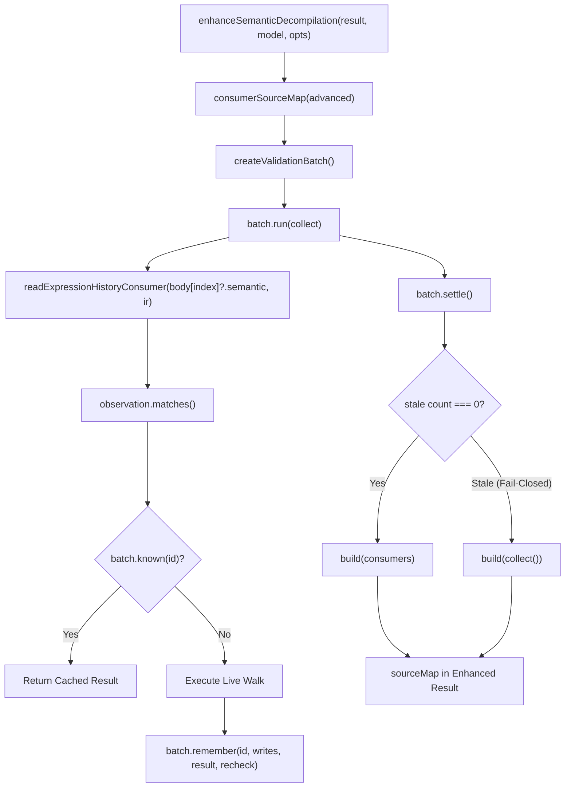

# Data Model & Flow: Phase 8 Canonical Expression & Consumer Validation Caching

## Component Relationships

## Entity Details

### 1. `consumerSourceMap(advanced)`
- **Scope**: Ephemeral synchronous helper executing inside `enhanceSemanticDecompilation()`.
- **Inputs**:
  - `advanced.printed.mapping`: Array of `{ line, column, length, source, ... }` source map entries.
  - `advanced.cAst.body`: Array of C-AST statement nodes corresponding to printed line indices.
  - `advanced.ir`: The semantic IR context for the function.
- **Output**: Array of source map entries with merged source provenance.
- **Lifecycle**:
  1. Instantiates an ephemeral `createValidationBatch()`.
  2. Runs `collect()` inside `batch.run()` to resolve expression consumers.
  3. Executes `batch.settle()`.
  4. If `settle() === 0`, returns `build(consumers)`.
  5. If `settle() > 0` (stale mutation detected), discards `consumers` and calls `build(collect())` live without memoization.

### 2. State & Invalidation Invariants
- **No Persistence**: The `ValidationBatch` is created and settled entirely within `consumerSourceMap()`. It is not stored on any object or exported across function boundaries.
- **Fail-Closed**: Any mutation to roots/children observed during collection triggers `recheck() !== value` during `settle()`, forcing complete fallback to un-memoized re-evaluation.
