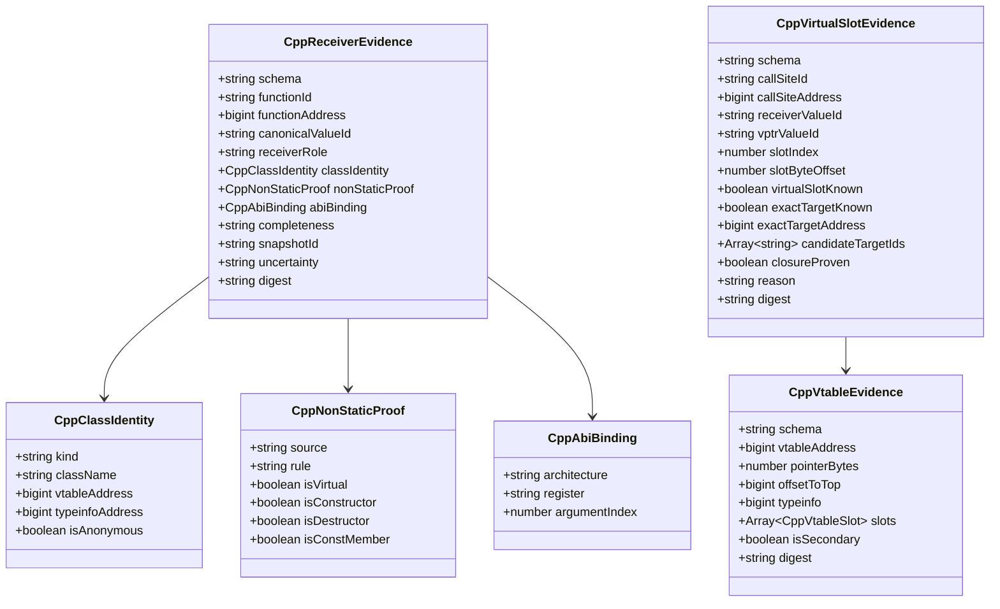
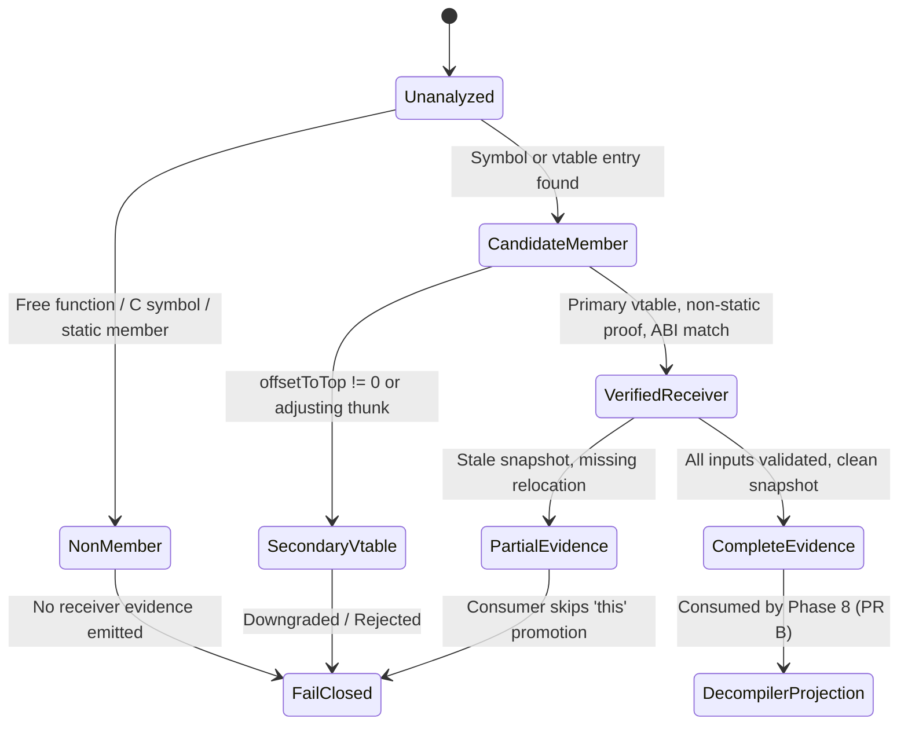

# Data Model & Contracts: C++ Object Evidence

**Feature**: `007-cpp-object-evidence`  
**Date**: 2026-09-21  
**Status**: Draft  

---

## 1. Public Evidence Schema

All evidence types are defined as deeply frozen objects with explicit provenance and validation.



---

## 2. Entity Details

### 2.1 `CppReceiverEvidence`
```typescript
interface CppReceiverEvidence {
  schema: 'cpp-receiver-evidence/v1';
  functionId: string;
  functionAddress: bigint | null;
  canonicalValueId: string | number;
  receiverRole: 'this';
  classIdentity: CppClassIdentity;
  nonStaticProof: CppNonStaticProof;
  abiBinding: CppAbiBinding;
  completeness: 'complete' | 'partial' | 'unknown';
  snapshotId: string;
  uncertainty: string | null;
  digest: string;
}
```
**Invariants**:
- `canonicalValueId` must correspond to argument 0 of the function's entry block.
- `receiverRole` is always `'this'`.
- `nonStaticProof` must carry verified evidence (e.g. constructor/destructor/cv-qualified symbol, or vtable slot membership, or authoritative non-static flag). It must NEVER be created for free functions, static member functions, or ordinary C functions.
- If `uncertainty != null` or `completeness !== 'complete'`, the decompiler consumer must NOT treat the receiver as exact.

### 2.2 `CppClassIdentity`
```typescript
interface CppClassIdentity {
  kind: 'named' | 'anonymous';
  className: string | null;
  vtableAddress: bigint | null;
  typeinfoAddress: bigint | null;
  isAnonymous: boolean;
}
```
**Invariants**:
- `kind === 'named'`: `className` is a non-empty string derived from RTTI or mangled symbol authority.
- `kind === 'anonymous'`: `className` is `null`, `isAnonymous: true`. No synthetic name like `Class_1234` or `Player` is ever fabricated.

### 2.3 `CppVtableEvidence`
```typescript
interface CppVtableEvidence {
  schema: 'cpp-vtable-evidence/v1';
  vtableAddress: bigint;
  pointerBytes: 4 | 8;
  offsetToTop: bigint;
  typeinfo: bigint | null;
  slots: Array<CppVtableSlot>;
  isSecondary: boolean;
  digest: string;
}

interface CppVtableSlot {
  index: number;
  offset: number;
  address: bigint | null;
  symbolName: string | null;
  unresolved: boolean;
  reason: string | null;
}
```
**Invariants**:
- `offsetToTop === 0n` indicates a primary vtable.
- `offsetToTop !== 0n` indicates a secondary vtable (multiple inheritance). `isSecondary: true`.
- If `unresolved === true`, the slot pointer was tagged, authenticated with PAC, or bound to a relocation that was not resolved. It cannot be treated as an address.

### 2.4 `CppVirtualSlotEvidence`
```typescript
interface CppVirtualSlotEvidence {
  schema: 'cpp-virtual-slot-evidence/v1';
  callSiteId: string | number;
  callSiteAddress: bigint | null;
  receiverValueId: string | number;
  vptrValueId: string | number;
  slotIndex: number;
  slotByteOffset: number;
  virtualSlotKnown: boolean;
  exactTargetKnown: boolean;
  exactTargetAddress: bigint | null;
  candidateTargetIds: Array<string>;
  closureProven: boolean;
  reason: string | null;
  digest: string;
}
```
**Invariants**:
- `virtualSlotKnown === true` whenever the canonical pattern (`receiver -> vptr load -> constant slot -> call`) is established.
- `exactTargetKnown` is `true` ONLY when `closureProven === true` (target candidate set is proven closed / exhaustive) and exactly one candidate target exists.
- In all other cases, `exactTargetKnown === false`, `exactTargetAddress === null`.

---

## 3. Evidence State Lifecycle


